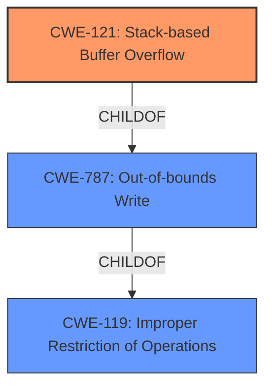

# Analysis for CVE-2021-20046

# Summary
| CWE ID | CWE Name | Confidence | CWE Abstraction Level | CWE Vulnerability Mapping Label | CWE-Vulnerability Mapping Notes |
|---|---|---|---|---|---|
| CWE-121 | Stack-based Buffer Overflow | 1.0 | Variant | Primary | Allowed |
| CWE-119 | Improper Restriction of Operations within the Bounds of a Memory Buffer | 0.5 | Class | Secondary | Discouraged |

## Evidence and Confidence

*   **Confidence Score:** 1.0
*   **Evidence Strength:** HIGH

## Relationship Analysis
The primary CWE is CWE-121, which is a variant of CWE-787 (Out-of-bounds Write) and CWE-119 (Improper Restriction of Operations within the Bounds of a Memory Buffer). The relationship shows a clear path from a general memory safety issue (CWE-119) to a more specific type of buffer overflow that occurs on the stack (CWE-121). The Variant level of CWE-121 is preferred due to its specificity.

## Vulnerability Chain
The vulnerability chain starts with the **stack-based buffer overflow** (CWE-121) due to **improper** handling of the HTTP Content-Length response header. A remote authenticated attacker can exploit this to cause a Denial of Service (DoS) and potentially achieve code execution.

## Summary of Analysis
The analysis strongly supports CWE-121 (Stack-based Buffer Overflow) as the primary CWE. The vulnerability description explicitly mentions "Stack-based buffer overflow" as the **root cause**. This aligns perfectly with the definition of CWE-121, which is a variant specifying where the buffer overflow occurs, which is on the stack.

The evidence is:
*   "A **Stack-based buffer overflow** in the SonicOS HTTP Content-Length response header allows a remote authenticated attacker to cause Denial of Service (DoS) and potentially results in code execution in the firewall."

CWE-119 (Improper Restriction of Operations within the Bounds of a Memory Buffer) was considered because it is a parent of CWE-121. However, CWE-121 provides more specific information about the location of the buffer, therefore is a better fit.

Relevant CWE Information:

# Enhanced Context (25 CWEs)
The following CWEs were identified as potentially relevant to this vulnerability:

## CWE-124: Buffer Underwrite ('Buffer Underflow')
**Abstraction Level**: Base
**Similarity Score**: 0.78
**Source**: dense
[Not Used] This CWE is not relevant because the vulnerability is a buffer overflow, not a buffer underflow.

## CWE-805: Buffer Access with Incorrect Length Value
**Abstraction Level**: Base
**Similarity Score**: 0.77
**Source**: dense
[Not Used] While a length value might be involved, the description does not explicitly state that an incorrect length value is the direct cause of the overflow.

## CWE-191: Integer Underflow (Wrap or Wraparound)
**Abstraction Level**: Base
**Similarity Score**: 0.76
**Source**: dense
[Not Used] Integer underflow is not mentioned or implied in the vulnerability description.

## CWE-131: Incorrect Calculation of Buffer Size
**Abstraction Level**: Base
**Similarity Score**: 0.76
**Source**: dense
[Not Used] The vulnerability description doesn't mention an incorrect calculation of buffer size.

## CWE-680: Integer Overflow to Buffer Overflow
**Abstraction Level**: Compound
**Similarity Score**: 0.76
**Source**: dense
[Not Used] Integer overflow is not mentioned in the vulnerability description.

## CWE-126: Buffer Over-read
**Abstraction Level**: Variant
**Similarity Score**: 0.75
**Source**: dense
[Not Used] The vulnerability description indicates a buffer overflow, not an over-read.

## CWE-1325: Improperly Controlled Sequential Memory Allocation
**Abstraction Level**: Base
**Similarity Score**: 0.75
**Source**: dense
[Not Used] This CWE is not relevant as the description doesn't discuss memory allocation issues.

## CWE-127: Buffer Under-read
**Abstraction Level**: Variant
**Similarity Score**: 0.74
**Source**: dense
[Not Used] This CWE is not relevant because the vulnerability is a buffer overflow, not a buffer under-read.

## CWE-789: Memory Allocation with Excessive Size Value
**Abstraction Level**: Variant
**Similarity Score**: 0.74
**Source**: dense
[Not Used] This CWE is not relevant as the description doesn't discuss memory allocation issues.

## CWE-190: Integer Overflow or Wraparound
**Abstraction Level**: Base
**Similarity Score**: 0.74
**Source**: dense
[Not Used] Integer overflow is not mentioned in the vulnerability description.

## CWE-190: Integer Overflow or Wraparound
**Abstraction Level**: Base
**Similarity Score**: 7478.26
**Source**: sparse
[Not Used] Integer overflow is not mentioned in the vulnerability description.

## CWE-125: Out-of-bounds Read
**Abstraction Level**: Base
**Similarity Score**: 6962.77
**Source**: sparse
[Not Used] This CWE is not relevant because the vulnerability is a buffer overflow, not an out-of-bounds read.

## CWE-1284: Improper Validation of Specified Quantity in Input
**Abstraction Level**: Base
**Similarity Score**: 6940.51
**Source**: sparse
[Not Used] Although the vulnerability is in the HTTP Content-Length response header, which involves a quantity, there is no specific mention of **improper validation** of that quantity in the description. Therefore, it is not a direct cause.

## CWE-119: Improper Restriction of Operations within the Bounds of a Memory Buffer
**Abstraction Level**: Class
**Similarity Score**: 6748.52
**Source**: sparse
[Secondary Candidate] While this is a very general description of the class of errors, it isn't as specific as the primary, and the primary is preferred.

## CWE-193: Off-by-one Error
**Abstraction Level**: Base
**Similarity Score**: 6626.47
**Source**: sparse
[Not Used] Off-by-one errors are not mentioned or implied in the vulnerability description.

## CWE-128: Wrap-around Error
**Abstraction Level**: base
**Similarity Score**: 5.03
**Source**: graph
[Not Used] Wrap-around errors are not mentioned or implied in the vulnerability description.

## CWE-170: Improper Null Termination
**Abstraction Level**: base
**Similarity Score**: 5.03
**Source**: graph
[Not Used] Improper Null Termination is not mentioned or implied in the vulnerability description.

## CWE-120: Buffer Copy without Checking Size of Input ('Classic Buffer Overflow')
**Abstraction Level**: base
**Similarity Score**: 4.82
**Source**: graph
[Not Used] Buffer Copy without Checking Size is not mentioned or implied in the vulnerability description.

## CWE-123: Write-what-where Condition
**Abstraction Level**: base
**Similarity Score**: 4.33
**Source**: graph
[Not Used] Write-what-where Condition is not mentioned or implied in the vulnerability description.

## CWE-770: Allocation of Resources Without Limits or Throttling
**Abstraction Level**: base
**Similarity Score**: 4.33
**Source**: graph
[Not Used] Allocation of Resources Without Limits or Throttling is not mentioned or implied in the vulnerability description.

## CWE-1284: Improper Validation of Specified Quantity in Input
**Abstraction Level**: base
**Similarity Score**: 4.33
**Source**: graph
[Not Used] Although the vulnerability is in the HTTP Content-Length response header, which involves a quantity, there is no specific mention of **improper validation** of that quantity in the description. Therefore, it is not a direct cause.

## CWE-410: Insufficient Resource Pool
**Abstraction Level**: base
**Similarity Score**: 4.33
**Source**: graph
[Not Used] Insufficient Resource Pool is not mentioned or implied in the vulnerability description.

## CWE-195: Signed to Unsigned Conversion Error
**Abstraction Level**: variant
**Similarity Score**: 3.88
**Source**: graph
[Not Used] Signed to Unsigned Conversion