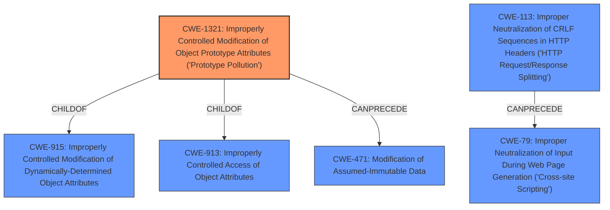

# Analysis for CVE-2021-20084

# Summary
| CWE ID | CWE Name | Confidence | CWE Abstraction Level | CWE Vulnerability Mapping Label | CWE-Vulnerability Mapping Notes |
|---|---|---|---|---|---|
| CWE-1321 | Improperly Controlled Modification of Object Prototype Attributes ('Prototype Pollution') | 1.0 | Variant | Allowed | Primary CWE |
| CWE-79 | Improper Neutralization of Input During Web Page Generation ('Cross-site Scripting') | 0.7 | Base | Allowed | Secondary CWE |

## Evidence and Confidence

*   **Confidence Score:** 0.9
*   **Evidence Strength:** HIGH

## Relationship Analysis
The primary CWE, CWE-1321, is a Variant of CWE-915 (Improperly Controlled Modification of Dynamically-Determined Object Attributes) and CWE-913 (Improperly Controlled Access of Object Attributes). This indicates that the vulnerability is a specific case of a more general class of weaknesses related to uncontrolled object attribute modification. CWE-1321 can precede CWE-471 (Modification of Assumed-Immutable Data). The secondary CWE, CWE-79, is a base CWE. It can be preceded by CWE-113.

## Vulnerability Chain
The vulnerability chain starts with the **improper handling of user-controlled input**, leading to **Prototype Pollution (CWE-1321)**. The `eval()` function, combined with the lack of input sanitization, creates a secondary vulnerability of **Cross-Site Scripting (CWE-79)**.

## Summary of Analysis
The initial assessment, based on the vulnerability description and the "CWE for similar CVE Descriptions" section, points to CWE-1321 as the primary weakness, which the retriever results also confirm. The **Prototype Pollution** allows injection of properties into `Object.prototype`. The CVE Reference Links Content Summary highlights that the `queryStringToJSON` function **does not properly sanitize keys and values extracted from the query string**, allowing for manipulation. The use of `eval()` without sanitization also leads to XSS.

The evidence from the CVE Reference Links Content Summary is strong: "Due to the **lack of validation or sanitization** of the parameter keys, it's possible to inject parameters that modify the prototype of the Object class." This directly supports the selection of CWE-1321.

The "Top CWEs" section lists CWE-1321 as the most frequent match for similar CVE descriptions, further solidifying the choice. The relationship graph confirms CWE-1321 as a Variant, providing the right level of specificity.

CWE-79 is selected as a secondary CWE because the use of `eval(decodeURIComponent(params))` when processing JSON strings directly exposes the application to XSS attacks.

The selected CWEs are at the optimal level of specificity, with CWE-1321 being a Variant and CWE-79 being a Base.

Relevant CWE Information:

# Enhanced Context (25 CWEs)
The following CWEs were identified as potentially relevant to this vulnerability:

## CWE-80: Improper Neutralization of Script-Related HTML Tags in a Web Page (Basic XSS)
**Abstraction Level**: Variant
**Similarity Score**: 0.79
**Source**: dense

**Description**:
The product receives input from an upstream component, but it does not neutralize or incorrectly neutralizes special characters such as "<", ">", and "&" that could be interpreted as web-scripting elements when they are sent to a downstream component that processes web pages.

**Mapping Guidance**:
- Usage: Allowed
- Rationale: This CWE entry is at the Variant level of abstraction, which is a preferred level of abstraction for mapping to the root causes of vulnerabilities.

*This CWE was not selected because it is more specific to HTML tags, while the eval() function allows for more general JavaScript execution.*

## CWE-1289: Improper Validation of Unsafe Equivalence in Input
**Abstraction Level**: Base
**Similarity Score**: 0.77
**Source**: dense

**Description**:
The product receives an input value that is used as a resource identifier or other type of reference, but it does not validate or incorrectly validates that the input is equivalent to a potentially-unsafe value.

**Mapping Guidance**:
- Usage: Allowed
- Rationale: This CWE entry is at the Base level of abstraction, which is a preferred level of abstraction for mapping to the root causes of vulnerabilities.

*This CWE was not selected because the core issue is the modification of object prototypes, not the validation of equivalence.*

## CWE-116: Improper Encoding or Escaping of Output
**Abstraction Level**: Class
**Similarity Score**: 0.77
**Source**: dense

**Description**:
The product prepares a structured message for communication with another component, but encoding or escaping of the data is either missing or done incorrectly. As a result, the intended structure of the message is not preserved.

**Mapping Guidance**:
- Usage: Allowed-with-Review
- Rationale: This CWE entry is a Class and might have Base-level children that would be more appropriate

*This CWE was not selected because it is a more general case of output handling, while CWE-79 and CWE-1321 are more specific and relevant.*

## CWE-74: Improper Neutralization of Special Elements in Output Used by a Downstream Component ('Injection')
**Abstraction Level**: Class
**Similarity Score**: 0.77
**Source**: dense

**Description**:
The product constructs all or part of a command, data structure, or record using externally-influenced input from an upstream component, but it does not neutralize or incorrectly neutralizes special elements that could modify how it is parsed or interpreted when it is sent to a downstream component.

**Mapping Guidance**:
- Usage: Discouraged
- Rationale: CWE-74 is high-level and often misused when lower-level weaknesses are more appropriate.

*This CWE was not selected because it is a higher-level class, and more specific CWEs like CWE-79 and CWE-1321 are more applicable.*

## CWE-472: External Control of Assumed-Immutable Web Parameter
**Abstraction Level**: Base
**Similarity Score**: 0.77
**Source**: dense

**Description**:
The web application does not sufficiently verify inputs that are assumed to be immutable but are actually externally controllable, such as hidden form fields.

**Mapping Guidance**:
- Usage: Allowed
- Rationale: This CWE entry is at the Base level of abstraction, which is a preferred level of abstraction for mapping to the root causes of vulnerabilities.

*This CWE was not selected because it focuses on immutable web parameters, which is not the primary issue in this vulnerability.*

## CWE-138: Improper Neutralization of Special Elements
**Abstraction Level**: Class
**Similarity Score**: 0.77
**Source**: dense

**Description**:
The product receives input from an upstream component, but it does not neutralize or incorrectly neutralizes special elements that could be interpreted as control elements or syntactic markers when they are sent to a downstream component.

**Mapping Guidance**:
- Usage: Discouraged
- Rationale: This CWE entry is a level-1 Class (i.e., a child of a Pillar). It might have lower-level children that would be more appropriate

*This CWE was not selected because it is too generic. More specific CWEs are identified.*

## CWE-184: Incomplete List of Disallowed Inputs
**Abstraction Level**: Base
**Similarity Score**: 0.77
**Source**: dense

**Description**:
The product implements a protection mechanism that relies on a list of inputs (or properties of inputs) that are not allowed by policy or otherwise require other action to neutralize before additional processing takes place, but the list is incomplete.

**Mapping Guidance**:
- Usage: Allowed
- Rationale: This CWE entry is at the Base level of abstraction, which is