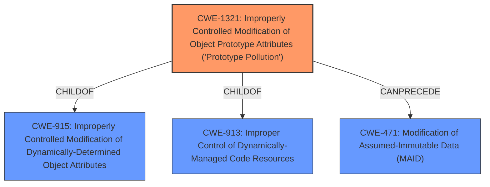

# Analysis for CVE-2021-20085

# Summary
| CWE ID | CWE Name | Confidence | CWE Abstraction Level | CWE Vulnerability Mapping Label | CWE-Vulnerability Mapping Notes |
|---|---|---|---|---|---|
| CWE-1321 | Improperly Controlled Modification of Object Prototype Attributes ('Prototype Pollution') | 1.0 | Variant | Allowed | Primary CWE |
| CWE-915 | Improperly Controlled Modification of Dynamically-Determined Object Attributes | 0.7 | Base | Allowed | Secondary Candidate |

## Evidence and Confidence

*   **Confidence Score:** 0.9
*   **Evidence Strength:** HIGH

## Relationship Analysis
The primary CWE selected is CWE-1321, which is a Variant of CWE-915 and CWE-913. This indicates a hierarchical relationship where CWE-1321 is a more specific case of a broader class of weaknesses related to improper control of object attribute modifications. The `CANPRECEDE` relationship from CWE-1321 to CWE-471 suggests that prototype pollution can lead to modification of assumed-immutable data. The selection of the Variant CWE-1321 is based on the precise nature of the vulnerability.

## Vulnerability Chain
The vulnerability chain starts with the **improper handling of user-controlled input** leading to **Improperly Controlled Modification of Object Prototype Attributes (Prototype Pollution)** (CWE-1321), which can then result in various impacts such as Denial of Service (DoS) or Remote Code Execution (RCE) by allowing attackers to **inject properties into Object.prototype**. This can also lead to bypassing security mechanisms.

## Summary of Analysis
The initial analysis strongly suggests CWE-1321 as the primary weakness, supported by both the vulnerability description and the CVE reference content summary. The summary explicitly states the **rootcause** as "Prototype Pollution" due to the `_setParamValue` function **lacking input sanitization** and allowing modification of base JavaScript object prototypes using keys like `__proto__`.

The retriever results also strongly support CWE-1321 as the best match, with a high similarity score. The relationship analysis confirms that it's a specific variant of the broader CWE-915, making it a more precise classification.

The final decision is based on the provided evidence, including the **rootcause** from the vulnerability description: "**Improperly Controlled Modification of Object Prototype Attributes (Prototype Pollution)**" and the **impact:** "inject properties into Object.prototype". The selection of CWE-1321 is at the optimal level of specificity because it directly addresses the prototype pollution vulnerability as a variant, offering a more precise classification than its parent CWE-915.

Relevant CWE Information:

# Enhanced Context (25 CWEs)
The following CWEs were identified as potentially relevant to this vulnerability:

## CWE-1289: Improper Validation of Unsafe Equivalence in Input
**Abstraction Level**: Base
**Similarity Score**: 0.78
**Source**: dense

**Description**:
The product receives an input value that is used as a resource identifier or other type of reference, but it does not validate or incorrectly validates that the input is equivalent to a potentially-unsafe value.

**Mapping Guidance**:
- Usage: Allowed
- Rationale: This CWE entry is at the Base level of abstraction, which is a preferred level of abstraction for mapping to the root causes of vulnerabilities.
- *Not Selected*: While input validation is lacking, the core issue is prototype pollution, not general input validation.

## CWE-472: External Control of Assumed-Immutable Web Parameter
**Abstraction Level**: Base
**Similarity Score**: 0.77
**Source**: dense

**Description**:
The web application does not sufficiently verify inputs that are assumed to be immutable but are actually externally controllable, such as hidden form fields.

**Mapping Guidance**:
- Usage: Allowed
- Rationale: This CWE entry is at the Base level of abstraction, which is a preferred level of abstraction for mapping to the root causes of vulnerabilities.
- *Not Selected*: While the prototype should be immutable, the vulnerability is more specific to prototype pollution.

## CWE-74: Improper Neutralization of Special Elements in Output Used by a Downstream Component ('Injection')
**Abstraction Level**: Class
**Similarity Score**: 0.77
**Source**: dense

**Description**:
The product constructs all or part of a command, data structure, or record using externally-influenced input from an upstream component, but it does not neutralize or incorrectly neutralizes special elements that could modify how it is parsed or interpreted when it is sent to a downstream component.

**Mapping Guidance**:
- Usage: Discouraged
- Rationale: CWE-74 is high-level and often misused when lower-level weaknesses are more appropriate.
- *Not Selected*: The vulnerability is not an injection vulnerability in the traditional sense.

## CWE-915: Improperly Controlled Modification of Dynamically-Determined Object Attributes
**Abstraction Level**: Base
**Similarity Score**: 0.77
**Source**: dense

**Description**:
The product receives input from an upstream component that specifies multiple attributes, properties, or fields that are to be initialized or updated in an object, but it does not properly control which attributes can be modified.

**Mapping Guidance**:
- Usage: Allowed
- Rationale: This CWE entry is at the Base level of abstraction, which is a preferred level of abstraction for mapping to the root causes of vulnerabilities.
- *Selected as Secondary*: This is a more general case of CWE-1321, which focuses on prototype pollution, but this is still relevant because the application doesn't properly control which attributes can be modified.

## CWE-639: Authorization Bypass Through User-Controlled Key
**Abstraction Level**: Base
**Similarity Score**: 0.77
**Source**: dense

**Description**:
The system's authorization functionality does not prevent one user from gaining access to another user's data or record by modifying the key value identifying the data.

**Mapping Guidance**:
- Usage: Allowed
- Rationale: This CWE entry is at the Base level of abstraction, which is a preferred level of abstraction for mapping to the root causes of vulnerabilities.
- *Not Selected*: This vulnerability is not related to authorization bypass.

## CWE-138: Improper Neutralization of Special Elements
**Abstraction Level**: Class
**Similarity Score**: 0.77
**Source**: dense

**Description**:
The product receives input from an upstream component, but it does not neutralize or incorrectly neutralizes special elements that could be interpreted as control elements or syntactic markers when they are sent to a downstream component.

**Mapping Guidance**:
- Usage: Discouraged
- Rationale: This CWE entry is a level-1 Class (i.e., a child of a Pillar). It might have lower-level children that would be more appropriate
- *Not Selected*: Too generic, and CWE-1321 is more specific to the vulnerability.

## CWE-184: Incomplete List of Disallowed Inputs
**Abstraction Level**: Base
**Similarity Score**: 0.76
**Source**: dense

**Description**:
The product implements a protection mechanism that relies on a list of inputs (or properties of inputs) that are not allowed by policy or otherwise require other action to neutralize before additional processing takes place, but the list is incomplete.

**Mapping Guidance**:
- Usage: Allowed
- Rationale: This CWE entry is at the Base level of abstraction, which is a preferred level of abstraction for mapping to the root causes of vulnerabilities.
- *Not Selected*: The core issue isn't an incomplete list, but rather a lack of sanitization of specific inputs that can cause prototype pollution.

## CWE-807: Reliance on Untrusted Inputs in a Security Decision
**Abstraction Level**: Base
**Similarity Score**: 0.76
**Source**: dense

**Description**:
The product uses a protection mechanism that relies on the existence or values of an input, but the input can be modified by an untrusted actor in a way that bypasses the protection mechanism.

**Mapping Guidance**:
- Usage: Allowed
- Rationale: This CWE entry is at the Base level of abstraction, which is a preferred level of abstraction for mapping to the root causes of vulnerabilities.
- *Not Selected*: This vulnerability doesn't directly involve a security