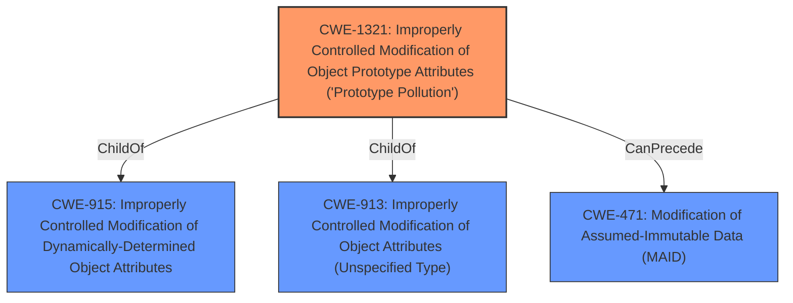

# Analysis Report for CVE-2021-20086

# Vulnerability Analysis Report: CVE-2021-20086

## Description


## Analysis (with Relationship Data)

# Summary
| CWE ID | CWE Name | Confidence | CWE Abstraction Level | CWE Vulnerability Mapping Label | CWE-Vulnerability Mapping Notes |
|---|---|---|---|---|---|
| CWE-1321 | Improperly Controlled Modification of Object Prototype Attributes ('Prototype Pollution') | 1.0 | Variant | Allowed | Primary CWE |

## Evidence and Confidence

*   **Confidence Score:** 1.0
*   **Evidence Strength:** HIGH

## Relationship Analysis
The primary relationship influencing this decision is the direct match and the Variant level of abstraction for CWE-1321, which is preferred. There are also ChildOf relationships to CWE-915 and CWE-913, indicating a hierarchy of object attribute modification issues. The CanPrecede relationship to CWE-471 suggests that prototype pollution can lead to modification of assumed-immutable data.



## Vulnerability Chain
The vulnerability chain starts with the **improperly controlled modification of object prototype attributes** due to the lack of input validation. This leads to the injection of properties into Object.prototype, potentially resulting in modification of assumed immutable data.

## Summary of Analysis
The initial analysis strongly suggests CWE-1321 as the primary weakness. The description explicitly mentions "**Prototype Pollution**" in jquery-bbq 1.2.1 and the ability to inject properties into Object.prototype. This aligns directly with CWE-1321's description: "The product receives input from an upstream component that specifies attributes that are to be initialized or updated in an object, but it does not properly control modifications of attributes of the object prototype."

The **CWE for similar CVE Descriptions** also lists CWE-1321 as the Primary CWE Match.

The Retriever Results also list CWE-1321 as the top match.

The graph relationships further support this selection, indicating that CWE-1321 is a more specific type of **improper object attribute modification**.

The selected CWE is at the optimal level of specificity (Variant) because it precisely captures the nature of the vulnerability.

Relevant CWE Information:

# Enhanced Context (25 CWEs)

## CWE-1321: Improperly Controlled Modification of Object Prototype Attributes ('Prototype Pollution')
**Abstraction:** Variant
**Status:** Incomplete

### Description
The product receives input from an upstream component that specifies attributes that are to be initialized or updated in an object, but it does not properly control modifications of attributes of the object prototype.

### Extended Description
By adding or modifying attributes of an object prototype, it is possible to create attributes that exist on every object, or replace critical attributes with malicious ones. This can be problematic if the product depends on existence or non-existence of certain attributes, or uses pre-defined attributes of object prototype (such as hasOwnProperty, toString or valueOf).

This weakness is usually exploited by using a special attribute of objects called proto, constructor or prototype. Such attributes give access to the object prototype. This weakness is often found in code that assigns object attributes based on user input, or merges or clones objects recursively.

### Relationships
ChildOf -> CWE-915
ChildOf -> CWE-913
CanPrecede -> CWE-471

### Mapping Guidance
**Usage:** Allowed
**Rationale:** This CWE entry is at the Variant level of abstraction, which is a preferred level of abstraction for mapping to the root causes of vulnerabilities.

## Other CWEs Considered:
*   **CWE-1188: Initialization of a Resource with an Insecure Default**: This was considered but deemed less relevant because the vulnerability is not about an insecure default value, but rather the ability to modify object prototypes.
*   **CWE-843: Access of Resource Using Incompatible Type ('Type Confusion')**: This was considered but deemed less relevant as the issue is not about type confusion but about modifying object prototypes.
*   **CWE-915: Improperly Controlled Modification of Dynamically-Determined Object Attributes**: While related, CWE-1321 is a more specific variant of this, focusing on prototype pollution.
*   **CWE-335: Incorrect Usage of Seeds in Pseudo-Random Number Generator (PRNG)**: This is completely unrelated to the described vulnerability.
*   **CWE-159: Improper Handling of Invalid Use of Special Elements**: This is a more general class, and CWE-1321 is a more specific variant.
*   **CWE-1257: Improper Access Control Applied to Mirrored or Aliased Memory Regions**: This is completely unrelated to the described vulnerability.
*   **CWE-1333: Inefficient Regular Expression Complexity**: This is completely unrelated to the described vulnerability.
*   **CWE-267: Privilege Defined With Unsafe Actions**: This is completely unrelated to the described vulnerability.
*   **CWE-113: Improper Neutralization of CRLF Sequences in HTTP Headers ('HTTP Request/Response Splitting')**: This is completely unrelated to the described vulnerability.


## CWE Relationship Analysis

Current CWEs represent these abstraction levels: .


### Vulnerability Chain Analysis

**Chain starting from CWE-1257:**
- 1257 (Improper Access Control Applied to Mirrored or Aliased Memory Regions) - ROOT


**Chain starting from CWE-335:**
- 335 (Incorrect Usage of Seeds in Pseudo-Random Number Generator (PRNG)) - ROOT


### CWE Relationship Diagram

```mermaid
graph TD
    classDef primary fill:#f96,stroke:#333,stroke-width:2px
    classDef secondary fill:#69f,stroke:#333
    classDef tertiary fill:#9e9,stroke:#333
```


*Report generated on 2025-03-31 12:55:57*
