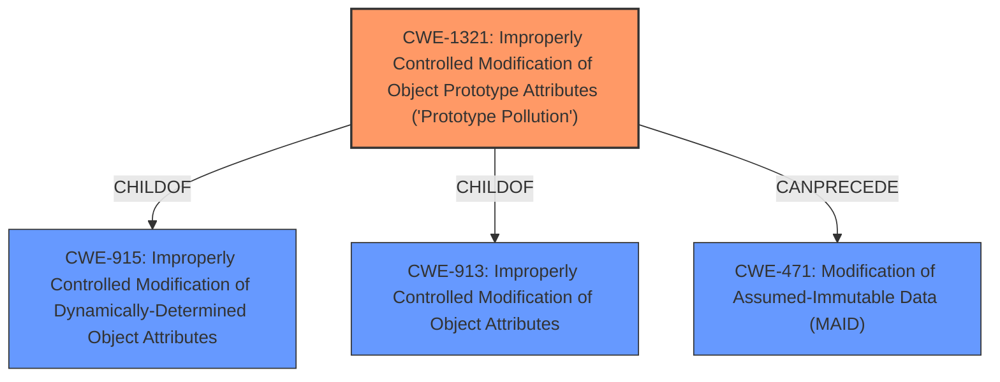

# Raw Analyzer Response for CVE-2021-20087

# Summary
| CWE ID    | CWE Name                                                                      | Confidence | CWE Abstraction Level | CWE Vulnerability Mapping Label | CWE-Vulnerability Mapping Notes |
| :-------- | :---------------------------------------------------------------------------- | :--------- | :-------------------- | :------------------------------ | :------------------------------ |
| CWE-1321 | Improperly Controlled Modification of Object Prototype Attributes ('Prototype Pollution') | 1.0        | Variant             | Allowed                       | Primary CWE                     |

## Evidence and Confidence

*   **Confidence Score:** 1.0
*   **Evidence Strength:** HIGH

## Relationship Analysis
The primary CWE is CWE-1321, which is a variant-level CWE. It has parent relationships to CWE-913 and CWE-915, which are base-level CWEs related to improperly controlled modification of object attributes. CWE-1321 also has a CANPRECEDE relationship to CWE-471 (Modification of Assumed-Immutable Data), indicating a potential chain where prototype pollution leads to modification of assumed-immutable data. The selection of CWE-1321 is based on its specific focus on prototype pollution, making it a more precise fit than its parents.

## Vulnerability Chain
The vulnerability chain starts with the **improper handling of URL query parameters** by the `jquery-deparam` library, leading to **prototype pollution** (CWE-1321), which can then result in denial of service, arbitrary code execution, or cross-site scripting.

## Summary of Analysis
The analysis is based on the vulnerability description and CVE reference links content summary, which clearly indicate the presence of **prototype pollution** in the `jquery-deparam` library. The library **does not properly control modifications of attributes of the object prototype**, allowing malicious users to inject properties into `Object.prototype`.

The evidence directly supports the selection of CWE-1321 (Improperly Controlled Modification of Object Prototype Attributes ('Prototype Pollution')).

The graph relationships highlight the connection between CWE-1321 and broader issues of object attribute modification. However, the specific nature of the vulnerability as **prototype pollution** makes CWE-1321 the most appropriate choice.

CWE-1321 is at the optimal level of specificity because it directly addresses the root cause of the vulnerability, which is the **improperly controlled modification of object prototype attributes**. The vulnerability description and the provided Proof of Concept (PoC) strongly support this classification.

Relevant CWE Information:
- CWE-1321: Improperly Controlled Modification of Object Prototype Attributes ('Prototype Pollution')
  - The product **receives input from an upstream component** that specifies attributes that are to be initialized or updated in an object, but it **does not properly control modifications of attributes of the object prototype.**
  - The "CVE Reference Links Content Summary" mentions: "The `deparam` function in `jquery-deparam.js` allows attackers to **inject or modify properties of the `Object.prototype`** by crafting specific query parameters."
  - The "CVE Reference Links Content Summary" mentions: "The library's recursive logic for creating nested objects **does not prevent the creation of properties on the `__proto__` object or the `constructor.prototype`**"
  - The attack vector is through crafted URL query parameters that are parsed by the vulnerable `jquery-deparam` library.