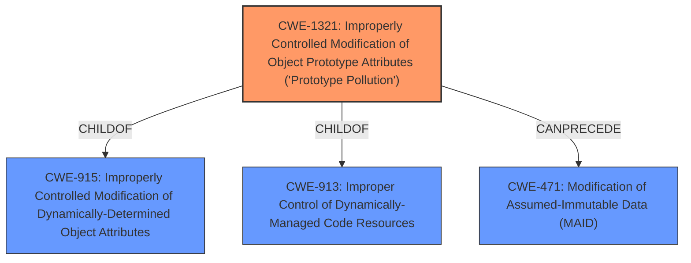

# Analysis for CVE-2021-20088

# Summary
| CWE ID    | CWE Name                                                                                    | Confidence | CWE Abstraction Level | CWE Vulnerability Mapping Label | CWE-Vulnerability Mapping Notes |
| :---------- | :------------------------------------------------------------------------------------------ | :---------- | :---------------------- | :------------------------------ | :------------------------------ |
| CWE-1321  | Improperly Controlled Modification of Object Prototype Attributes ('Prototype Pollution') | 1          | Variant                 | Primary CWE                     | Allowed                       |

## Evidence and Confidence

*   **Confidence Score:** 1
*   **Evidence Strength:** HIGH

## Relationship Analysis
The primary CWE selected is CWE-1321, which is a Variant of CWE-915 and CWE-913. The relationship analysis confirms that focusing on the variant level is appropriate due to the specific nature of the vulnerability.

## Vulnerability Chain
The vulnerability chain starts with the **Improperly Controlled Modification of Object Prototype Attributes (Prototype Pollution)** (CWE-1321), stemming from the lack of input sanitization. This can lead to modification of assumed-immutable data (CWE-471).

## Summary of Analysis
The initial analysis correctly identifies the root cause as **Improperly Controlled Modification of Object Prototype Attributes (Prototype Pollution)**. This assessment is strongly supported by the provided evidence, particularly the "Vulnerability Description Key Phrases" and "CVE Reference Links Content Summary".

The "Vulnerability Description Key Phrases" section explicitly states:
- **rootcause:** **Improperly Controlled Modification of Object Prototype Attributes (Prototype Pollution)**

The "CVE Reference Links Content Summary" section provides more details:
- The vulnerability stems from the `parseQueryString` function in MooTools More, specifically how it handles query string parameters, and does not sanitize the keys allowing an attacker to use `__proto__` or `constructor[prototype]` as a key, leading to prototype pollution.
- **Prototype Pollution:** The core vulnerability is the ability to manipulate the prototype of JavaScript objects by injecting specific keys like `__proto__` or `constructor[prototype]`.
- **Lack of Input Sanitization:** The `parseQueryString` function doesn't properly sanitize or validate the keys from the query string before using them to create object properties. This allows an attacker to inject malicious keys like `__proto__` or `constructor` which bypass normal object creation and target the prototype.

The Retriever Results also list CWE-1321 as the top match, further reinforcing this assessment.

The selection of CWE-1321 is at the optimal level of specificity because it directly addresses the core issue of prototype pollution, which is a specific type of improperly controlled modification of object attributes.