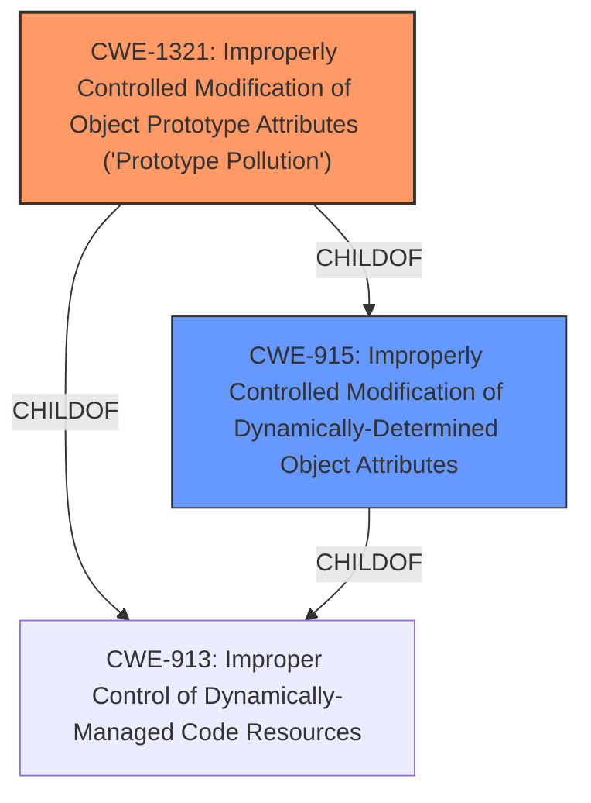

# Analysis Report for CVE-2021-20089

# Vulnerability Analysis Report: CVE-2021-20089

## Description


## Analysis (with Relationship Data)

# Summary
| CWE ID  | CWE Name                                                                                                                              | Confidence | CWE Abstraction Level | CWE Vulnerability Mapping Label | CWE-Vulnerability Mapping Notes |
| ------- | ------------------------------------------------------------------------------------------------------------------------------------- | ---------- | --------------------- | ------------------------------- | ------------------------------- |
| CWE-1321 | Improperly Controlled Modification of Object Prototype Attributes ('Prototype Pollution')                                             | 1          | Variant               | Allowed                       |                                 |
| CWE-915 | Improperly Controlled Modification of Dynamically-Determined Object Attributes                                                        | 0.7        | Base                  | Allowed                       | Secondary Candidate             |

## Evidence and Confidence

*   **Confidence Score:** 0.9
*   **Evidence Strength:** HIGH

## Relationship Analysis
The primary CWE is CWE-1321, which is a variant of CWE-915. This means it's a more specific type of improper control of object attributes, focusing specifically on prototype pollution. The relationship analysis guided the selection towards the more specific CWE-1321 since the vulnerability description mentions "Object.prototype" and "prototype pollution". CWE-915 is considered a secondary candidate because it is a more general case of the issue.



## Vulnerability Chain
The vulnerability chain starts with the **improperly controlled modification** of object prototype attributes. This leads to the ability for an attacker to inject properties into `Object.prototype`, which can then lead to denial of service, arbitrary code execution, or data corruption.

## Summary of Analysis
The initial analysis focused on identifying the root cause of the vulnerability, which is the **improperly controlled modification of object prototype attributes**. The vulnerability description, CVE Reference Links Content Summary, and Retriever Results all point to CWE-1321 as the most appropriate classification. The evidence clearly indicates that the vulnerability involves the injection of properties into `Object.prototype`, which is the defining characteristic of CWE-1321.

The analysis considered other CWEs, such as CWE-915, but ultimately determined that CWE-1321 is the most specific and accurate classification. The MITRE mapping guidance supports the use of Variant-level CWEs when the evidence supports it, and in this case, the evidence clearly points to prototype pollution.

The final decision is based on the following evidence:

*   **Vulnerability Description:** "Improperly Controlled Modification of Object Prototype Attributes (Prototype Pollution) in purl 2.3.2 allows a malicious user to inject properties into Object.prototype."
*   **Vulnerability Description Key Phrases:** "rootcause: **Improperly Controlled Modification of Object Prototype Attributes (Prototype Pollution)**"
*   **CVE Reference Links Content Summary:** "Prototype pollution: The `merge` function can modify the prototype of the base object due to the lack of proper validation of the input keys. This occurs when the provided key contains `__proto__` or `constructor`"
*   **Retriever Results:** CWE-1321 is the top result with a score of 0.550.

CWE-1321 is at the optimal level of specificity because it directly addresses the prototype pollution aspect of the vulnerability. Other CWEs, such as CWE-915, are more general and do not capture the specific nature of the vulnerability.

Relevant CWE Information:

# Enhanced Context (25 CWEs)
The following CWEs were identified as potentially relevant to this vulnerability:

## CWE-915: Improperly Controlled Modification of Dynamically-Determined Object Attributes
**Abstraction Level**: Base
**Similarity Score**: 0.78
**Source**: dense

**Description**:
The product receives input from an upstream component that specifies multiple attributes, properties, or fields that are to be initialized or updated in an object, but it does not properly control which attributes can be modified.

**Mapping Guidance**:
- Usage: Allowed
- Rationale: This CWE entry is at the Base level of abstraction, which is a preferred level of abstraction for mapping to the root causes of vulnerabilities.

## CWE-664: Improper Control of a Resource Through its Lifetime
**Abstraction Level**: Pillar
**Similarity Score**: 0.77
**Source**: dense

**Description**:
The product does not maintain or incorrectly maintains control over a resource throughout its lifetime of creation, use, and release.

**Mapping Guidance**:
- Usage: Discouraged
- Rationale: This CWE entry is high-level when lower-level children are available.

## CWE-913: Improper Control of Dynamically-Managed Code Resources
**Abstraction Level**: Class
**Similarity Score**: 0.77
**Source**: dense

**Description**:
The product does not properly restrict reading from or writing to dynamically-managed code resources such as variables, objects, classes, attributes, functions, or executable instructions or statements.

**Mapping Guidance**:
- Usage: Allowed-with-Review
- Rationale: This CWE entry is a Class and might have Base-level children that would be more appropriate

## CWE-668: Exposure of Resource to Wrong Sphere
**Abstraction Level**: Class
**Similarity Score**: 0.76
**Source**: dense

**Description**:
The product exposes a resource to the wrong control sphere, providing unintended actors with inappropriate access to the resource.

**Mapping Guidance**:
- Usage: Discouraged
- Rationale: CWE-668 is high-level and is often misused as a catch-all when lower-level CWE IDs might be applicable. It is sometimes used for low-information vulnerability reports [REF-1287]. It is a level-1 Class (i.e., a child of a Pillar). It is not useful for trend analysis.

## CWE-404: Improper Resource Shutdown or Release
**Abstraction Level**: Class
**Similarity Score**: 0.76
**Source**: dense

**Description**:
The product does not release or incorrectly releases a resource before it is made available for re-use.

**Mapping Guidance**:
- Usage: Allowed-with-Review
- Rationale: This CWE entry is a Class and might have Base-level children that would be more appropriate

## CWE-472: External Control of Assumed-Immutable Web Parameter
**Abstraction Level**: Base
**Similarity Score**: 0.76
**Source**: dense

**Description**:
The web application does not sufficiently verify inputs that are assumed to be immutable but are actually externally controllable, such as hidden form fields.

**Mapping Guidance**:
- Usage: Allowed
- Rationale: This CWE entry is at the Base level of abstraction, which is a preferred level of abstraction for mapping to the root causes of vulnerabilities.

## CWE-610: Externally Controlled Reference to a Resource in Another Sphere
**Abstraction Level**: Class
**Similarity Score**: 0.76
**Source**: dense

**Description**:
The product uses an externally controlled name or reference that resolves to a resource that is outside of the intended control sphere.

**Mapping Guidance**:
- Usage: Discouraged
- Rationale: This CWE entry is a level-1 Class (i.e., a child of a Pillar). It might have lower-level children that would be more appropriate

## CWE-639: Authorization Bypass Through User-Controlled Key
**Abstraction Level**: Base
**Similarity Score**: 0.76
**Source**: dense

**Description**:
The system's authorization functionality does not prevent one user from gaining access to another user's data or record by modifying the key value identifying the data.

**Mapping Guidance**:
- Usage: Allowed
- Rationale: This CWE entry is at the Base level of abstraction, which is a preferred level of abstraction for mapping to the root causes of vulnerabilities.

## CWE-1289: Improper Validation of Unsafe Equivalence in Input
**Abstraction Level**: Base
**Similarity Score**: 0.76
**Source**: dense

**Description**:
The product receives an input value that is used as a resource identifier or other type of reference, but it does not validate or incorrectly validates that the input is equivalent to a potentially-unsafe value.

**Mapping Guidance**:
- Usage: Allowed
- Rationale: This CWE entry is at the Base level of abstraction, which is a preferred level of abstraction for mapping to the root causes of vulnerabilities.

## CWE-41: Improper Resolution of Path Equivalence
**Abstraction Level**: Base
**Similarity Score**: 0.76
**Source**: dense

**Description**:
The product is vulnerable to file system


## CWE Relationship Analysis

Current CWEs represent these abstraction levels: .


### Vulnerability Chain Analysis

**Chain starting from CWE-472:**
- 472 (External Control of Assumed-Immutable Web Parameter) - ROOT


**Chain starting from CWE-41:**
- 41 (Improper Resolution of Path Equivalence) - ROOT


### CWE Relationship Diagram

```mermaid
graph TD
    classDef primary fill:#f96,stroke:#333,stroke-width:2px
    classDef secondary fill:#69f,stroke:#333
    classDef tertiary fill:#9e9,stroke:#333
```


*Report generated on 2025-03-30 18:55:31*
