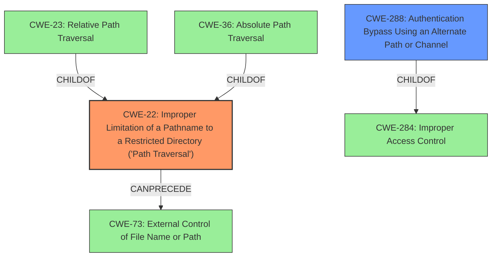

# Raw Analyzer Response for CVE-2021-20090

# Summary
| CWE ID | CWE Name | Confidence | CWE Abstraction Level | CWE Vulnerability Mapping Label | CWE-Vulnerability Mapping Notes |
|---|---|---|---|---|---|
| CWE-22 | Improper Limitation of a Pathname to a Restricted Directory ('Path Traversal') | 1.0 | Base | Allowed | Primary CWE |
| CWE-288 | Authentication Bypass Using an Alternate Path or Channel | 0.7 | Base | Allowed | Secondary Candidate |

## Evidence and Confidence

*   **Confidence Score:** 0.9
*   **Evidence Strength:** HIGH

## Relationship Analysis
The primary CWE is CWE-22, which is a base-level CWE describing path traversal. It has child CWEs like CWE-23 (Relative Path Traversal) and CWE-36 (Absolute Path Traversal). CWE-22 can precede CWE-73 (External Control of File Name or Path). The secondary CWE is CWE-288, which describes authentication bypass using an alternate path or channel. It is a base-level CWE and can be a child of CWE-284 (Improper Access Control).

## Vulnerability Chain
The vulnerability chain starts with a **path traversal** (CWE-22), which allows unauthenticated remote attackers to **bypass authentication** (CWE-288).

## Summary of Analysis
The analysis indicates a high confidence level due to the clear description of the **path traversal** vulnerability and its direct impact on authentication.

The vulnerability description explicitly states: "A **path traversal** vulnerability... could allow unauthenticated remote attackers to bypass authentication." The "CVE Reference Links Content Summary" confirms this: "The root cause is a path traversal vulnerability... This vulnerability stems from a list of folders that are incorrectly included in a 'bypass list' for authentication." It also states, "**Path Traversal**: The vulnerability allows an attacker to bypass authentication by using directory traversal sequences (e.g., `..%2f`) in the URL...**Improper Access Control**: The vulnerability also highlights a failure to properly restrict access to sensitive resources via the web interface."

The selection of CWE-22 is based on the explicit mention of **path traversal** as the root cause. The selection of CWE-288 is based on the impact which is **authentication bypass**, and the "CVE Reference Links Content Summary" section supports this.

CWE-22 is at the optimal level of specificity because it directly describes the **improper limitation of a pathname to a restricted directory**. CWE-288 is also at a good level of specificity as it highlights that the **authentication bypass** is happening because of an alternate path.

Other CWEs Considered:

*   CWE-23 (Relative Path Traversal): While related, CWE-22 is broader and more appropriate as the description doesn't specifically mention relative path traversal.
*   CWE-73 (External Control of File Name or Path): While the path is controlled externally, the core issue is the traversal itself, making CWE-22 more suitable.
*   CWE-287 (Improper Authentication): This is a class-level CWE and is too general. The vulnerability is specifically an **authentication bypass** due to a **path traversal**, making CWE-288 more appropriate.
*   CWE-284 (Improper Access Control): This is a pillar-level CWE and is too general. The specific weakness is **path traversal** leading to **authentication bypass**.
Relevant CWE Information:

# Enhanced Context (25 CWEs)
The following CWEs were identified as potentially relevant to this vulnerability:

## CWE-23: Relative Path Traversal
**Abstraction Level**: Base
**Similarity Score**: 0.77
**Source**: dense

**Description**:
The product uses external input to construct a pathname that should be within a restricted directory, but it does not properly neutralize sequences such as ".." that can resolve to a location that is outside of that directory.

**Mapping Guidance**:
- Usage: Allowed
- Rationale: This CWE entry is at the Base level of abstraction, which is a preferred level of abstraction for mapping to the root causes of vulnerabilities.

## CWE-41: Improper Resolution of Path Equivalence
**Abstraction Level**: Base
**Similarity Score**: 0.77
**Source**: dense

**Description**:
The product is vulnerable to file system contents disclosure through path equivalence. Path equivalence involves the use of special characters in file and directory names. The associated manipulations are intended to generate multiple names for the same object.

**Mapping Guidance**:
- Usage: Allowed
- Rationale: This CWE entry is at the Base level of abstraction, which is a preferred level of abstraction for mapping to the root causes of vulnerabilities.

## CWE-424: Improper Protection of Alternate Path
**Abstraction Level**: Class
**Similarity Score**: 0.76
**Source**: dense

**Description**:
The product does not sufficiently protect all possible paths that a user can take to access restricted functionality or resources.

**Mapping Guidance**:
- Usage: Allowed-with-Review
- Rationale: This CWE entry is a Class and might have Base-level children that would be more appropriate

## CWE-73: External Control of File Name or Path
**Abstraction Level**: Base
**Similarity Score**: 0.76
**Source**: dense

**Description**:
The product allows user input to control or influence paths or file names that are used in filesystem operations.

**Mapping Guidance**:
- Usage: Allowed
- Rationale: This CWE entry is at the Base level of abstraction, which is a preferred level of abstraction for mapping to the root causes of vulnerabilities.

## CWE-552: Files or Directories Accessible to External Parties
**Abstraction Level**: Base
**Similarity Score**: 0.75
**Source**: dense

**Description**:
The product makes files or directories accessible to unauthorized actors, even though they should not be.

**Mapping Guidance**:
- Usage: Allowed
- Rationale: This CWE entry is at the Base level of abstraction, which is a preferred level of abstraction for mapping to the root causes of vulnerabilities.

## CWE-274: Improper Handling of Insufficient Privileges
**Abstraction Level**: Base
**Similarity Score**: 0.75
**Source**: dense

**Description**:
The product does not handle or incorrectly handles when it has insufficient privileges to perform an operation, leading to resultant weaknesses.

**Mapping Guidance**:
- Usage: Discouraged
- Rationale: This CWE entry could be deprecated in a future version of CWE.

## CWE-668: Exposure of Resource to Wrong Sphere
**Abstraction Level**: Class
**Similarity Score**: 0.75
**Source**: dense

**Description**:
The product exposes a resource to the wrong control sphere, providing unintended actors with inappropriate access to the resource.

**Mapping Guidance**:
- Usage: Discouraged
- Rationale: CWE-668 is high-level and is often misused as a catch-all when lower-level CWE IDs might be applicable. It is sometimes used for low-information vulnerability reports [REF-1287]. It is a level-1 Class (i.e., a child of a Pillar). It is not useful for trend analysis.

## CWE-653: Improper Isolation or Compartmentalization
**Abstraction Level**: Class
**Similarity Score**: 0.74
**Source**: dense

**Description**:
The product does not properly compartmentalize or isolate functionality, processes, or resources that require different privilege levels, rights, or permissions.

**Mapping Guidance**:
- Usage: Allowed
- Rationale: This CWE entry is at the Base level of abstraction, which is a preferred level of abstraction for mapping to the root causes of vulnerabilities.

## CWE-807: Reliance on Untrusted Inputs in a Security Decision
**Abstraction Level**: Base
**Similarity Score**: 0.74
**Source**: dense

**Description**:
The product uses a protection mechanism that relies on the existence or values of an input, but the input can be modified by an untrusted actor in a way that bypasses the protection mechanism.

**Mapping Guidance**:
- Usage: