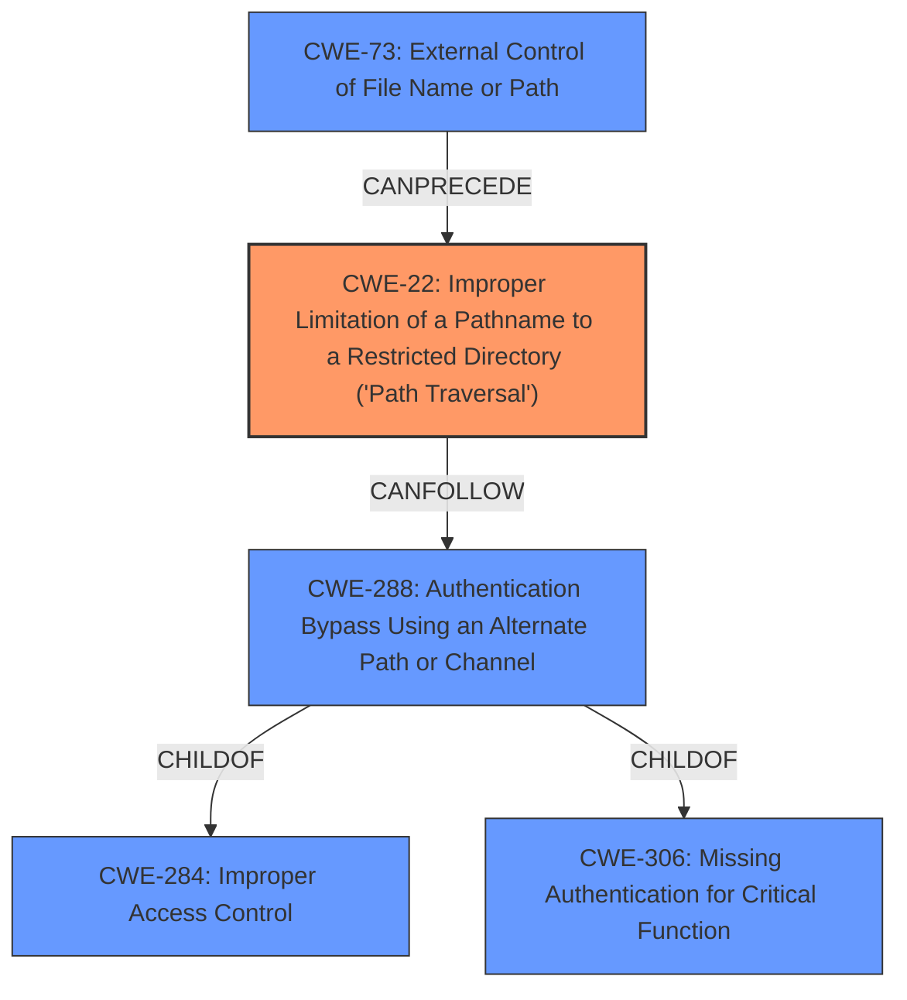

# Analysis Report for CVE-2021-20090

# Vulnerability Analysis Report: CVE-2021-20090

## Description


## Analysis (with Relationship Data)

# Summary
| CWE ID  | CWE Name                                                                                      | Confidence | CWE Abstraction Level | CWE Vulnerability Mapping Label | CWE-Vulnerability Mapping Notes |
| :-------- | :--------------------------------------------------------------------------------------------- | :---------- | :----------------------- | :----------------------------- | :-------------------------------- |
| CWE-22    | Improper Limitation of a Pathname to a Restricted Directory ('Path Traversal')               | 1.0         | Base                     | Primary                       | Allowed                           |
| CWE-288   | Authentication Bypass Using an Alternate Path or Channel                                      | 0.7         | Base                     | Secondary                     | Allowed                           |
| CWE-73    | External Control of File Name or Path                                                        | 0.6         | Base                     | Secondary                     | Allowed                           |

## Evidence and Confidence

*   **Confidence Score:** 0.8
*   **Evidence Strength:** HIGH

## Relationship Analysis
The primary weakness is CWE-22 [Improper Limitation of a Pathname to a Restricted Directory ('Path Traversal')], which is a base-level CWE. It is related to CWE-73 [External Control of File Name or Path], as external control of the file name or path can precede path traversal. The authentication bypass (CWE-288 [Authentication Bypass Using an Alternate Path or Channel]) is a consequence of the path traversal, as the attacker is able to access resources without proper authentication. CWE-288 is a peer of CWE-420 [Unprotected Alternate Channel] and child of CWE-284 [Improper Access Control] and CWE-306 [Missing Authentication for Critical Function].



## Vulnerability Chain
The vulnerability chain starts with the **external control of the file name or path** (CWE-73), which allows for **path traversal** (CWE-22), ultimately leading to **authentication bypass** (CWE-288).

## Summary of Analysis
The primary vulnerability is **path traversal** (CWE-22), which leads to **authentication bypass** (CWE-288). The root cause is the **improper limitation of a pathname to a restricted directory**. The vulnerability description and the CVE Reference Links Content Summary both explicitly mention "path traversal" as the root cause, which aligns well with CWE-22. The attacker uses path traversal to bypass authentication, gaining unauthorized access.

The selection of CWE-22 is based on the evidence: "A **path traversal** vulnerability in the web interfaces of Buffalo WSR-2533DHPL2 firmware version <= 1.02 and WSR-2533DHP3 firmware version <= 1.24 could allow unauthenticated remote attackers to bypass authentication." The CWE-22 is at the base level of abstraction and accurately represents the weakness.

CWE-73 [External Control of File Name or Path] was considered and added as a secondary CWE because the attacker is controlling the path.

CWE-288 [Authentication Bypass Using an Alternate Path or Channel] was selected because the path traversal allows bypassing authentication.

Other CWEs were considered but not selected:

*   CWE-23 [Relative Path Traversal]: While relative path traversal is a common type of path traversal, the description does not specifically indicate relative traversal. CWE-22 is a more general case.
*   CWE-36 [Absolute Path Traversal]: Similar to CWE-23, the description does not specify absolute path traversal.
*   CWE-912 [Hidden Functionality]: Not applicable as the vulnerability is not related to hidden functionality.
*   CWE-291 [Reliance on IP Address for Authentication]: Not relevant to this vulnerability.
*   CWE-287 [Improper Authentication]: Too general; CWE-288 is more specific.
*   CWE-41 [Improper Resolution of Path Equivalence]: While related to path manipulation, path traversal is a more direct description of the vulnerability.
*   CWE-284 [Improper Access Control]: Too general; CWE-22 and CWE-288 are more specific.
*   CWE-73 [External Control of File Name or Path]: Added as a secondary CWE.

The selected CWEs are at the optimal level of specificity, with CWE-22 accurately describing the root cause and CWE-288 describing the impact of the vulnerability.


## CWE Relationship Analysis

Current CWEs represent these abstraction levels: .


### Vulnerability Chain Analysis

**Chain starting from CWE-41:**
- 41 (Improper Resolution of Path Equivalence) - ROOT


**Chain starting from CWE-36:**
- 36 (Absolute Path Traversal) - ROOT


### CWE Relationship Diagram

```mermaid
graph TD
    classDef primary fill:#f96,stroke:#333,stroke-width:2px
    classDef secondary fill:#69f,stroke:#333
    classDef tertiary fill:#9e9,stroke:#333
```


*Report generated on 2025-03-30 16:20:58*
