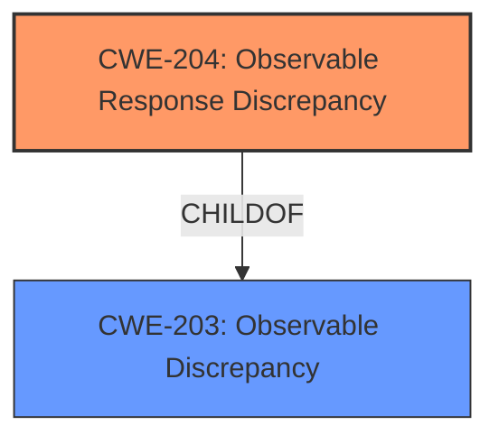

# Analysis for CVE-2021-20147

# Summary
| CWE ID | CWE Name | Confidence | CWE Abstraction Level | CWE Vulnerability Mapping Label | CWE-Vulnerability Mapping Notes |
|---|---|---|---|---|---|
| CWE-204 | Observable Response Discrepancy | 1.0 | Base | Allowed | Primary CWE |

## Evidence and Confidence

*   **Confidence Score:** 1.0
*   **Evidence Strength:** HIGH

## Relationship Analysis
The primary relationship influencing the decision is the ChildOf relationship between CWE-204 (Observable Response Discrepancy) and CWE-203 (Observable Discrepancy). While both are applicable, CWE-204 is a more specific categorization.

## Vulnerability Chain
The vulnerability chain is straightforward:
1.  **Root Cause:** **Observable response discrepancy** (CWE-204) in the `ChangePasswordAPI` endpoint.
2.  **Impact:** An unauthenticated attacker can determine whether a Windows domain user exists, leading to potential information disclosure.

## Summary of Analysis
The analysis strongly supports mapping this vulnerability to CWE-204 (Observable Response Discrepancy).

The vulnerability description clearly states an **observable response discrepancy**: "This allows an unauthenticated remote attacker to determine whether a Windows domain user exists." The CVE Reference Links Content Summary elaborates on the **root cause**: "The ManageEngine ADSelfService Plus (ADSSP) application exposes an API endpoint that allows an unauthenticated user to make requests that respond differently depending on whether a user exists in the configured domain...successful requests...result in a `200 OK` response if the user exists and a `500 Internal Server Error` if the user does not exist."

CWE-204's description directly aligns with this: "The product provides different responses to incoming requests in a way that reveals internal state information to an unauthorized actor outside of the intended control sphere."

Other CWEs considered include:

*   CWE-203 (Observable Discrepancy): While applicable as a parent, CWE-204 is more specific to response discrepancies.
*   CWE-208 (Observable Timing Discrepancy): This is not a timing-related issue.
*   CWE-206 (Observable Internal Behavioral Discrepancy): This is not about internal behavior being observable but the responses themselves.
*   CWE-620 (Unverified Password Change): While the API involves password changes, the core issue isn't the lack of verification but the differing responses.

The evidence and the retriever results align to make CWE-204 the most appropriate choice at the base level of abstraction.

# Enhanced Query for CVE-2021-20147

## Vulnerability Description
ManageEngine ADSelfService Plus below build 6116 contains an **observable response discrepancy** in the UMCP operation of the ChangePasswordAPI. This allows an unauthenticated remote attacker to determine whether a Windows domain user exists.

### Vulnerability Description Key Phrases
- **rootcause:** **observable response discrepancy**
- **impact:** determine whether a Windows domain user exists
- **attacker:** unauthenticated remote attacker
- **product:** ManageEngine ADSelfService Plus
- **version:** below build 6116
- **component:** UMCP operation of the ChangePasswordAPI

## CVE Reference Links Content Summary
Based on the provided content, here's a breakdown of the vulnerability:

**CVE ID:** CVE-2021-20147

**Vulnerability Description:** Windows Domain User Existence Determination

**Root Cause:** The ManageEngine ADSelfService Plus (ADSSP) application exposes an API endpoint that allows an unauthenticated user to make requests that respond differently depending on whether a user exists in the configured domain. This is due to an improper implementation within the `/RestAPI/ChangePasswordAPI` endpoint where successful requests to change a user's password (even with invalid passwords) result in a `200 OK` response if the user exists and a `500 Internal Server Error` if the user does not exist.

**Weakness:** Information Disclosure Vulnerability. The system reveals the existence or non-existence of user accounts, which constitutes sensitive information. This also violates security best practices, because successful or unsuccessful user authentication should not reveal user existence.

**Impact of Exploitation:** An unauthenticated remote attacker can enumerate valid usernames in configured Windows domains by analyzing the HTTP status codes received when using the vulnerable endpoint.

**Attack Vector:** Network access to the ADSSP application through the exposed REST API.

**Required Attacker Capabilities/Position:** The attacker needs to be able to send HTTP requests to the ADSSP server on port 8888. No prior authentication is required.

**Technical Details:**
*   The vulnerability is present in the `/RestAPI/ChangePasswordAPI` endpoint.
*   An attacker sends a POST request with parameters like `oldPassword`, `newPassword`, `operation=UMCP`, `umcp=1`, `loginName`, and `domainName`.
*   The ADSSP application responds with HTTP status code `200 OK` if the user specified in `loginName` exists.
*   The application responds with HTTP status code `500 Internal Server Error` if the user does not exist.

**Additional Notes:**
* The specific requests and responses show how the information about a user's existence is leaked via HTTP response codes.
* The advisory specifically notes that oldPassword and newPassword parameters need to conform to the password policies of the target domain, implying that the password policy of the domain is checked before the user existence is evaluated.
* The vulnerability is fixed in build 6116.

## Retriever Results

### Top Combined Results

| Rank | CWE ID | Name | Abstraction | Usage  | Retrievers | Individual Scores |
|------|--------|------|-------------|-------|------------|-------------------|
| 1 | 204 | Observable Response Discrepancy | Base | Allowed | sparse | 0.402 |
| 2 | 203 | Observable Discrepancy | Base | Allowed | sparse | 0.261 |
| 3 | 208 | Observable Timing Discrepancy | Base | Allowed | sparse | 0.257 |
| 4 | 206 | Observable Internal Behavioral Discrepancy | Variant | Allowed | sparse | 0.217 |
| 5 | 219 | Storage of File with Sensitive Data Under Web Root | Variant | Allowed | sparse | 0.191 |
| 6 | 620 | Unverified Password Change | Base | Allowed | dense | 0.569 |
| 7 | 385 | Covert Timing Channel | Base | Allowed | graph | 0.002 |
| 8 | 205 | Observable Behavioral Discrepancy | Base | Allowed | sparse | 0.181 |
| 9 | 207 | Observable Behavioral Discrepancy With Equivalent Products | Variant | Allowed | sparse | 0.175 |
| 10 | 341 | Predictable from Observable State | Base | Allowed | sparse | 0.173 |

# Complete CWE Specifications

## CWE-204: Observable Response Discrepancy
**Abstraction:** Base
**Status:** Incomplete

### Description
The product provides different responses to incoming requests in a way that reveals internal state information to an unauthorized actor outside of the intended control sphere.

### Extended Description
This issue frequently occurs during authentication, where a difference in failed-login messages could allow an attacker to determine if the username is valid or not. These exposures can be inadvertent (bug) or intentional (design).

### Alternative Terms
None

### Relationships
ChildOf -> CWE-203

### Mapping Guidance
**Usage:** Allowed
**Rationale:** This CWE entry is at the Base level of abstraction, which is a preferred level of abstraction for mapping to the root causes of vulnerabilities.
**Comments:** Carefully read both the name and description to ensure that this mapping is an appropriate fit. Do not try to 'force' a mapping to a lower-level Base/Variant simply to comply with this preferred level of abstraction.
**Reasons:**
- Acceptable-Use

### Additional Notes
**[Relationship]** can overlap errors related to escalated privileges

### Observed Examples
- **CVE-2002-2094:** This, and others, use ".." attacks and monitor error responses, so there is overlap with directory traversal.
- **CVE-2001-1483:** Enumeration of valid usernames based on inconsistent responses
- **CVE-2001-1528:** Account number enumeration via inconsistent responses.

## CWE-203: Observable Discrepancy
**Abstraction:** Base
**Status:** Incomplete

### Description
The product behaves differently or sends different responses under different circumstances in a way that is observable to an unauthorized actor, which exposes security-relevant information about the state of the product, such as whether a particular operation was successful or not.

### Extended Description
Discrepancies can take many forms, and variations may be detectable in timing, control flow, communications such as replies or requests, or general behavior. These discrepancies can reveal information about the product's operation or internal state to an unauthorized actor. In some cases, discrepancies can be used by attackers to form a side channel.

### Alternative Terms
Side Channel Attack: Observable Discrepancies are at the root of side channel attacks.

### Relationships
ChildOf -> CWE-200
ChildOf -> CWE-200

### Mapping Guidance
**Usage:** Allowed
**Rationale:** This CWE entry is at the Base level of abstraction, which is a preferred level of abstraction for mapping to the root causes of vulnerabilities.
**Comments:** Carefully read both the name and description to ensure that this mapping is an appropriate fit. Do not try to 'force' a mapping to a lower-level Base/Variant simply to comply with this preferred level of abstraction.
**Reasons:**
- Acceptable-Use

### Observed Examples
- **CVE-2020-8695:** Observable discrepancy in the RAPL interface for some Intel processors allows information disclosure.
- **CVE-2019-14353:** Crypto hardware wallet's power consumption relates to total number of pixels illuminated, creating a side channel in the USB connection that allows attackers to determine secrets displayed such as PIN numbers and passwords
- **CVE-2019-10071:** Java-oriented framework compares HMAC signatures using String.equals() instead of a constant-time algorithm, causing timing discrepancies

## CWE-208: Observable Timing Discrepancy
**Abstraction:** Base
**Status:** Incomplete

### Description
Two separate operations in a product require different amounts of time to complete, in a way that is observable to an actor and reveals security-relevant information about the state of the product, such as whether a particular operation was successful or not.

### Extended Description
In security-relevant contexts, even small variations in timing can be exploited by attackers to indirectly infer certain details about the product's internal operations. For example, in some cryptographic algorithms, attackers can use timing differences to infer certain properties about a private key, making the key easier to guess. Timing discrepancies effectively form a timing side channel.

### Alternative Terms
None

### Relationships
ChildOf -> CWE-203
CanPrecede -> CWE-385
CanPrecede -> CWE-327

### Mapping Guidance
**Usage:** Allowed
**Rationale:** This CWE entry is at the Base level of abstraction, which is a preferred level of abstraction for mapping to the root causes of vulnerabilities.
**Comments:** Carefully read both the name and description to ensure that this mapping is an appropriate fit. Do not try to 'force' a mapping to a lower-level Base/Variant simply to comply with this preferred level of abstraction.
**Reasons:**
- Acceptable-Use

### Additional Notes
**[Relationship]** Often primary in cryptographic applications and algorithms.

**[Maintenance]** CWE 4.16 removed a demonstrative example for a hardware module because it was inaccurate and unable to be adapted. The CWE team is developing an alternative.

### Observed Examples
- **CVE-2019-10071:** Java-oriented framework compares HMAC signatures using String.equals() instead of a constant-time algorithm, causing timing discrepancies
- **CVE-2019-10482:** Smartphone OS uses comparison functions that are not in constant time, allowing side channels
- **CVE-2014-0984:** Password-checking function in router terminates validation of a password entry when it encounters the first incorrect character, which allows remote attackers to obtain passwords via a brute-force attack that relies on timing differences in responses to incorrect password guesses, aka a timing side-channel attack.

## CWE-206: Observable Internal Behavioral Discrepancy
**Abstraction:** Variant
**Status:** Incomplete

### Description
The product performs multiple behaviors that are combined to produce a single result, but the individual behaviors are observable separately in a way that allows attackers to reveal internal state or internal decision points.

### Extended Description
Ideally, a product should provide as little information as possible to an attacker. Any hints that the attacker may be making progress can then be used to simplify or optimize the attack. For example, in a login procedure that requires a username and password, ultimately there is only one decision: success or failure. However, internally, two separate actions are performed: determining if the username exists, and checking if the password is correct. If the product behaves differently based on whether the username exists or not, then the attacker only needs to concentrate on the password.

### Alternative Terms
None

### Relationships
ChildOf -> CWE-205

### Mapping Guidance
**Usage:** Allowed
**Rationale:** This CWE entry is at the Variant level of abstraction, which is a preferred level of abstraction for mapping to the root causes of vulnerabilities.
**Comments:** Carefully read both the name and description to ensure that this mapping is an appropriate fit. Do not try to 'force' a mapping to a lower-level Base/Variant simply to comply with this preferred level of abstraction.
**Reasons:**
- Acceptable-Use

### Observed Examples
- **CVE-2002-2031:** File existence via infoleak monitoring whether "onerror" handler fires or not.
- **CVE-2005-2025:** Valid groupname enumeration via behavioral infoleak (sends response if valid, doesn't respond if not).
- **CVE-2001-1497:** Behavioral infoleak in GUI allows attackers to distinguish between alphanumeric and non-alphanumeric characters in a password, thus reducing the search space.

## CWE-219: Storage of File with Sensitive Data Under Web Root
**Abstraction:** Variant
**Status:** Draft

### Description
The product stores sensitive data under the web document root with insufficient access control, which might make it accessible to untrusted parties.

### Extended Description
Besides public-facing web pages and code, products may store sensitive data, code that is not directly invoked, or other files under the web document root of the web server. If the server is not configured or otherwise used to prevent direct access to those files, then attackers may obtain this sensitive data.

### Alternative Terms
None

### Relationships
ChildOf -> CWE-552

### Mapping Guidance
**Usage:** Allowed
**Rationale:** This CWE entry is at the Variant level of abstraction, which is a preferred level of abstraction for mapping to the root causes of vulnerabilities.
**Comments:** Carefully read both the name and description to ensure that this mapping is an appropriate fit. Do not try to 'force' a mapping to a lower-level Base/Variant simply to comply with this preferred level of abstraction.
**Reasons:**
- Acceptable-Use

### Observed Examples
- **CVE-2005-1835:** Data file under web root.
- **CVE-2005-2217:** Data file under web root.
- **CVE-2002-1449:** Username/password in data file under web root.

## CWE-620: Unverified Password Change
**Abstraction:** Base
**Status:** Draft

### Description
When setting a new password for a user, the product does not require knowledge of the original password, or using another form of authentication.

### Extended Description
This could be used by an attacker to change passwords for another user, thus gaining the privileges associated with that user.

### Alternative Terms
None

### Relationships
ChildOf -> CWE-1390

### Mapping Guidance
**Usage:** Allowed
**Rationale:** This CWE entry is at the Base level of abstraction, which is a preferred level of abstraction for mapping to the root causes of vulnerabilities.
**Comments:** Carefully read both the name and description to ensure that this mapping is an appropriate fit. Do not try to 'force' a mapping to a lower-level Base/Variant simply to comply with this preferred level of abstraction.
**Reasons:**
- Acceptable-Use

### Observed Examples
- **CVE-2007-0681:** Web app allows remote attackers to change the passwords of arbitrary users without providing the original password, and possibly perform other unauthorized actions.
- **CVE-2000-0944:** Web application password change utility doesn't check the original password.

## CWE-385: Covert Timing Channel
**Abstraction:** Base
**Status:** Incomplete

### Description
Covert timing channels convey information by modulating some aspect of system behavior over time, so that the program receiving the information can observe system behavior and infer protected information.

### Extended Description

In some instances, knowing when data is transmitted between parties can provide a malicious user with privileged information. Also, externally monitoring the timing of operations can potentially reveal sensitive data. For example, a cryptographic operation can expose its internal state if the time it takes to perform the operation varies, based on the state.

Covert channels are frequently classified as either storage or timing channels. Some examples of covert timing channels are the system's paging rate, the time a certain transaction requires to execute, and the time it takes to gain access to a shared bus.

### Alternative Terms
None

### Relationships
ChildOf -> CWE-514

### Mapping Guidance
**Usage:** Allowed
**Rationale:** This CWE entry is at the Base level of abstraction, which is a preferred level of abstraction for mapping to the root causes of vulnerabilities.
**Comments:** Carefully read both the name and description to ensure that this mapping is an appropriate fit. Do not try to 'force' a mapping to a lower-level Base/Variant simply to comply with this preferred level of abstraction.
**Reasons:**
- Acceptable-Use

### Additional Notes
**[Maintenance]** As of CWE 4.9, members of the CWE Hardware SIG are working to improve CWE's coverage of transient execution weaknesses, which include issues related to Spectre, Meltdown, and other attacks that create or exploit covert channels. As a result of that work, this entry might change in CWE 4.10.

## CWE-205: Observable Behavioral Discrepancy
**Abstraction:** Base
**Status:** Incomplete

### Description
The product's behaviors indicate important differences that may be observed by unauthorized actors in a way that reveals (1) its internal state or decision process, or (2) differences from other products with equivalent functionality.

### Extended Description
Ideally, a product should provide as little information about its internal operations as possible. Otherwise, attackers could use knowledge of these internal operations to simplify or optimize their attack. In some cases, behavioral discrepancies can be used by attackers to form a side channel.

### Alternative Terms
None

### Relationships
ChildOf -> CWE-203
CanPrecede -> CWE-514

### Mapping Guidance
**Usage:** Allowed
**Rationale:** This CWE entry is at the Base level of abstraction, which is a preferred level of abstraction for mapping to the root causes of vulnerabilities.
**Comments:** Carefully read both the name and description to ensure that this mapping is an appropriate fit. Do not try to 'force' a mapping to a lower-level Base/Variant simply to comply with this preferred level of abstraction.
**Reasons:**
- Acceptable-Use

### Observed Examples
- **CVE-2002-0208:** Product modifies TCP/IP stack and ICMP error messages in unusual ways that show the product is in use.
- **CVE-2004-2252:** Behavioral infoleak by responding to SYN-FIN packets.

## CWE-207: Observable Behavioral Discrepancy With Equivalent Products
**Abstraction:** Variant
**Status:** Draft

### Description
The product operates in an environment in which its existence or specific identity should not be known, but it behaves differently than other products with equivalent functionality, in a way that is observable to an attacker.

### Extended Description
For many kinds of products, multiple products may be available that perform the same functionality, such as a web server, network interface, or intrusion detection system. Attackers often perform "fingerprinting," which uses discrepancies in order to identify which specific product is in use. Once the specific product has been identified, the attacks can be made more customized and efficient. Often, an organization might intentionally allow the specific product to be identifiable. However, in some environments, the ability to identify a distinct product is unacceptable, and it is expected that every product would behave in exactly the same way. In these more restricted environments, a behavioral difference might pose an unacceptable risk if it makes it easier to identify the product's vendor, model, configuration, version, etc.

### Alternative Terms
None

### Relationships
ChildOf -> CWE-205

### Mapping Guidance
**Usage:** Allowed
**Rationale:** This CWE entry is at the Variant level of abstraction, which is a preferred level of abstraction for mapping to the root causes of vulnerabilities.
**Comments:** Carefully read both the name and description to ensure that this mapping is an appropriate fit. Do not try to 'force' a mapping to a lower-level Base/Variant simply to comply with this preferred level of abstraction.
**Reasons:**
- Acceptable-Use

### Observed Examples
- **CVE-2002-0208:** Product modifies TCP/IP stack and ICMP error messages in unusual ways that show the product is in use.
- **CVE-2004-2252:** Behavioral infoleak by responding to SYN-FIN packets.
- **CVE-2000-1142:** Honeypot generates an error with a "pwd" command in a particular directory, allowing attacker to know they are in a honeypot system.

## CWE-341: Predictable from Observable State
**Abstraction:** Base
**Status:** Draft

### Description
A number or object is predictable based on observations that the attacker can make about the state of the system or network, such as time, process ID, etc.

### Extended Description
Not provided

### Alternative Terms
None

### Relationships
ChildOf -> CWE-340

### Mapping Guidance
**Usage:** Allowed
**Rationale:** This CWE entry is at the Base level of abstraction, which is a preferred level of abstraction for mapping to the root causes of vulnerabilities.
**Comments:** Carefully read both the name and description to ensure that this mapping is an appropriate fit. Do not try to 'force' a mapping to a lower-level Base/Variant simply to comply with this preferred level of abstraction.
**Reasons:**
- Acceptable-Use

### Additional Notes
**[Maintenance]** As of CWE 4.5, terminology related to randomness, entropy, and predictability can vary widely. Within the developer and other communities, "randomness" is used heavily. However, within cryptography, "entropy" is distinct, typically implied as a measurement. There are no commonly-used definitions, even within standards documents and cryptography papers. Future versions of CWE will attempt to define these terms and, if necessary, distinguish between them in ways that are appropriate for different communities but do not reduce the usability of CWE for mapping, understanding, or other scenarios.

### Observed Examples
- **CVE-2002-0389:** Mail server stores private mail messages with predictable filenames in a world-executable directory, which allows local users to read private mailing list archives.
- **CVE-2001-1141:** PRNG allows attackers to use the output of small PRNG requests to determine the internal state information, which could be used by attackers to predict future pseudo-random numbers.
- **CVE-2000-0335:** DNS resolver library uses predictable IDs, which allows a local attacker to spoof DNS query results.

