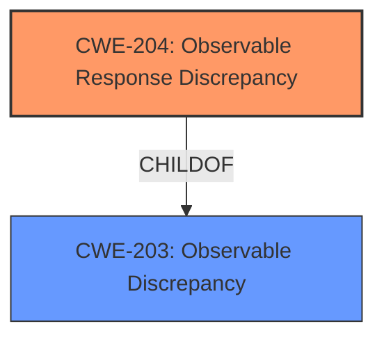

# Analysis Report for CVE-2021-20147

# Vulnerability Analysis Report: CVE-2021-20147

## Description


## Analysis (with Relationship Data)

# Summary
| CWE ID | CWE Name | Confidence | CWE Abstraction Level | CWE Vulnerability Mapping Label | CWE-Vulnerability Mapping Notes |
|---|---|---|---|---|---|
| CWE-204 | Observable Response Discrepancy | 1.0 | Base | Allowed | Primary CWE |

## Evidence and Confidence

*   **Confidence Score:** 1.0
*   **Evidence Strength:** HIGH

## Relationship Analysis
The primary relationship influencing the decision is the ChildOf relationship between CWE-204 (Observable Response Discrepancy) and CWE-203 (Observable Discrepancy). While both are applicable, CWE-204 is a more specific categorization.



## Vulnerability Chain
The vulnerability chain is straightforward:
1.  **Root Cause:** **Observable response discrepancy** (CWE-204) in the `ChangePasswordAPI` endpoint.
2.  **Impact:** An unauthenticated attacker can determine whether a Windows domain user exists, leading to potential information disclosure.

## Summary of Analysis
The analysis strongly supports mapping this vulnerability to CWE-204 (Observable Response Discrepancy).

The vulnerability description clearly states an **observable response discrepancy**: "This allows an unauthenticated remote attacker to determine whether a Windows domain user exists." The CVE Reference Links Content Summary elaborates on the **root cause**: "The ManageEngine ADSelfService Plus (ADSSP) application exposes an API endpoint that allows an unauthenticated user to make requests that respond differently depending on whether a user exists in the configured domain...successful requests...result in a `200 OK` response if the user exists and a `500 Internal Server Error` if the user does not exist."

CWE-204's description directly aligns with this: "The product provides different responses to incoming requests in a way that reveals internal state information to an unauthorized actor outside of the intended control sphere."

Other CWEs considered include:

*   CWE-203 (Observable Discrepancy): While applicable as a parent, CWE-204 is more specific to response discrepancies.
*   CWE-208 (Observable Timing Discrepancy): This is not a timing-related issue.
*   CWE-206 (Observable Internal Behavioral Discrepancy): This is not about internal behavior being observable but the responses themselves.
*   CWE-620 (Unverified Password Change): While the API involves password changes, the core issue isn't the lack of verification but the differing responses.

The evidence and the retriever results align to make CWE-204 the most appropriate choice at the base level of abstraction.


## CWE Relationship Analysis

Current CWEs represent these abstraction levels: .


### Vulnerability Chain Analysis

**Chain starting from CWE-208:**
- 208 (Observable Timing Discrepancy) - ROOT


**Chain starting from CWE-203:**
- 203 (Observable Discrepancy) - ROOT


### CWE Relationship Diagram

```mermaid
graph TD
    classDef primary fill:#f96,stroke:#333,stroke-width:2px
    classDef secondary fill:#69f,stroke:#333
    classDef tertiary fill:#9e9,stroke:#333
```


*Report generated on 2025-03-31 11:30:30*
