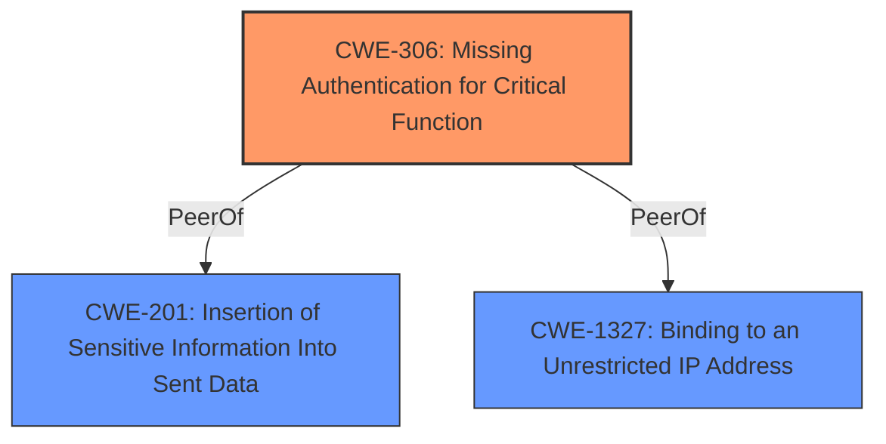

# Analysis for CVE-2021-20238

# Summary
| CWE ID  | CWE Name                                                  | Confidence | CWE Abstraction Level | CWE Vulnerability Mapping Label | CWE-Vulnerability Mapping Notes |
|---------|-----------------------------------------------------------|------------|-----------------------|---------------------------------|---------------------------------|
| CWE-306 | Missing Authentication for Critical Function            | 1          | Base                  | Primary                          | Allowed                         |
| CWE-201 | Insertion of Sensitive Information Into Sent Data         | 0.7        | Base                  | Secondary                        | Allowed                         |
| CWE-1327| Binding to an Unrestricted IP Address                    | 0.6        | Base                  | Secondary                        | Allowed                         |

## Evidence and Confidence

*   **Confidence Score:** 0.8
*   **Evidence Strength:** HIGH

## Relationship Analysis
The primary relationship influencing the CWE selection is that CWE-306 **(Missing Authentication for Critical Function)** is a base-level weakness, directly addressing the lack of authentication.
CWE-201 **(Insertion of Sensitive Information Into Sent Data)** is a base-level weakness, addressing the potential inclusion of sensitive data in the configurations served by the Machine Config Server.

## Vulnerability Chain
The vulnerability chain starts with the **lack of authentication** on the Machine Config Server (MCS) endpoint (CWE-306). This allows external or internal access to the ignition configurations, which might contain sensitive data (CWE-201). The problem is compounded by network configurations that expose the MCS endpoint due to the service **binding to an unrestricted IP address** (CWE-1327).

## Summary of Analysis
The primary CWE is CWE-306 **(Missing Authentication for Critical Function)**, as the core issue is the **unauthenticated access** to a critical function (serving ignition configurations). The vulnerability description explicitly states that the ignition config can be **accessed externally from clusters without authentication**. This aligns directly with the description of CWE-306, which states "The product does not perform any authentication for functionality that requires a provable user identity or consumes a significant amount of resources." The "CVE Reference Links Content Summary" further reinforces this by stating "**Unauthenticated Access:** The primary weakness is the **lack of authentication** on the MCS endpoint, allowing unauthorized access to potentially sensitive data."

CWE-201 **(Insertion of Sensitive Information Into Sent Data)** is a secondary concern because the exposed ignition configurations *may* contain sensitive data such as registry pull secrets. The "CVE Reference Links Content Summary" supports this by saying, "Attackers can access ignition configurations, which may contain sensitive data such as registry pull secrets used for bootstrapping nodes." While not guaranteed, the potential for sensitive data exposure warrants including CWE-201.

CWE-1327 **(Binding to an Unrestricted IP Address)** is also selected as a secondary concern. This weakness stems from the fact that some deployment types allow external access to port 22623 from the standard OpenShift API Virtual IP address, which indicates that the service is bound to an unrestricted IP address.

Other CWEs were considered but deemed less appropriate:

*   CWE-863 **(Incorrect Authorization)**: Authorization implies that some form of authentication is present. Here, there is *no* authentication, making CWE-306 a more accurate fit than CWE-863, which deals with cases where authorization is incorrectly implemented.
*   CWE-923 **(Improper Restriction of Communication Channel to Intended Endpoints)**: This is related, but it is more focused on misconfigured communication channels rather than the fundamental lack of authentication.
*   CWE-532 **(Insertion of Sensitive Information into Log File)**: This is not about logging sensitive information, but rather about serving sensitive information through an exposed endpoint.
*   CWE-1390 **(Weak Authentication)**: This is not about weak authentication, but rather about no authentication at all.
*   CWE-322 **(Key Exchange without Entity Authentication)**: This CWE is not about key exchange.
*   CWE-400 **(Uncontrolled Resource Consumption)**: This CWE is not about resource consumption.

The selected CWEs are at the optimal level of specificity. CWE-306 is a base-level CWE that directly describes the **missing authentication**. CWE-201 is a base-level CWE that directly describes the potential **insertion of sensitive information**. CWE-1327 is a base-level CWE that directly describes the **binding to an unrestricted IP address**.