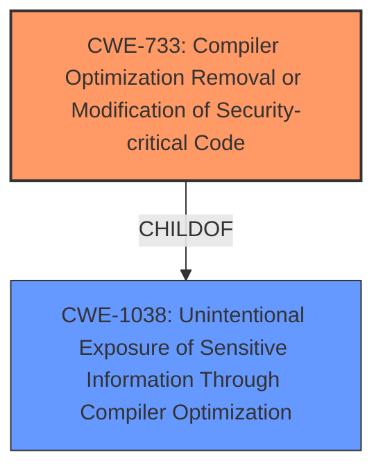

# Raw Analyzer Response for CVE-2021-20320

# Summary
| CWE ID  | CWE Name                                                                                                  | Confidence | CWE Abstraction Level | CWE Vulnerability Mapping Label | CWE-Vulnerability Mapping Notes |
| :-------- | :---------------------------------------------------------------------------------------------------------- | :----------- | :---------------------- | :-------------------------------- | :-------------------------------- |
| CWE-733   | Compiler Optimization Removal or Modification of Security-critical Code                                  | 0.9          | Base                    | Allowed                           | Primary CWE                       |

## Evidence and Confidence

*   **Confidence Score:** 0.9
*   **Evidence Strength:** HIGH

## Relationship Analysis
The primary relationship that impacted my decision was the direct match of the vulnerability description to CWE-733. The description explicitly mentions that the issue is due to a miscompilation in the s390 eBPF JIT, indicating that the compiler is **incorrectly** optimizing the code. CWE-733 directly addresses scenarios where the compiler **modifies** or removes security-critical code.

## Vulnerability Chain
The vulnerability chain starts with the root cause of the miscompilation in the s390 eBPF JIT. This leads to the ability of a local attacker to bypass the verifier, ultimately resulting in a confidentiality problem.
  - **Root Cause:** Miscompilation in s390 eBPF JIT (CWE-733)
  - **Weakness:** Circumvent the verifier
  - **Impact:** Confidentiality problem

## Summary of Analysis
The initial analysis pointed towards CWE-733 as the primary weakness due to the **miscompilation** issue. The retriever results also listed CWE-733 as the top candidate. The evidence from the CVE description and the provided content summary strongly supports this classification. The graph relationships show that CWE-733 is a base level CWE, which is preferred, and it's a child of CWE-1038.

The selection of CWE-733 is based on the evidence that the **vulnerability** is directly caused by a flaw in the s390 eBPF JIT compiler, leading to **miscompilation** issues. This aligns perfectly with the description of CWE-733, which addresses situations where the compiler incorrectly optimizes code, potentially removing or modifying security-critical protections.

The provided text includes the following supporting evidence:

*   "A flaw was found in s390 eBPF JIT in bpf_jit_insn in arch/s390/net/bpf_jit_comp.c in the Linux kernel."
*   "Specifically, there were three **miscompilation** issues in the s390 eBPF JIT related to the `bpf_jit_insn` function."

The selected CWE is at the optimal level of specificity because it directly addresses the root cause of the **vulnerability**, which is the **miscompilation** by the compiler.

Relevant CWE Information:

# Enhanced Context (25 CWEs)

## CWE-733: Compiler Optimization Removal or Modification of Security-critical Code
**Abstraction:** Base
**Status:** Incomplete

### Description
The developer builds a security-critical protection mechanism into the software, but the compiler optimizes the program such that the mechanism is removed or modified.

### Extended Description
Not provided

### Alternative Terms
None

### Relationships
ChildOf -> CWE-1038

### Mapping Guidance
**Usage:** Allowed
**Rationale:** This CWE entry is at the Base level of abstraction, which is a preferred level of abstraction for mapping to the root causes of vulnerabilities.
**Comments:** Carefully read both the name and description to ensure that this mapping is an appropriate fit. Do not try to 'force' a mapping to a lower-level Base/Variant simply to comply with this preferred level of abstraction.
**Reasons:**
- Acceptable-Use