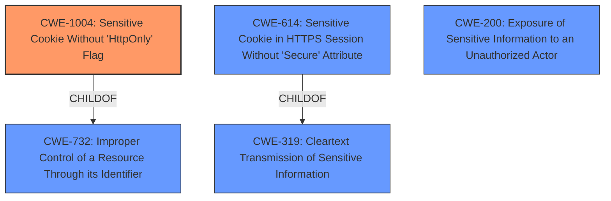

# Raw Analyzer Response for CVE-2021-20355

# Summary
| CWE ID    | CWE Name                                              | Confidence | CWE Abstraction Level | CWE Vulnerability Mapping Label | CWE-Vulnerability Mapping Notes |
| --------- | ----------------------------------------------------- | ---------- | ----------------------- | ------------------------------- | ----------------------------- |
| CWE-1004  | Sensitive Cookie Without 'HttpOnly' Flag            | 0.9        | Variant                 | Allowed                         | Primary CWE                   |
| CWE-319   | Cleartext Transmission of Sensitive Information       | 0.7        | Base                    | Allowed                         | Secondary Candidate           |
| CWE-200   | Exposure of Sensitive Information to an Unauthorized Actor | 0.5        | Class                    | Discouraged                      | Secondary Candidate           |

## Evidence and Confidence

*   **Confidence Score:** 0.9
*   **Evidence Strength:** HIGH

## Relationship Analysis
The primary CWE selected is CWE-1004, which is a variant of CWE-732 (Improper Control of a Resource Through its Identifier). CWE-1004 is more specific because it directly addresses the **failure to set the HTTPOnly flag** for sensitive cookies. CWE-319 (Cleartext Transmission of Sensitive Information) is a parent of CWE-614 (Sensitive Cookie in HTTPS Session Without 'Secure' Attribute). The relationships helped narrow down the specific weakness related to cookie security.

## Vulnerability Chain
The vulnerability chain starts with the **failure to set the HTTPOnly flag** (CWE-1004), which allows a remote attacker to potentially execute local scripts to access the cookie(s) and transmit them to another site, leading to unauthorized access. The final impact is sensitive information exposure (CWE-200).
  - Root Cause: **Failure to set the HTTPOnly flag** (CWE-1004)
  - Weakness: Allows local scripts to access the cookie(s)
  - Impact: Potential transmission of cookie data to another site, leading to unauthorized access (CWE-200).

## Summary of Analysis
The initial analysis focused on the **root cause: failure to set the HTTPOnly flag** on cookies. The retriever results and similar CVE descriptions strongly suggested CWE-1004 as the primary candidate. The vulnerability description explicitly states that the **failure to set the HTTPOnly flag** allows a remote attacker to obtain sensitive information.

The evidence is clear from the "Vulnerability Description Key Phrases" and "CVE Reference Links Content Summary" sections, which both highlight the lack of the HTTPOnly flag as the **root cause**.

"Root cause of vulnerability: The Jazz Team Server is vulnerable to cross-site scripting due to the lack of the HttpOnly flag on cookies."
"Weaknesses/vulnerabilities present: The vulnerability lies in the **failure to set the HttpOnly flag** on cookies, which allows local scripts to access the cookie(s)."

CWE-1004 is at the Variant level of abstraction, which is the preferred level for root cause analysis.

CWE-319 was considered because cookies are transmitted without proper protection, but CWE-1004 more precisely identifies the **failure to set the HTTPOnly flag**. CWE-200 was also considered, but it represents the impact (exposure of sensitive information) rather than the root cause.

Relevant CWE Information:

# Enhanced Context (25 CWEs)

## CWE-538: Insertion of Sensitive Information into Externally-Accessible File or Directory
**Abstraction Level**: Base
**Similarity Score**: 0.77
**Source**: dense

**Description**:
The product places sensitive information into files or directories that are accessible to actors who are allowed to have access to the files, but not to the sensitive information.

**Mapping Guidance**:
- Usage: Allowed
- Rationale: This CWE entry is at the Base level of abstraction, which is a preferred level of abstraction for mapping to the root causes of vulnerabilities.

## CWE-226: Sensitive Information in Resource Not Removed Before Reuse
**Abstraction Level**: Base
**Similarity Score**: 0.76
**Source**: dense

**Description**:
The product releases a resource such as memory or a file so that it can be made available for reuse, but it does not clear or "zeroize" the information contained in the resource before the product performs a critical state transition or makes the resource available for reuse by other entities.

**Mapping Guidance**:
- Usage: Allowed
- Rationale: This CWE entry is at the Base level of abstraction, which is a preferred level of abstraction for mapping to the root causes of vulnerabilities.

## CWE-668: Exposure of Resource to Wrong Sphere
**Abstraction Level**: Class
**Similarity Score**: 0.76
**Source**: dense

**Description**:
The product exposes a resource to the wrong control sphere, providing unintended actors with inappropriate access to the resource.

**Mapping Guidance**:
- Usage: Discouraged
- Rationale: CWE-668 is high-level and is often misused as a catch-all when lower-level CWE IDs might be applicable. It is sometimes used for low-information vulnerability reports [REF-1287]. It is a level-1 Class (i.e., a child of a Pillar). It is not useful for trend analysis.

## CWE-807: Reliance on Untrusted Inputs in a Security Decision
**Abstraction Level**: Base
**Similarity Score**: 0.76
**Source**: dense

**Description**:
The product uses a protection mechanism that relies on the existence or values of an input, but the input can be modified by an untrusted actor in a way that bypasses the protection mechanism.

**Mapping Guidance**:
- Usage: Allowed
- Rationale: This CWE entry is at the Base level of abstraction, which is a preferred level of abstraction for mapping to the root causes of vulnerabilities.

## CWE-41: Improper Resolution of Path Equivalence
**Abstraction Level**: Base
**Similarity Score**: 0.75
**Source**: dense

**Description**:
The product is vulnerable to file system contents disclosure through path equivalence. Path equivalence involves the use of special characters in file and directory names. The associated manipulations are intended to generate multiple names for the same object.

**Mapping Guidance**:
- Usage: Allowed
- Rationale: This CWE entry is at the Base level of abstraction, which is a preferred level of abstraction for mapping to the root causes of vulnerabilities.

## CWE-319: Cleartext Transmission of Sensitive Information
**Abstraction Level**: Base
**Similarity Score**: 0.75
**Source**: dense

**Description**:
The product transmits sensitive or security-critical data in cleartext in a communication channel that can be sniffed by unauthorized actors.

**Mapping Guidance**:
- Usage: Allowed
- Rationale: This CWE entry is at the Base level of abstraction, which is a preferred level of abstraction for mapping to the root causes of vulnerabilities.

## CWE-312: Cleartext Storage of Sensitive Information
**Abstraction Level**: Base
**Similarity Score**: 0.74
**Source**: dense

**Description**:
The product stores sensitive information in cleartext within a resource that might be accessible to another control sphere.

**Mapping Guidance**:
- Usage: Allowed
- Rationale: This CWE entry is at the Base level of abstraction, which is a preferred level of abstraction for mapping to the root causes of vulnerabilities.

## CWE-212: Improper Removal of Sensitive Information Before Storage or Transfer
**Abstraction Level**: Base
**Similarity Score**: 0.74
**Source**: dense

**Description**:
The product stores, transfers, or shares a resource that contains sensitive information, but it does not properly remove that information before the product makes the resource available to unauthorized actors.

**Mapping Guidance**:
- Usage: Allowed
- Rationale: This CWE entry is at the Base level of abstraction, which is a preferred level of abstraction for mapping to the root causes of vulnerabilities.

## CWE-497: Exposure of Sensitive System Information to an Unauthorized Control Sphere
**Abstraction Level**: Base
**Similarity Score**: 0.74
**Source**: dense

**Description**:
The product does not properly prevent sensitive system-level information from being accessed by unauthorized actors who do not have the same level of access to the underlying system as the product does.

**