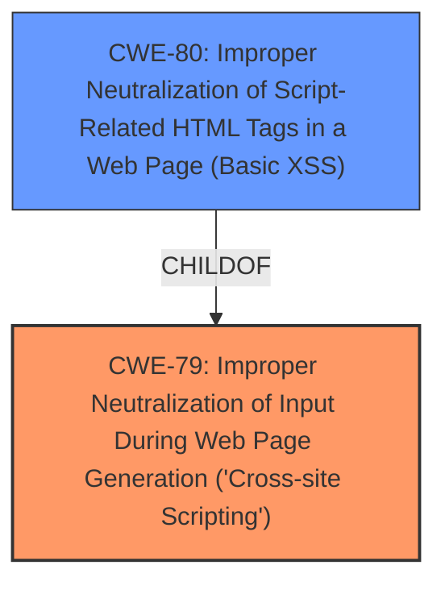

# Analysis Report for CVE-2021-20543

# Vulnerability Analysis Report: CVE-2021-20543

## Description


## Analysis (with Relationship Data)

# Summary
| CWE ID | CWE Name | Confidence | CWE Abstraction Level | CWE Vulnerability Mapping Label | CWE-Vulnerability Mapping Notes |
|---|---|---|---|---|---|
| CWE-79 | Improper Neutralization of Input During Web Page Generation ('Cross-site Scripting') | 1.0 | Base | Allowed | Primary CWE |
| CWE-80 | Improper Neutralization of Script-Related HTML Tags in a Web Page (Basic XSS) | 0.7 | Variant | Allowed | Secondary Candidate |

## Evidence and Confidence

*   **Confidence Score:** 0.9
*   **Evidence Strength:** HIGH

## Relationship Analysis
The primary CWE selected is CWE-79, which is a Base level CWE. CWE-80, a Variant of CWE-79, was also considered as a secondary candidate. This relationship indicates that CWE-80 is a more specific type of Cross-Site Scripting (XSS). The choice of CWE-79 as primary reflects the general nature of the vulnerability description, while CWE-80 is a strong but less certain secondary candidate due to the mention of HTML tags.



## Vulnerability Chain
The vulnerability chain starts with the Jazz Team Server allowing administrators to upload custom process templates. These templates can contain custom HTML or JavaScript code. The server then fails to properly handle user-supplied data within these templates, which leads to the **HTML injection** vulnerability. This allows an attacker to inject malicious HTML code, which then gets executed in the victim's web browser within the security context of the hosting site.

## Summary of Analysis
The initial analysis clearly points to an **HTML injection** vulnerability, which aligns with CWE-79 (Improper Neutralization of Input During Web Page Generation ('Cross-site Scripting')). The "CVE Reference Links Content Summary" section supports this by stating that the server **does not properly handle user-supplied data** within process templates, leading to the injection.

The retriever results also strongly suggest CWE-79 as the primary candidate, with a score of 1.0 based on alternate terms. The vulnerability description uses the phrase "**HTML injection**" which is an alternative term for XSS. The relationship analysis shows that CWE-79 is a base-level CWE, which is preferred for mapping root causes.

CWE-80 (Improper Neutralization of Script-Related HTML Tags in a Web Page (Basic XSS)) was considered because the vulnerability involves **HTML injection**, but CWE-79 is a more general case that covers various forms of XSS, making it a better fit as the primary CWE. The description doesn't specifically limit the injection to script-related HTML tags.

The decision to select CWE-79 is based on the evidence from the vulnerability description, the retriever results, and the CWE specifications. The confidence level is high because the description directly mentions **HTML injection**, and the root cause involves **improper handling of user-supplied data**, aligning with the characteristics of CWE-79.

Relevant CWE Information:

# Enhanced Context (25 CWEs)

## CWE-1289: Improper Validation of Unsafe Equivalence in Input
**Abstraction Level**: Base
**Similarity Score**: 0.78
**Source**: dense

**Description**:
The product receives an input value that is used as a resource identifier or other type of reference, but it does not validate or incorrectly validates that the input is equivalent to a potentially-unsafe value.

**Mapping Guidance**:
- Usage: Allowed
- Rationale: This CWE entry is at the Base level of abstraction, which is a preferred level of abstraction for mapping to the root causes of vulnerabilities.

This CWE doesn't directly apply because the core issue isn't about validating equivalence, but rather about neutralizing input to prevent injection.

## CWE-80: Improper Neutralization of Script-Related HTML Tags in a Web Page (Basic XSS)
**Abstraction Level**: Variant
**Similarity Score**: 0.78
**Source**: dense

**Description**:
The product receives input from an upstream component, but it does not neutralize or incorrectly neutralizes special characters such as "<", ">", and "&" that could be interpreted as web-scripting elements when they are sent to a downstream component that processes web pages.

**Mapping Guidance**:
- Usage: Allowed
- Rationale: This CWE entry is at the Variant level of abstraction, which is a preferred level of abstraction for mapping to the root causes of vulnerabilities.

CWE-80 is a strong secondary candidate because the vulnerability is explicitly described as **HTML injection**, and this CWE specifically addresses the improper handling of script-related HTML tags. However, the description of the vulnerability does not explicitly say that the injection is limited to script-related tags and therefore CWE-79 is a more appropriate primary CWE.

## CWE-74: Improper Neutralization of Special Elements in Output Used by a Downstream Component ('Injection')
**Abstraction Level**: Class
**Similarity Score**: 0.78
**Source**: dense

**Description**:
The product constructs all or part of a command, data structure, or record using externally-influenced input from an upstream component, but it does not neutralize or incorrectly neutralizes special elements that could modify how it is parsed or interpreted when it is sent to a downstream component.

**Mapping Guidance**:
- Usage: Discouraged
- Rationale: CWE-74 is high-level and often misused when lower-level weaknesses are more appropriate.

CWE-74 is too general and is discouraged. CWE-79 provides a more specific description of the XSS vulnerability.

## CWE-917: Improper Neutralization of Special Elements used in an Expression Language Statement ('Expression Language Injection')
**Abstraction Level**: Base
**Similarity Score**: 0.77
**Source**: dense

**Description**:
The product constructs all or part of an expression language (EL) statement in a framework such as a Java Server Page (JSP) using externally-influenced input from an upstream component, but it does not neutralize or incorrectly neutralizes special elements that could modify the intended EL statement before it is executed.

**Mapping Guidance**:
- Usage: Allowed
- Rationale: This CWE entry is at the Base level of abstraction, which is a preferred level of abstraction for mapping to the root causes of vulnerabilities.

This CWE is not appropriate because the vulnerability isn't specifically related to Expression Language injection.

## CWE-1236: Improper Neutralization of Formula Elements in a CSV File
**Abstraction Level**: Base
**Similarity Score**: 0.77
**Source**: dense

**Description**:
The product saves user-provided information into a Comma-Separated Value (CSV) file, but it does not neutralize or incorrectly neutralizes special elements that could be interpreted as a command when the file is opened by a spreadsheet product.

**Mapping Guidance**:
- Usage: Allowed
- Rationale: This CWE entry is at the Base level of abstraction, which is a preferred level of abstraction for mapping to the root causes of vulnerabilities.

This CWE is not relevant because the vulnerability doesn't involve CSV file generation.

## CWE-138: Improper Neutralization of Special Elements
**Abstraction Level**: Class
**Similarity Score**: 0.76
**Source**: dense

**Description**:
The product receives input from an upstream component, but it does not neutralize or incorrectly neutralizes special elements that could be interpreted as control elements or syntactic markers when they are sent to a downstream component.

**Mapping Guidance**:
- Usage: Discouraged
- Rationale: This CWE entry is a level-1 Class (i.e., a child of a Pillar). It might have lower-level children that would be more appropriate

This CWE is too general. CWE-79 provides a more specific description of the XSS vulnerability.

## CWE-184: Incomplete List of Disallowed Inputs
**Abstraction Level**: Base
**Similarity Score**: 0.76
**Source**: dense

**Description**:
The product implements a protection mechanism that relies on a list of inputs (or properties of inputs) that are not allowed by policy or otherwise require other action to neutralize before additional processing takes place, but the list is incomplete.

**Mapping Guidance**:
- Usage: Allowed
- Rationale: This CWE entry is at the Base level of abstraction, which is a preferred level of abstraction for mapping to the root causes of vulnerabilities.

This CWE doesn't fit because the issue isn't about an incomplete list of disallowed inputs, but rather the **improper handling of user-supplied data** in general.

## CWE-807: Reliance on Untrusted Inputs in a Security Decision
**Abstraction Level**: Base
**Similarity Score**: 0.76
**Source**: dense

**Description**:
The product uses a protection mechanism that relies on the existence or values of an input, but the input can be modified by an untrusted actor in a way that bypasses the protection mechanism.


## CWE Relationship Analysis

Current CWEs represent these abstraction levels: .


### Vulnerability Chain Analysis

**Chain starting from CWE-80:**
- 80 (Improper Neutralization of Script-Related HTML Tags in a Web Page (Basic XSS)) - ROOT


**Chain starting from CWE-184:**
- 184 (Incomplete List of Disallowed Inputs) - ROOT


### CWE Relationship Diagram

```mermaid
graph TD
    classDef primary fill:#f96,stroke:#333,stroke-width:2px
    classDef secondary fill:#69f,stroke:#333
    classDef tertiary fill:#9e9,stroke:#333
```


*Report generated on 2025-03-30 11:11:58*
