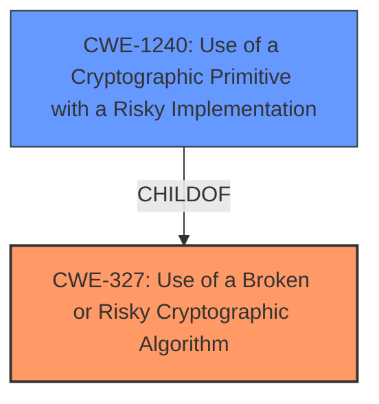

# Analysis Report for CVE-2021-20566

# Vulnerability Analysis Report: CVE-2021-20566

## Description


## Analysis (with Relationship Data)

# Summary
| CWE ID | CWE Name | Confidence | CWE Abstraction Level | CWE Vulnerability Mapping Label | CWE-Vulnerability Mapping Notes |
|---|---|---|---|---|---|
| CWE-327 | Use of a Broken or Risky Cryptographic Algorithm | 0.9 | Class | Allowed-with-Review | Primary CWE. The product uses weaker than expected cryptographic algorithms. |
| CWE-1240 | Use of a Cryptographic Primitive with a Risky Implementation | 0.8 | Base | Allowed | Secondary CWE. The Resilient platform supports TLS 1.2 ciphers that are not enabled for Perfect Forward Secrecy (PFS). |

## Evidence and Confidence

*   **Confidence Score:** 0.9
*   **Evidence Strength:** HIGH

## Relationship Analysis
The primary CWE is CWE-327, which is a Class-level CWE. It has a child CWE, CWE-1240, which is a Base-level CWE and provides more specific details about the usage of risky cryptographic implementation. The vulnerability description indicates the use of weaker than expected cryptographic algorithms, and the CVE reference links confirm the use of TLS 1.2 ciphers without Perfect Forward Secrecy (PFS), making CWE-1240 a relevant secondary CWE.



## Vulnerability Chain
The vulnerability chain starts with the **use of weak cryptographic algorithms** (CWE-327), specifically the use of TLS 1.2 ciphers without Perfect Forward Secrecy (PFS) (CWE-1240). This **weakness** allows an attacker to decrypt highly sensitive information if the attacker records encrypted traffic and later obtains the server's private key.
  - **Root Cause:** Use of weak cryptographic algorithms (CWE-327).
  - **Weakness:** Use of TLS 1.2 ciphers without Perfect Forward Secrecy (PFS) (CWE-1240).
  - **Impact:** An attacker who has recorded encrypted traffic and later obtains the server's key could decrypt highly sensitive information.

## Summary of Analysis
The analysis is based on the provided vulnerability description and the CVE reference links content summary. The key phrases from the vulnerability description, especially "**weak cryptographic algorithms**", directly point to CWE-327. The CVE reference links confirm the use of TLS 1.2 ciphers without Perfect Forward Secrecy (PFS), further supporting the selection of CWE-1240. The relationship analysis shows that CWE-1240 is a child of CWE-327, providing a more specific classification of the vulnerability.

The retriever results also suggest CWE-327 as the top candidate, further validating the selection. Other CWEs like CWE-326 (Inadequate Encryption Strength) and CWE-916 (Use of Password Hash With Insufficient Computational Effort) were considered but deemed less relevant as the core issue is the use of a broken or risky cryptographic algorithm rather than inadequate encryption strength or password hashing issues.

The selected CWEs are at the optimal level of specificity. CWE-327 represents the general class of vulnerability, while CWE-1240 provides more specific details about the risky implementation of cryptographic primitives.

Relevant CWE Information:
*   **CWE-327: Use of a Broken or Risky Cryptographic Algorithm**
    *   **Description:** The product uses a broken or risky cryptographic algorithm or protocol.
    *   The **Vulnerability Description Key Phrases** includes: **rootcause:** **weak cryptographic algorithms**
*   **CWE-1240: Use of a Cryptographic Primitive with a Risky Implementation**
    *   **Description**: To fulfill the need for a cryptographic primitive, the product implements a cryptographic algorithm using a non-standard, unproven, or disallowed/non-compliant cryptographic implementation.
    *   The **CVE Reference Links Content Summary** includes: **Weaknesses/vulnerabilities present**: Use of TLS 1.2 ciphers without Perfect Forward Secrecy (PFS).


## CWE Relationship Analysis

Current CWEs represent these abstraction levels: .


### Vulnerability Chain Analysis

**Chain starting from CWE-916:**
- 916 (Use of Password Hash With Insufficient Computational Effort) - ROOT


**Chain starting from CWE-327:**
- 327 (Use of a Broken or Risky Cryptographic Algorithm) - ROOT


### CWE Relationship Diagram

```mermaid
graph TD
    classDef primary fill:#f96,stroke:#333,stroke-width:2px
    classDef secondary fill:#69f,stroke:#333
    classDef tertiary fill:#9e9,stroke:#333
```


*Report generated on 2025-03-30 17:45:43*
