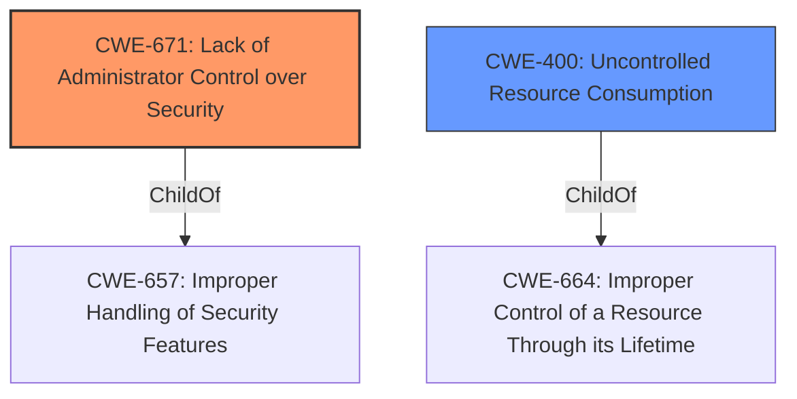

# Raw Analyzer Response for CVE-2021-20612

# Summary
| CWE ID | CWE Name | Confidence | CWE Abstraction Level | CWE Vulnerability Mapping Label | CWE-Vulnerability Mapping Notes |
|---|---|---|---|---|---|
| CWE-671 | Lack of Administrator Control over Security | 1.0 | Class | Primary | Allowed-with-Review |
| CWE-400 | Uncontrolled Resource Consumption | 0.7 | Class | Secondary | Discouraged |

## Evidence and Confidence

*   **Confidence Score:** 0.85
*   **Evidence Strength:** HIGH

## Relationship Analysis
The primary relationship that influenced the CWE selection was the direct match of the **root cause** to CWE-671. The relationship between CWE-400 and CWE-664 (its parent) was considered, but CWE-400 was deemed secondary as it describes a potential impact rather than the direct **root cause**. The hierarchy helps refine the selection, but the direct evidence is stronger for CWE-671.

## Vulnerability Chain
The vulnerability chain starts with the **lack of administrator control over security** (CWE-671), leading to an unnecessary opening of TCP port and the potential for a remote attacker to send specially crafted packets. This can then result in a denial-of-service (DoS) condition (CWE-400).

## Summary of Analysis
The initial analysis focused on identifying the **root cause** and potential impacts of the vulnerability. The vulnerability description clearly states the **root cause** as the "**Lack of administrator control over security**".

The CVE Reference Links Content Summary also states:
"**Root cause of vulnerability**: The vulnerability is due to a lack of administrative controls in the affected Mitsubishi Electric MELSEC-F Series devices. This allows attackers to send specially crafted packets."
"**Weaknesses/vulnerabilities present**: Lack of Administrator Control Over Security (CWE-671)"
"**Impact of exploitation**: Successful exploitation can lead to a denial-of-service (DoS) condition in the communication function of the product or other unspecified effects."

CWE-671 aligns perfectly with this description, as it addresses situations where the administrator lacks the ability to manage security-related decisions. The potential DoS condition is a downstream effect, making CWE-400 a secondary consideration.

The decision to prioritize CWE-671 is strongly based on the direct evidence from the vulnerability description and the CVE Reference Links Content Summary. While other CWEs like CWE-400 were considered, they describe potential impacts rather than the **root cause** itself. The selection of CWE-671 ensures that the classification focuses on the fundamental **weakness** that allows the vulnerability to occur, aligning with best practices for CWE mapping.

Relevant CWE Information:

# Enhanced Context (25 CWEs)

## CWE-671: Lack of Administrator Control over Security
**Abstraction:** Class
**Status:** Draft

### Description
The product uses security features in a way that prevents the product's administrator from tailoring security settings to reflect the environment in which the product is being used. This introduces resultant weaknesses or prevents it from operating at a level of security that is desired by the administrator.

### Extended Description
If the product's administrator does not have the ability to manage security-related decisions at all times, then protecting the product from outside threats - including the product's developer - can become impossible. For example, a hard-coded account name and password cannot be changed by the administrator, thus exposing that product to attacks that the administrator can not prevent.

### Alternative Terms
None

### Relationships
ChildOf -> CWE-657

### Mapping Guidance
**Usage:** Allowed-with-Review
**Rationale:** This CWE entry is a Class and might have Base-level children that would be more appropriate
**Comments:** Examine children of this entry to see if there is a better fit
**Reasons:**
- Abstraction

### Observed Examples
- **CVE-2022-29953:** Condition Monitor firmware has a maintenance interface with hard-coded credentials
- **CVE-2000-0127:** GUI configuration tool does not enable a security option when a checkbox is selected, although that option is honored when manually set in the configuration file.

**Technical Explanation:**
The vulnerability description states "**Lack of administrator control over security**," which directly aligns with CWE-671. The MELSEC-F series devices do not allow administrators to properly configure security settings, leading to an unnecessary opening of TCP ports.
**Security Implications:**
This **weakness** allows remote unauthenticated attackers to send specially crafted packets, leading to a denial-of-service (DoS) condition.
**Relationship Analysis:**
CWE-671 is a child of CWE-657 (Improper Handling of Security Features). While CWE-657 is a broader category, CWE-671 is more specific and accurately captures the **root cause**.
**Mapping Guidance Influence:**
The MITRE mapping guidance suggests that this is a Class and that a more Base-level child might be more appropriate, however the **root cause** is the lack of control, so this is the best fit.
**Justification:**
CWE-671 is the primary **weakness** because it directly addresses the **root cause** of the vulnerability. The other CWEs are secondary impacts.
**Confidence:** 1.0

## CWE-400: Uncontrolled Resource Consumption
**Abstraction:** Class
**Status:** Draft

### Description
The product does not properly control the allocation and maintenance of a limited resource, thereby enabling an actor to influence the amount of resources consumed, eventually leading to the exhaustion of available resources.

### Extended Description
Limited resources include memory, file system storage, database connection pool entries, and CPU. If an attacker can trigger the allocation of these limited resources, but the number or size of the resources is not controlled, then the attacker could cause a denial of service that consumes all available resources. This would prevent valid users from accessing the product, and it could potentially have an impact on the surrounding environment. For example, a memory exhaustion attack against an application could slow down the application as well as its host operating system.

There are at least three distinct scenarios which can commonly lead to resource exhaustion:

  - Lack of throttling for the number of allocated resources
  - Losing all references to a resource before reaching the shutdown stage
  - Not closing/returning a resource after processing

Resource exhaustion problems are often result due to an incorrect implementation of the following situations:

  - Error conditions and other exceptional circumstances.
  - Confusion over which part of the program is responsible for releasing the resource.

### Alternative Terms
Resource Exhaustion

### Relationships
ChildOf -> CWE-664

### Mapping Guidance
**Usage:** Discouraged
**Rationale:** CWE-400 is intended for incorrect behaviors in which the product is expected to track and restrict how many resources it consumes, but CWE-400 is often misused because it is conflated with the "technical impact" of vulnerabilities in which resource consumption occurs. It is sometimes used for low-information vulnerability reports. It is a level-1 Class (i.e., a child of a Pillar).
**Comments:** Closely analyze the specific mistake that is causing resource consumption, and perform a CWE mapping for that mistake. Consider children/descendants such as CWE-770: Allocation of Resources Without Limits or Throttling, CWE-771: Missing Reference to Active Allocated Resource, CWE-410: Insufficient Resource Pool, CWE-772: Missing Release of Resource after Effective Lifetime, CWE-834: Excessive Iteration, CWE-405: Asymmetric Resource Consumption (Amplification), and others.
**Reasons:**
- Frequent Misuse

### Additional Notes
**[Maintenance]** "Resource consumption" could be interpreted as a consequence instead of an insecure behavior, so this entry is being considered for modification. It appears to be referenced too frequently when more precise mappings are available. Some of its children, such as CWE-771, might be better considered as a chain.

**[Theoretical]** Vulnerability theory is largely about how behaviors and resources interact. "Resource exhaustion" can be regarded as either a consequence or an attack, depending on the perspective. This entry is an attempt to reflect the underlying weaknesses that enable these attacks (or consequences) to take place.

**[Other]** 

Database queries that take a long time to process are good DoS targets. An attacker would have to write a few lines of Perl code to generate enough traffic to exceed the site's ability to keep up. This would effectively prevent authorized users from using the site at all. Resources can be exploited simply by ensuring that the target machine must do much more work and consume