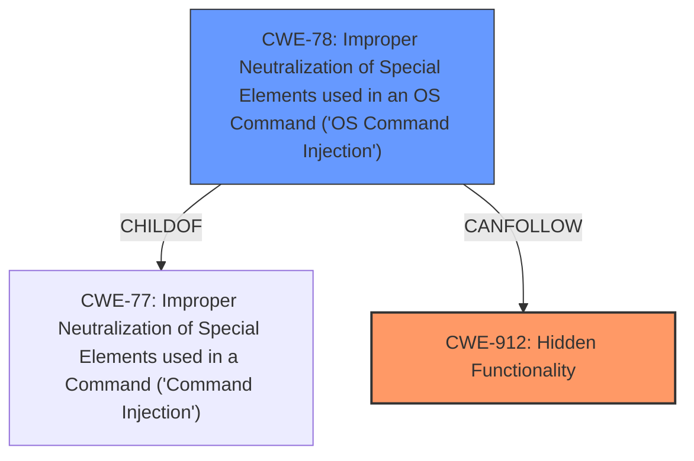

# Analysis for CVE-2021-20716

# Summary
| CWE ID | CWE Name | Confidence | CWE Abstraction Level | CWE Vulnerability Mapping Label | CWE-Vulnerability Mapping Notes |
|---|---|---|---|---|---|
| CWE-912 | Hidden Functionality | 0.9 | Class | Allowed-with-Review | Primary CWE |
| CWE-78 | Improper Neutralization of Special Elements used in an OS Command ('OS Command Injection') | 0.8 | Base | Allowed | Secondary Candidate |

## Evidence and Confidence

*   **Confidence Score:** 0.85
*   **Evidence Strength:** MEDIUM

## Relationship Analysis
The primary weakness is the presence of **Hidden Functionality (CWE-912)**. This hidden functionality then leads to **OS Command Injection (CWE-78)**. CWE-912 is a Class-level CWE, while CWE-78 is a Base-level CWE, indicating a more specific flaw. CWE-78 is a child of CWE-77, which is a more general Command Injection weakness.

## Vulnerability Chain
The chain of events is:
1.  Presence of **Hidden Functionality (CWE-912)** within the Buffalo network device firmware.
2.  This **hidden functionality** allows a remote attacker to enable debug options.
3.  Enabling debug options leads to **Improper Neutralization of Special Elements used in an OS Command ('OS Command Injection') (CWE-78)**.
4.  **OS Command Injection** allows the attacker to execute arbitrary code or OS commands, change the configuration, and cause a denial of service (DoS) condition.

## Summary of Analysis
Initially, the primary focus was on **Improper Neutralization of Special Elements used in an OS Command (CWE-78)** due to the description mentioning "execute arbitrary code or OS commands". However, the CVE Reference Links Content Summary indicates that the root cause is **Hidden Functionality (CWE-912)**: "Hidden functionality (CWE-912) exists within multiple Buffalo network devices that allows an attacker to enable debug options." The **command injection** (CWE-78) is a consequence of exploiting the hidden functionality.

The description clearly indicates the presence of **Hidden Functionality**, which allows enabling debug options, and this, in turn, leads to the ability to execute arbitrary code and commands. The presence of **command injection** is listed in the Vulnerability Description Key Phrases.

The evidence supporting **CWE-912** is in the "CVE Reference Links Content Summary" section:
*"Root cause of vulnerability: Hidden functionality (CWE-912) exists within multiple Buffalo network devices that allows an attacker to enable debug options."*

The evidence supporting **CWE-78** is the vulnerability description:
*"allows a remote attacker to enable the debug option and to execute arbitrary code or OS commands, change the configuration, and cause a denial of service (DoS) condition."* and "command injection".

Therefore, the assessment is based on provided evidence, and the graph relationships show that **CWE-78** can follow **CWE-912**. The selected CWEs are at the optimal level of specificity because **CWE-912** identifies the root cause (hidden functionality), while **CWE-78** describes the exploitation technique (command injection) enabled by the hidden functionality.

# Relevant CWE Information:

## CWE-807: Reliance on Untrusted Inputs in a Security Decision
**Abstraction Level**: Base
**Similarity Score**: 0.77
**Source**: dense

**Description**:
The product uses a protection mechanism that relies on the existence or values of an input, but the input can be modified by an untrusted actor in a way that bypasses the protection mechanism.
**Not Selected**: The vulnerability isn't directly related to a protection mechanism being bypassed due to reliance on untrusted inputs.

## CWE-303: Incorrect Implementation of Authentication Algorithm
**Abstraction Level**: Base
**Similarity Score**: 0.76
**Source**: dense

**Description**:
The requirements for the product dictate the use of an established authentication algorithm, but the implementation of the algorithm is incorrect.
**Not Selected**: Authentication is not explicitly mentioned as the primary weakness.

## CWE-345: Insufficient Verification of Data Authenticity
**Abstraction Level**: Class
**Similarity Score**: 0.76
**Source**: dense

**Description**:
The product does not sufficiently verify the origin or authenticity of data, in a way that causes it to accept invalid data.
**Not Selected**: Data authenticity is not a core element of this vulnerability.

## CWE-668: Exposure of Resource to Wrong Sphere
**Abstraction Level**: Class
**Similarity Score**: 0.75
**Source**: dense

**Description**:
The product exposes a resource to the wrong control sphere, providing unintended actors with inappropriate access to the resource.
**Not Selected**: While technically the debug option could be seen as a resource, CWE-912 and CWE-78 are more precise.

## CWE-1299: Missing Protection Mechanism for Alternate Hardware Interface
**Abstraction Level**: Base
**Similarity Score**: 0.75
**Source**: dense

**Description**:
The lack of protections on alternate paths to access control-protected assets (such as unprotected shadow registers and other external facing unguarded interfaces) allows an attacker to bypass existing protections to the asset that are only performed against the primary path.
**Not Selected**: This CWE focuses on hardware interfaces, which is not the case here.

## CWE-41: Improper Resolution of Path Equivalence
**Abstraction Level**: Base
**Similarity Score**: 0.75
**Source**: dense

**Description**:
The product is vulnerable to file system contents disclosure through path equivalence. Path equivalence involves the use of special characters in file and directory names. The associated manipulations are intended to generate multiple names for the same object.
**Not Selected**: Path equivalence is not a factor in this vulnerability.

## CWE-74: Improper Neutralization of Special Elements in Output Used by a Downstream Component ('Injection')
**Abstraction Level**: Class
**Similarity Score**: 0.75
**Source**: dense

**Description**:
The product constructs all or part of a command, data structure, or record using externally-influenced input from an upstream component, but it does not neutralize or incorrectly neutralizes special elements that could modify how it is parsed or interpreted when it is sent to a downstream component.
**Not Selected**: CWE-78 is a more specific and appropriate option.

## CWE-1391: Use of Weak Credentials
**Abstraction Level**: Class
**Similarity Score**: 0.75
**Source**: dense

**Description**:
The product uses weak credentials (such as a default key or hard-coded password) that can be calculated, derived, reused, or guessed by an attacker.
**Not Selected**: Weak credentials are not explicitly mentioned.

## CWE-184: Incomplete List of Disallowed Inputs
**Abstraction Level**: Base
**Similarity Score**: 0.75
**Source**: dense

**Description**:
The product implements a protection mechanism that relies on a list of inputs (or properties of inputs) that are not allowed by policy or otherwise require other action to neutralize before additional processing takes place, but the list is incomplete.
**Not Selected**: While this could be a contributing factor, it is not the primary weakness.

## CWE-755: Improper Handling of Exceptional Conditions
**Abstraction Level**: Class
**Similarity Score**: 0.75
**Source**: dense

**Description**:
The product does not handle or incorrectly handles an exceptional condition.
**Not Selected**: Exceptional conditions are not relevant here.

## CWE-912: Hidden Functionality
**Abstraction Level**: Class
**Similarity Score**: 7205.84
**Source**: sparse

**Description**:
The product contains functionality that is not documented, not part of the specification, and not accessible through an interface or command sequence that is obvious to the product's users or administrators.
**Selected**: This is the root cause, as the hidden debug functionality enables the vulnerability.

## CWE-184: Incomplete List of Disallowed Inputs
**Abstraction Level**: Base
**Similarity Score**: 6808.26
**Source**: sparse

**Description**:
The product implements a protection mechanism that relies on a list of inputs (or properties of inputs) that are not allowed by policy or otherwise require other action to neutralize before additional processing takes place, but the list is incomplete.
**Not Selected**: See above explanation.

## CWE-88: Improper Neutralization of Argument Delimiters in a