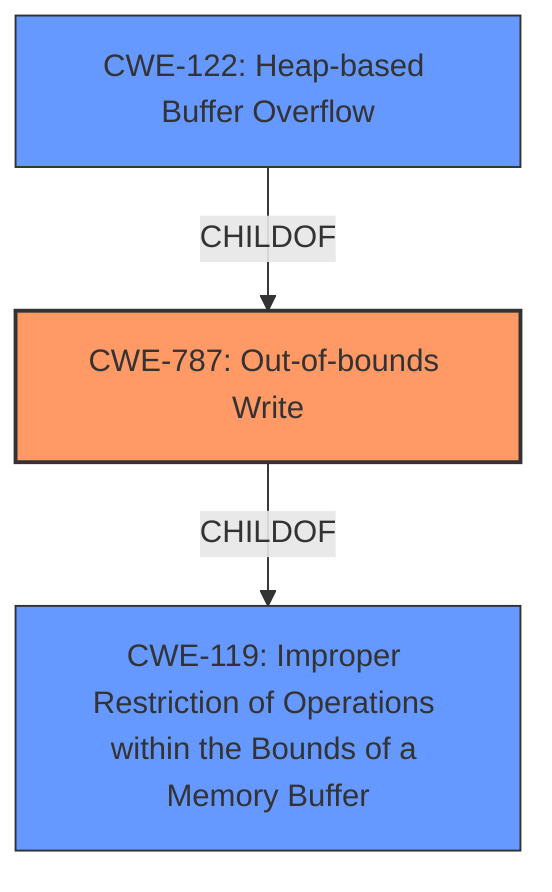

# Raw Analyzer Response for CVE-2021-21017

# Summary
| CWE ID  | CWE Name                                                                | Confidence | CWE Abstraction Level | CWE Vulnerability Mapping Label | CWE-Vulnerability Mapping Notes |
| :-------- | :---------------------------------------------------------------------- | :---------- | :---------------------- | :------------------------------ | :------------------------------ |
| CWE-787 | Out-of-bounds Write                                                     | 0.9         | Base                    | Primary                           | Allowed                       |
| CWE-122 | Heap-based Buffer Overflow                                              | 0.8         | Variant                 | Secondary                         | Allowed                       |
| CWE-119 | Improper Restriction of Operations within the Bounds of a Memory Buffer | 0.6         | Class                   | Secondary                         | Discouraged                   |

## Evidence and Confidence

*   **Confidence Score:** 0.9
*   **Evidence Strength:** HIGH

## Relationship Analysis
The primary CWE is CWE-787, which represents the **out-of-bounds write** condition. CWE-122 (Heap-based Buffer Overflow) is a variant of CWE-787, providing more specific context about where the overflow occurs. CWE-119 is a more general class that encompasses various memory buffer errors and is parent to CWE-787. The abstraction levels influenced the selection, favoring the base level (CWE-787) for its balance of specificity and generality.

## Vulnerability Chain
The vulnerability chain starts with the application's **failure to properly restrict write operations within the bounds of a memory buffer (CWE-119)**. This leads to an **out-of-bounds write (CWE-787)**, specifically a **heap-based buffer overflow (CWE-122)**. The final impact is **arbitrary code execution**.

## Summary of Analysis
The analysis is primarily based on the provided vulnerability description and the CVE Reference Links Content Summary. The vulnerability description explicitly states a "**heap-based buffer overflow** vulnerability," which is strong evidence.

The CVE Reference Links Content Summary reinforces this by stating:
-   "**Root cause of vulnerability:** Heap-based buffer overflow."
-   "**Weaknesses/vulnerabilities present:** A heap-based buffer overflow vulnerability exists."

The graph relationships influenced the selection, with CWE-787 chosen as the primary due to its accurate representation of the **out-of-bounds write** condition. CWE-122 is a more specific variant, and CWE-119 is a more general class.

The selected CWEs are at the optimal level of specificity because they directly address the root cause of the vulnerability (CWE-787), provide context (CWE-122), and highlight the general class of memory buffer errors (CWE-119). This multi-faceted approach provides a comprehensive understanding of the vulnerability.

Relevant CWE Information:

# Enhanced Context (25 CWEs)
The following CWEs were identified as potentially relevant to this vulnerability:

## CWE-1289: Improper Validation of Unsafe Equivalence in Input
**Abstraction Level**: Base
**Similarity Score**: 0.75
**Source**: dense

**Description**:
The product receives an input value that is used as a resource identifier or other type of reference, but it does not validate or incorrectly validates that the input is equivalent to a potentially-unsafe value.

**Mapping Guidance**:
- Usage: Allowed
- Rationale: This CWE entry is at the Base level of abstraction, which is a preferred level of abstraction for mapping to the root causes of vulnerabilities.

**Why Not Used:** There is no evidence to suggest that the vulnerability involves improper validation of unsafe equivalence in input. The description focuses on buffer overflows, not input validation.

## CWE-665: Improper Initialization
**Abstraction Level**: Class
**Similarity Score**: 0.74
**Source**: dense

**Description**:
The product does not initialize or incorrectly initializes a resource, which might leave the resource in an unexpected state when it is accessed or used.

**Mapping Guidance**:
- Usage: Discouraged
- Rationale: This CWE entry is a level-1 Class (i.e., a child of a Pillar). It might have lower-level children that would be more appropriate

**Why Not Used:** There is no mention of initialization issues in the vulnerability description. The focus is on buffer overflows, not initialization.

## CWE-457: Use of Uninitialized Variable
**Abstraction Level**: Variant
**Similarity Score**: 0.74
**Source**: dense

**Description**:
The code uses a variable that has not been initialized, leading to unpredictable or unintended results.

**Mapping Guidance**:
- Usage: Allowed
- Rationale: This CWE entry is at the Variant level of abstraction, which is a preferred level of abstraction for mapping to the root causes of vulnerabilities.

**Why Not Used:** There is no evidence to suggest the use of uninitialized variables. The vulnerability is described as a buffer overflow, not an initialization issue.

## CWE-691: Insufficient Control Flow Management
**Abstraction Level**: Pillar
**Similarity Score**: 0.73
**Source**: dense

**Description**:
The code does not sufficiently manage its control flow during execution, creating conditions in which the control flow can be modified in unexpected ways.

**Mapping Guidance**:
- Usage: Discouraged
- Rationale: This CWE entry is extremely high-level, a Pillar. However, classification research is limited for weaknesses of this type, so there can be gaps or organizational difficulties within CWE that force use of this weakness, even at such a high level of abstraction.

**Why Not Used:** This is too high-level and does not specifically address the buffer overflow issue.

## CWE-1419: Incorrect Initialization of Resource
**Abstraction Level**: Class
**Similarity Score**: 0.73
**Source**: dense

**Description**:
The product attempts to initialize a resource but does not correctly do so, which might leave the resource in an unexpected, incorrect, or insecure state when it is accessed.

**Mapping Guidance**:
- Usage: Allowed-with-Review
- Rationale: This CWE entry is a Class and might have Base-level children that would be more appropriate

**Why Not Used:** This is related to initialization issues which is not the focus of the vulnerability.

## CWE-226: Sensitive Information in Resource Not Removed Before Reuse
**Abstraction Level**: Base
**Similarity Score**: 0.73
**Source**: dense

**Description**:
The product releases a resource such as memory or a file so that it can be made available for reuse, but it does not clear or "zeroize" the information contained in the resource before the product performs a critical state transition or makes the resource available for reuse by other entities.

**Mapping Guidance**:
- Usage: Allowed
- Rationale: This CWE entry is at the Base level of abstraction, which is a preferred level of abstraction for mapping to the root causes of vulnerabilities.

**Why Not Used:** This CWE focuses on sensitive information not being removed before resource reuse, which is unrelated to the buffer overflow vulnerability described.

## CWE-1173: Improper Use of Validation Framework
**Abstraction Level**: Base
**Similarity Score**: 0.72
**Source**: dense

**Description**:
The product does not use, or incorrectly uses, an input validation framework that is provided by the source language or an independent library.

**Mapping Guidance**:
- Usage: Allowed
- Rationale: This CWE entry is at the Base level of abstraction, which is a preferred level of abstraction for mapping to the root causes of vulnerabilities.

**Why Not Used:** This CWE relates to improper use of a validation framework, but the provided information doesn't indicate any issues with input validation.

## CWE-404: Improper Resource Shutdown or Release
**Abstraction Level**: Class
**Similarity Score**: 0.72
**Source**: dense

**Description**:
The product does not release or incorrectly releases a resource before it is made available for re-use.

**Mapping Guidance**:
- Usage: Allowed-with-Review
- Rationale: This CWE entry is a Class and might have Base-level children that would be more appropriate

**Why Not Used:** This CWE is about resource shutdown or release, which doesn't align with the heap-based buffer overflow described.

## CWE-664: Improper Control of a Resource Through its Lifetime
**Abstraction Level**: Pillar
**Similarity Score**: 0.72
**Source**: dense

**Description**:
The product does not maintain or incorrectly maintains control over a resource throughout its lifetime of creation, use, and release.

**Mapping