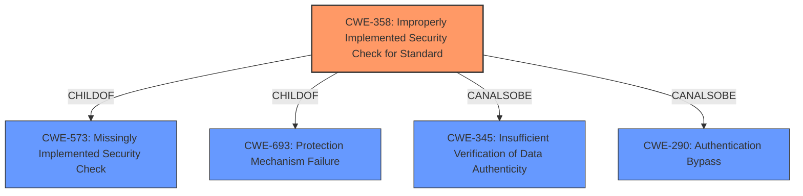

# Analysis Report for CVE-2021-21126

# Vulnerability Analysis Report: CVE-2021-21126

## Description


## Analysis (with Relationship Data)

# Summary
| CWE ID | CWE Name | Confidence | CWE Abstraction Level | CWE Vulnerability Mapping Label | CWE-Vulnerability Mapping Notes |
|---|---|---|---|---|---|
| **CWE-358** | **Improperly Implemented Security Check for Standard** | 0.8 | Base | Allowed | Primary CWE |
| CWE-942 | Permissive Cross-domain Policy with Untrusted Domains | 0.5 | Variant | Allowed | Secondary Candidate |
| CWE-451 | User Interface (UI) Misrepresentation of Critical Information | 0.3 | Class | Allowed-with-Review | Secondary Candidate |

## Evidence and Confidence

*   **Confidence Score:** 0.8
*   **Evidence Strength:** HIGH

## Relationship Analysis
The primary CWE, CWE-358, is a base-level weakness describing **improper implementation of a security check for a standard**. It has child relationships with CWE-573 (Missingly Implemented Security Check) and CWE-693 (Protection Mechanism Failure). It also has peer relationships with CWE-345 (Insufficient Verification of Data Authenticity) and CWE-290 (Authentication Bypass). This structure suggests that the vulnerability may stem from either a completely missing security check or an incorrectly implemented one. The relationship with authentication bypass indicates the potential for attackers to circumvent security measures.



## Vulnerability Chain
The vulnerability chain starts with **insufficient policy enforcement** in Chrome extensions (the root cause). This leads to the ability to bypass site isolation, which is the impact.

## Summary of Analysis
The initial analysis focused on the **insufficient policy enforcement** in Chrome extensions, allowing attackers to bypass site isolation. The evidence provided directly points to a **failure in implementing security policies**.

The vulnerability description states: "**Insufficient policy enforcement in extensions** in Google Chrome prior to 88.0.4324.96 allowed a remote attacker to bypass site isolation via a crafted Chrome Extension." The CVE Reference Links Content Summary reinforces this: "root_cause: **Insufficient policy enforcement in extensions**."

CWE-358 (Improperly Implemented Security Check for Standard) is the most appropriate because it directly addresses the **failure to properly implement security checks**. The term "policy enforcement" aligns well with the concept of a "security check" as defined in CWE-358.

CWE-942 (Permissive Cross-domain Policy with Untrusted Domains) was considered because extensions often deal with cross-domain policies. However, the description is more specific to cross-domain policy files and doesn't directly address the broader issue of **insufficient policy enforcement**. It's a potential contributing factor, but not the root cause.

CWE-451 (User Interface (UI) Misrepresentation of Critical Information) was also considered, but it focuses on UI-related issues, which aren't explicitly mentioned in the vulnerability description.

Therefore, CWE-358 is selected as the primary CWE due to its direct relevance to the **insufficient policy enforcement**, and it is at the optimal level of specificity (Base).

Relevant CWE Information:

# Enhanced Context (25 CWEs)

## CWE-451: User Interface (UI) Misrepresentation of Critical Information
**Abstraction Level**: Class
**Similarity Score**: 0.77
**Source**: dense

**Description**:
The user interface (UI) does not properly represent critical information to the user, allowing the information - or its source - to be obscured or spoofed. This is often a component in phishing attacks.

**Mapping Guidance**:
- Usage: Allowed-with-Review
- Rationale: This CWE entry is a Class and might have Base-level children that would be more appropriate

## CWE-668: Exposure of Resource to Wrong Sphere
**Abstraction Level**: Class
**Similarity Score**: 0.77
**Source**: dense

**Description**:
The product exposes a resource to the wrong control sphere, providing unintended actors with inappropriate access to the resource.

**Mapping Guidance**:
- Usage: Discouraged
- Rationale: CWE-668 is high-level and is often misused as a catch-all when lower-level CWE IDs might be applicable. It is sometimes used for low-information vulnerability reports [REF-1287]. It is a level-1 Class (i.e., a child of a Pillar). It is not useful for trend analysis.

## CWE-667: Improper Locking
**Abstraction Level**: Class
**Similarity Score**: 0.77
**Source**: dense

**Description**:
The product does not properly acquire or release a lock on a resource, leading to unexpected resource state changes and behaviors.

**Mapping Guidance**:
- Usage: Allowed-with-Review
- Rationale: This CWE entry is a Class and might have Base-level children that would be more appropriate

## CWE-41: Improper Resolution of Path Equivalence
**Abstraction Level**: Base
**Similarity Score**: 0.77
**Source**: dense

**Description**:
The product is vulnerable to file system contents disclosure through path equivalence. Path equivalence involves the use of special characters in file and directory names. The associated manipulations are intended to generate multiple names for the same object.

**Mapping Guidance**:
- Usage: Allowed
- Rationale: This CWE entry is at the Base level of abstraction, which is a preferred level of abstraction for mapping to the root causes of vulnerabilities.

## CWE-404: Improper Resource Shutdown or Release
**Abstraction Level**: Class
**Similarity Score**: 0.77
**Source**: dense

**Description**:
The product does not release or incorrectly releases a resource before it is made available for re-use.

**Mapping Guidance**:
- Usage: Allowed-with-Review
- Rationale: This CWE entry is a Class and might have Base-level children that would be more appropriate

## CWE-754: Improper Check for Unusual or Exceptional Conditions
**Abstraction Level**: Class
**Similarity Score**: 0.77
**Source**: dense

**Description**:
The product does not check or incorrectly checks for unusual or exceptional conditions that are not expected to occur frequently during day to day operation of the product.

**Mapping Guidance**:
- Usage: Allowed-with-Review
- Rationale: This CWE entry is a Class and might have Base-level children that would be more appropriate

## CWE-653: Improper Isolation or Compartmentalization
**Abstraction Level**: Class
**Similarity Score**: 0.76
**Source**: dense

**Description**:
The product does not properly compartmentalize or isolate functionality, processes, or resources that require different privilege levels, rights, or permissions.

**Mapping Guidance**:
- Usage: Allowed
- Rationale: This CWE entry is at the Base level of abstraction, which is a preferred level of abstraction for mapping to the root causes of vulnerabilities.

## CWE-59: Improper Link Resolution Before File Access ('Link Following')
**Abstraction Level**: Base
**Similarity Score**: 0.76
**Source**: dense

**Description**:
The product attempts to access a file based on the filename, but it does not properly prevent that filename from identifying a link or shortcut that resolves to an unintended resource.

**Mapping Guidance**:
- Usage: Allowed
- Rationale: This CWE entry is at the Base level of abstraction, which is a preferred level of abstraction for mapping to the root causes of vulnerabilities.

## CWE-1289: Improper Validation of Unsafe Equivalence in Input
**Abstraction Level**: Base
**Similarity Score**: 0.76
**Source**: dense

**Description**:
The product receives an input value that is used as a resource identifier or other type of reference, but it does not validate or incorrectly validates that the input is equivalent to a potentially-unsafe value.

**Mapping Guidance**:
- Usage: Allowed
- Rationale: This CWE entry is at the Base level of abstraction, which is a preferred level of abstraction for mapping to the root causes of vulnerabilities.

## CWE-703: Improper Check or Handling of Exceptional Conditions
**Abstraction Level**: Pillar
**Similarity Score**: 0.76
**Source**: dense

**Description**:
The product does not properly anticipate or handle exceptional conditions that rarely occur during


## CWE Relationship Analysis

Current CWEs represent these abstraction levels: .


### Vulnerability Chain Analysis

**Chain starting from CWE-942:**
- 942 (Permissive Cross-domain Policy with Untrusted Domains) - ROOT


**Chain starting from CWE-693:**
- 693 (Protection Mechanism Failure) - ROOT


### CWE Relationship Diagram

```mermaid
graph TD
    classDef primary fill:#f96,stroke:#333,stroke-width:2px
    classDef secondary fill:#69f,stroke:#333
    classDef tertiary fill:#9e9,stroke:#333
```


*Report generated on 2025-03-30 18:08:09*
