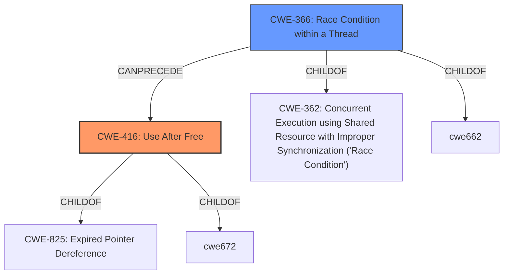

# Enhanced Analysis for CVE-2021-21166

# Summary
| CWE ID | CWE Name | Confidence | CWE Abstraction Level | CWE Vulnerability Mapping Label | CWE-Vulnerability Mapping Notes |
|---|---|---|---|---|---|
| CWE-416 | Use After Free | 0.8 | Variant | Allowed | Primary CWE |
| CWE-366 | Race Condition within a Thread | 0.7 | Base | Allowed | Secondary Candidate |

## Evidence and Confidence

*   **Confidence Score:** 0.8
*   **Evidence Strength:** HIGH

## Relationship Analysis
The primary relationship influencing the CWE selection is the CANPRECEDE relationship, where CWE-366 can precede CWE-416. This indicates that a race condition can lead to a use-after-free vulnerability. This relationship helps frame the vulnerability as a race condition creating an exploitable state where freed memory is accessed.



## Vulnerability Chain
The vulnerability chain starts with a **data race** (CWE-366) in audio processing within Google Chrome. This **data race** results in **heap corruption**, which ultimately leads to a use-after-free condition (CWE-416). An attacker can exploit this by crafting a malicious HTML page that triggers the race condition and subsequent memory corruption, potentially leading to arbitrary code execution.

## Summary of Analysis
The initial analysis focused on identifying the root cause and the resulting weakness. The description clearly states a **data race** leading to **heap corruption**. The CVE Reference Links Content Summary further clarifies that the vulnerability is due to an object lifecycle issue in audio, resulting in a use-after-free or other memory safety violation.

The Retriever Results highlighted several potential CWEs, including CWE-366, CWE-416, CWE-843, CWE-122, and CWE-362.

The selection of CWE-416 as the primary CWE is based on the evidence of **heap corruption** and the resulting use-after-free condition, both explicitly mentioned in the vulnerability description and the CVE reference summary. CWE-416 is a Variant-level CWE, providing a more specific classification than its parent CWEs.

CWE-366 is selected as a secondary CWE due to the mention of a **data race** as the root cause. The relationship between CWE-366 and CWE-416 (CWE-366 can precede CWE-416) supports the inclusion of CWE-366 to represent the initial cause of the vulnerability.

CWE-362 was considered, as it is a more general form of a **race condition**, but CWE-366 is a better fit, because it is a Base level and describes a **race condition within a thread**, which is more precise.

CWE-787 (Out-of-bounds Write) was also considered, given the mention of "heap corruption," but the more specific "use-after-free" condition is better captured by CWE-416.

Ultimately, the selection of CWE-416 and CWE-366 provides a comprehensive representation of the vulnerability, capturing both the root cause (**data race**) and the resulting weakness (use-after-free).

Relevant CWE Information:

# Enhanced Context (25 CWEs)
The following CWEs were identified as potentially relevant to this vulnerability:

## CWE-366: Race Condition within a Thread
**Abstraction Level**: Base
**Similarity Score**: 0.79
**Source**: dense

**Description**:
If two threads of execution use a resource simultaneously, there exists the possibility that resources may be used while invalid, in turn making the state of execution undefined.

**Mapping Guidance**:
- Usage: Allowed
- Rationale: This CWE entry is at the Base level of abstraction, which is a preferred level of abstraction for mapping to the root causes of vulnerabilities.

## CWE-416: Use After Free
**Abstraction Level**: Variant

**Description**:
The product reuses or references memory after it has been freed. At some point afterward, the memory may be allocated again and saved in another pointer, while the original pointer references a location somewhere within the new allocation. Any operations using the original pointer are no longer valid because the memory "belongs" to the code that operates on the new pointer.

## CWE-843: Access of Resource Using Incompatible Type ('Type Confusion')
**Abstraction Level**: Base

**Description**:
The product allocates or initializes a resource such as a pointer, object, or variable using one type, but it later accesses that resource using a type that is incompatible with the original type.

## CWE-122: Heap-based Buffer Overflow
**Abstraction Level**: Variant

**Description**:
A heap overflow condition is a buffer overflow, where the buffer that can be overwritten is allocated in the heap portion of memory, generally meaning that the buffer was allocated using a routine such as malloc().

## CWE-362: Concurrent Execution using Shared Resource with Improper Synchronization ('Race Condition')
**Abstraction Level**: Class

**Description**:
The product contains a concurrent code sequence that requires temporary, exclusive access to a shared resource, but a timing window exists in which the shared resource can be modified by another code sequence operating concurrently.

## CWE-367: Time-of-check Time-of-use (TOCTOU) Race Condition
**Abstraction Level**: Base

**Description**:
The product checks the state of a resource before using that resource, but the resource's state can change between the check and the use in a way that invalidates the results of the check. This can cause the product to perform invalid actions when the resource is in an unexpected state.

## CWE-364: Signal Handler Race Condition
**Abstraction Level**: Base

**Description**:
The product uses a signal handler that introduces a race condition.

## CWE-415: Double Free
**Abstraction Level**: Variant

**Description**:
The product calls free() twice on the same memory address, potentially leading to modification of unexpected memory locations.

## CWE-451: User Interface (UI) Misrepresentation of Critical Information
**Abstraction Level**: Class

**Description**:
The user interface (UI) does not properly represent critical information to the user, allowing the information - or its source - to be obscured or spoofed. This is often a component in phishing attacks.

## CWE-787: Out-of-bounds Write
**Abstraction Level**: Base

**Description**:
The product writes data past the end, or before the beginning, of the intended buffer.


## CWE Relationship Analysis

Current CWEs represent these abstraction levels: .


### Vulnerability Chain Analysis

**Chain starting from CWE-787:**
- 787 (Out-of-bounds Write) - ROOT


**Chain starting from CWE-415:**
- 415 (Double Free) - ROOT


### CWE Relationship Diagram

```mermaid
graph TD
    classDef primary fill:#f96,stroke:#333,stroke-width:2px
    classDef secondary fill:#69f,stroke:#333
    classDef tertiary fill:#9e9,stroke:#333
```