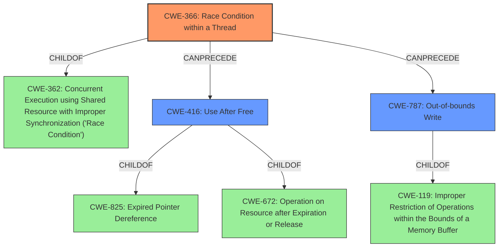

# Analysis Report for CVE-2021-21166

# Vulnerability Analysis Report: CVE-2021-21166

## Description


## Analysis (with Relationship Data)

# Summary
| CWE ID | CWE Name | Confidence | CWE Abstraction Level | CWE Vulnerability Mapping Label | CWE-Vulnerability Mapping Notes |
|---|---|---|---|---|---|
| CWE-366 | Race Condition within a Thread | 0.75 | Base | Allowed | Primary CWE |
| CWE-416 | Use After Free | 0.65 | Variant | Allowed | Secondary Candidate |
| CWE-787 | Out-of-bounds Write | 0.50 | Base | Allowed | Secondary Candidate |

## Evidence and Confidence

*   **Confidence Score:** 0.70
*   **Evidence Strength:** MEDIUM

## Relationship Analysis
The primary weakness is a **data race** condition (CWE-366), which can lead to **heap corruption**.

-   **CWE-366 (Race Condition within a Thread)** is a Base CWE, which is related to CWE-362 (Concurrent Execution using Shared Resource with Improper Synchronization ('Race Condition')), a Class CWE.
-   **CWE-416 (Use After Free)** is a Variant of CWE-825 (Expired Pointer Dereference) and CWE-672 (Operation on Resource after Expiration or Release). It can be a consequence of race conditions.
-   **CWE-787 (Out-of-bounds Write)** is a Base CWE that could be a consequence of **heap corruption**. It is child of CWE-119 (Improper Restriction of Operations within the Bounds of a Memory Buffer).



## Vulnerability Chain
The vulnerability chain starts with a **data race** (CWE-366) which leads to **heap corruption**. The **heap corruption** could result in a **use-after-free** (CWE-416) or an **out-of-bounds write** (CWE-787).

## Summary of Analysis
The initial analysis and criticism identified the **data race** as the primary cause, leading to **heap corruption**. This assessment is based on the vulnerability description key phrases, which explicitly mention "**data race**" as the root cause and "**heap corruption**" as the weakness.

The graph relationships influenced the selection by highlighting the potential consequences of the **data race**, such as **use-after-free** (CWE-416) and **out-of-bounds write** (CWE-787).

The selected CWEs are at the optimal level of specificity because they represent the most accurate and detailed description of the vulnerability based on the available evidence. CWE-366 is a Base CWE, which is the preferred level of abstraction for mapping root causes.

CWE-362, Concurrent Execution using Shared Resource with Improper Synchronization ('Race Condition'), was considered, as it is the Class of CWE-366, but CWE-366 is more specific because it is a race condition within a thread.

CWE-416 and CWE-787 are potential consequences of the **heap corruption** caused by the **data race**, but the evidence does not strongly support either as a definite consequence. Therefore, they are listed as secondary candidates.


## CWE Relationship Analysis

Current CWEs represent these abstraction levels: .


### Vulnerability Chain Analysis

**Chain starting from CWE-825:**
- 825 (Expired Pointer Dereference) - ROOT


**Chain starting from CWE-672:**
- 672 (Operation on a Resource after Expiration or Release) - ROOT


### CWE Relationship Diagram

```mermaid
graph TD
    classDef primary fill:#f96,stroke:#333,stroke-width:2px
    classDef secondary fill:#69f,stroke:#333
    classDef tertiary fill:#9e9,stroke:#333
```


*Report generated on 2025-03-31 03:26:26*
