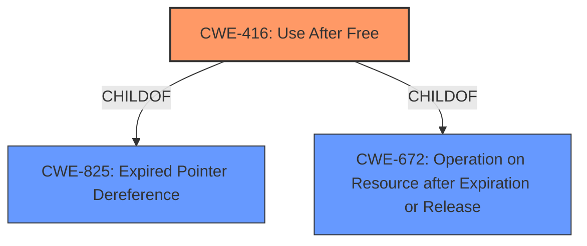

# Analysis Report for CVE-2021-21206

# Vulnerability Analysis Report: CVE-2021-21206

## Description


## Analysis (with Relationship Data)

# Summary
| CWE ID | CWE Name | Confidence | CWE Abstraction Level | CWE Vulnerability Mapping Label | CWE-Vulnerability Mapping Notes |
|---|---|---|---|---|---|
| CWE-416 | Use After Free | 1.0 | Variant | Allowed | Primary CWE |

## Evidence and Confidence

*   **Confidence Score:** 1.0
*   **Evidence Strength:** HIGH

## Relationship Analysis
The primary relationship that influenced my decision was the ChildOf relationship, with CWE-416 being a variant of higher-level classes such as CWE-825 (Expired Pointer Dereference) and CWE-672 (Operation on Resource after Expiration or Release). This confirmed that CWE-416 is at the appropriate level of specificity for this vulnerability.



## Vulnerability Chain
The vulnerability chain is relatively simple: the root cause is a **use-after-free** condition, which leads to **heap corruption**.

## Summary of Analysis
The primary CWE is CWE-416 **Use After Free**. This assessment is based on the vulnerability description which explicitly states "**use after free** in Blink" and "**heap corruption**". The CVE Reference Links Content Summary confirms this with the statement that the root cause is "**Use after free** in Blink". The retriever results list CWE-416 as the top candidate.

The selection of CWE-416 is at the optimal level of specificity because it is a Variant-level CWE, which is the preferred level of abstraction for mapping root causes. The MITRE mapping guidance for CWE-416 allows its usage and states that it is at the Variant level of abstraction, which is a preferred level of abstraction for mapping to the root causes of vulnerabilities.

Relevant CWE Information:

# Enhanced Context (25 CWEs)

## CWE-416: Use After Free
**Abstraction:** Variant
**Status:** Stable

### Description
The product reuses or references memory after it has been freed. At some point afterward, the memory may be allocated again and saved in another pointer, while the original pointer references a location somewhere within the new allocation. Any operations using the original pointer are no longer valid because the memory "belongs" to the code that operates on the new pointer.

### Extended Description
Not provided

### Alternative Terms
Dangling pointer: a pointer that no longer points to valid memory, often after it has been freed
UAF: commonly used acronym for Use After Free
Use-After-Free

### Relationships
ChildOf -> CWE-825
ChildOf -> CWE-672
ChildOf -> CWE-672
ChildOf -> CWE-672
CanPrecede -> CWE-120
CanPrecede -> CWE-123

### Mapping Guidance
**Usage:** Allowed
**Rationale:** This CWE entry is at the Variant level of abstraction, which is a preferred level of abstraction for mapping to the root causes of vulnerabilities.
**Comments:** Carefully read both the name and description to ensure that this mapping is an appropriate fit. Do not try to 'force' a mapping to a lower-level Base/Variant simply to comply with this preferred level of abstraction.
**Reasons:**
- Acceptable-Use

### Considered but not used:
- CWE-787 **Out-of-bounds Write**: This CWE was considered because **heap corruption** is often a consequence of out-of-bounds writes. However, the root cause is the **use-after-free**, so CWE-787 is not the primary weakness.
- CWE-366 **Race Condition within a Thread**: This CWE was considered because **use-after-free** conditions can be caused by race conditions. However, there is no evidence of a race condition in this vulnerability description.
- CWE-843 **Access of Resource Using Incompatible Type ('Type Confusion')**: This CWE was considered because **heap corruption** can be caused by type confusion. However, the root cause is the **use-after-free**, so CWE-843 is not the primary weakness.
- CWE-122 **Heap-based Buffer Overflow**: This CWE was considered because **heap corruption** can be a consequence of heap-based buffer overflows. However, the root cause is the **use-after-free**, so CWE-122 is not the primary weakness.
- CWE-415 **Double Free**: This CWE was considered because it is a type of memory corruption. However, the root cause is the **use-after-free**, not a double free.


## CWE Relationship Analysis

Current CWEs represent these abstraction levels: .


### Vulnerability Chain Analysis

**Chain starting from CWE-787:**
- 787 (Out-of-bounds Write) - ROOT


**Chain starting from CWE-415:**
- 415 (Double Free) - ROOT


### CWE Relationship Diagram

```mermaid
graph TD
    classDef primary fill:#f96,stroke:#333,stroke-width:2px
    classDef secondary fill:#69f,stroke:#333
    classDef tertiary fill:#9e9,stroke:#333
```


*Report generated on 2025-04-02 07:55:43*
