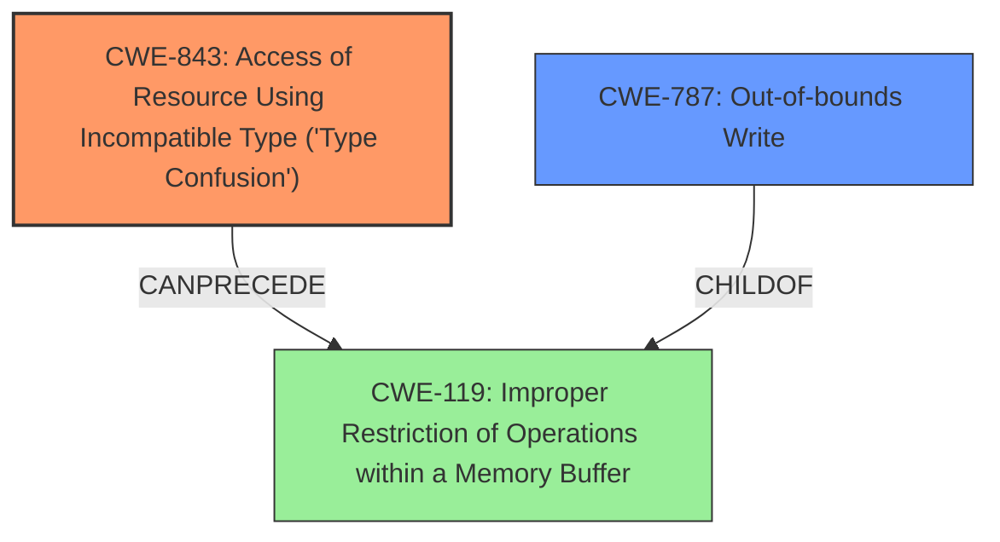

# Raw Analyzer Response for CVE-2021-21224

# Summary
| CWE ID | CWE Name | Confidence | CWE Abstraction Level | CWE Vulnerability Mapping Label | CWE-Vulnerability Mapping Notes |
|---|---|---|---|---|---|
| **CWE-843** | **Access of Resource Using Incompatible Type ('Type Confusion')** | 1.0 | Base | Primary | Allowed |
| CWE-787 | Out-of-bounds Write | 0.5 | Base | Secondary | Allowed |

## Evidence and Confidence

*   **Confidence Score:** 1.0
*   **Evidence Strength:** HIGH

## Relationship Analysis
The primary CWE is CWE-843, which is a base-level CWE describing type confusion. While CWE-787 is also listed as a potential mapping, CWE-843 more directly addresses the root cause. CWE-843 can precede CWE-119 (Improper Restriction of Operations within a Memory Buffer), potentially leading to out-of-bounds writes (CWE-787). The relationship influenced the decision by highlighting potential consequences of type confusion but emphasizing the core weakness.

## Vulnerability Chain
The vulnerability chain begins with **type confusion** (CWE-843) in the V8 JavaScript engine. This leads to the potential for **arbitrary code execution**. While not explicitly stated, it's possible this leads to an **out-of-bounds write** (CWE-787) if the type confusion allows writing to memory locations outside the intended buffer.

## Summary of Analysis
The initial analysis strongly pointed towards CWE-843 due to the explicit mention of "**type confusion**" in both the vulnerability description and the CVE reference summary: "**Root Cause:** **Type Confusion** in the V8 JavaScript engine." The CVE Reference Links Content Summary also states, "The vulnerability stems from a **type confusion** error within the V8 JavaScript engine. This means that the engine incorrectly handles the type of a variable, leading to unexpected behavior."

The retriever results further support this, listing CWE-843 as the top candidate with a high score. The "CWE for similar CVE Descriptions" section also lists CWE-843 as the primary match.

CWE-787 was considered as a potential secondary weakness. Type confusion can lead to memory corruption, including out-of-bounds writes. The description states that the impact of exploitation is arbitrary code execution. This could be a consequence of the type confusion leading to an out-of-bounds write. However, since the description does not explicitly mention out-of-bounds write, it's a less confident mapping.

The selected CWEs are at the optimal level of specificity. CWE-843 is a base-level CWE that directly addresses the **root cause**. While more specific variants might exist for certain type confusion scenarios, the provided information does not warrant a more specific classification.

Relevant CWE Information:

# Enhanced Context (25 CWEs)

## CWE-451: User Interface (UI) Misrepresentation of Critical Information
**Abstraction Level**: Class
**Similarity Score**: 0.79
**Source**: dense

**Description**:
The user interface (UI) does not properly represent critical information to the user, allowing the information - or its source - to be obscured or spoofed. This is often a component in phishing attacks.

**Mapping Guidance**:
- Usage: Allowed-with-Review
- Rationale: This CWE entry is a Class and might have Base-level children that would be more appropriate

*This CWE was not selected because the vulnerability does not involve UI misrepresentation.*

## CWE-1289: Improper Validation of Unsafe Equivalence in Input
**Abstraction Level**: Base
**Similarity Score**: 0.79
**Source**: dense

**Description**:
The product receives an input value that is used as a resource identifier or other type of reference, but it does not validate or incorrectly validates that the input is equivalent to a potentially-unsafe value.

**Mapping Guidance**:
- Usage: Allowed
- Rationale: This CWE entry is at the Base level of abstraction, which is a preferred level of abstraction for mapping to the root causes of vulnerabilities.

*This CWE was not selected because the vulnerability does not involve improper validation of input equivalence.*

## CWE-838: Inappropriate Encoding for Output Context
**Abstraction Level**: Base
**Similarity Score**: 0.78
**Source**: dense

**Description**:
The product uses or specifies an encoding when generating output to a downstream component, but the specified encoding is not the same as the encoding that is expected by the downstream component.

**Mapping Guidance**:
- Usage: Allowed
- Rationale: This CWE entry is at the Base level of abstraction, which is a preferred level of abstraction for mapping to the root causes of vulnerabilities.

*This CWE was not selected because the vulnerability does not involve inappropriate output encoding.*

## CWE-843: Access of Resource Using Incompatible Type ('Type Confusion')
**Abstraction Level**: Base
**Similarity Score**: 0.78
**Source**: dense

**Description**:
The product allocates or initializes a resource such as a pointer, object, or variable using one type, but it later accesses that resource using a type that is incompatible with the original type.

**Mapping Guidance**:
- Usage: Allowed
- Rationale: This CWE entry is at the Base level of abstraction, which is a preferred level of abstraction for mapping to the root causes of vulnerabilities.

*This CWE **was** selected because the vulnerability involves accessing a resource using an incompatible type.*

## CWE-80: Improper Neutralization of Script-Related HTML Tags in a Web Page (Basic XSS)
**Abstraction Level**: Variant
**Similarity Score**: 0.77
**Source**: dense

**Description**:
The product receives input from an upstream component, but it does not neutralize or incorrectly neutralizes special characters such as "<", ">", and "&" that could be interpreted as web-scripting elements when they are sent to a downstream component that processes web pages.

**Mapping Guidance**:
- Usage: Allowed
- Rationale: This CWE entry is at the Variant level of abstraction, which is a preferred level of abstraction for mapping to the root causes of vulnerabilities.

*This CWE was not selected because the vulnerability is not related to Cross-Site Scripting (XSS).*

## CWE-116: Improper Encoding or Escaping of Output
**Abstraction Level**: Class
**Similarity Score**: 0.77
**Source**: dense

**Description**:
The product prepares a structured message for communication with another component, but encoding or escaping of the data is either missing or done incorrectly. As a result, the intended structure of the message is not preserved.

**Mapping Guidance**:
- Usage: Allowed-with-Review
- Rationale: This CWE entry is a Class and might have Base-level children that would be more appropriate

*This CWE was not selected because the vulnerability does not involve improper encoding or escaping of output.*

## CWE-74: Improper Neutralization of Special Elements in Output Used by a Downstream Component ('Injection')
**Abstraction Level**: Class
**Similarity Score**: 0.77
**Source**: dense

**Description**:
The product constructs all or part of a command, data structure, or record using externally-influenced input from an upstream component, but it does not neutralize or incorrectly neutralizes special elements that could modify how it is parsed or interpreted when it is sent to a downstream component.

**Mapping Guidance**:
- Usage: Discouraged
- Rationale: CWE-74 is high-level and often misused when lower-level weaknesses are more appropriate.

*This CWE was not selected because the vulnerability is not an injection vulnerability.*

## CWE-138: Improper Neutralization of Special Elements
**Abstraction Level**: Class
**Similarity Score**: 0.76
**Source**: dense

**Description**:
The product receives input from an upstream component, but it does not neutralize or incorrectly neutralizes special elements that could be interpreted as control elements or syntactic markers when they are sent to a downstream component.

**Mapping Guidance**:
- Usage: Discouraged
- Rationale: This CWE entry is a level-1 Class (i.e., a child of a Pillar). It might have lower-level children that would be more appropriate

*This CWE was not selected because the vulnerability does not involve improper neutralization.*

## CWE-184: Incomplete List of Disallowed Inputs
**Abstraction Level**: Base
**Similarity Score**: 0.76
**Source**: dense

**Description**:
The product implements a protection mechanism that relies on a list of inputs (or properties of inputs) that are not