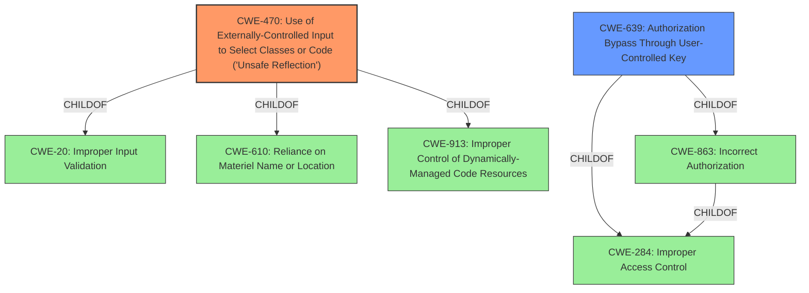

# Enhanced Analysis for CVE-2021-21327

# Summary
| CWE ID | CWE Name | Confidence | CWE Abstraction Level | CWE Vulnerability Mapping Label | CWE-Vulnerability Mapping Notes |
|---|---|---|---|---|---|
| CWE-470 | Use of Externally-Controlled Input to Select Classes or Code ('Unsafe Reflection') | 1.0 | Base | Allowed | Primary CWE |
| CWE-639 | Authorization Bypass Through User-Controlled Key | 0.5 | Base | Allowed | Secondary CWE |

## Evidence and Confidence

*   **Confidence Score:** 0.8
*   **Evidence Strength:** HIGH

## Relationship Analysis
The primary relationship that impacted the decision was the ChildOf relationship between CWE-470 and its parents, specifically CWE-20 (Improper Input Validation). This highlights that **improper input validation** is a contributing factor to the **unsafe reflection**. There is also a relationship with CWE-610 (Reliance on Materiel Name or Location), and CWE-913 (Improper Control of Dynamically-Managed Code Resources) which are parent relationships of CWE-470.



## Vulnerability Chain
The vulnerability chain starts with the **lack of validation** of the class name provided by the user. This leads to the **use of externally-controlled input to select classes or code** (CWE-470). The impact of this is that an unauthenticated user can instantiate arbitrary objects, potentially leading to malicious attacks and compromising the integrity of the application.

## Summary of Analysis
The analysis is based on the provided evidence, especially the "CVE Reference Links Content Summary" and "Vulnerability Description Key Phrases" sections.

The "CVE Reference Links Content Summary" clearly states: "The vulnerability stems from unsafe reflection in the `getItemForItemtype()` function within the GLPI application. This function allows the instantiation of objects of arbitrary classes by an unauthenticated user, which is inherently dangerous." This directly supports the selection of CWE-470 (Use of Externally-Controlled Input to Select Classes or Code ('Unsafe Reflection')).

The "Vulnerability Description Key Phrases" highlights the "**weakness**: **remote object instantiation**" which also aligns with CWE-470.

The retriever results also list CWE-470 as the top match, further reinforcing the decision.

CWE-470 is at the Base level of abstraction, which is preferred. It accurately represents the weakness, which is the use of external input to select classes or code without sufficient validation.

CWE-639 (Authorization Bypass Through User-Controlled Key) was considered as a secondary CWE. While the vulnerability allows unauthenticated users to instantiate objects, it's not primarily about bypassing authorization through a user-controlled key. The root cause is the unsafe reflection, so CWE-470 is the more appropriate primary CWE.

CWE-79 (Improper Neutralization of Input During Web Page Generation ('Cross-site Scripting')) and CWE-89 (Improper Neutralization of Special Elements used in an SQL Command ('SQL Injection')) were also considered but deemed not applicable. The vulnerability is not related to web page generation or SQL commands.

Relevant CWE Information:

# Enhanced Context (25 CWEs)

## CWE-1289: Improper Validation of Unsafe Equivalence in Input
**Abstraction Level**: Base
**Similarity Score**: 0.76
**Source**: dense

**Description**:
The product receives an input value that is used as a resource identifier or other type of reference, but it does not validate or incorrectly validates that the input is equivalent to a potentially-unsafe value.

**Mapping Guidance**:
- Usage: Allowed
- Rationale: This CWE entry is at the Base level of abstraction, which is a preferred level of abstraction for mapping to the root causes of vulnerabilities.

## CWE-74: Improper Neutralization of Special Elements in Output Used by a Downstream Component ('Injection')
**Abstraction Level**: Class
**Similarity Score**: 0.76
**Source**: dense

**Description**:
The product constructs all or part of a command, data structure, or record using externally-influenced input from an upstream component, but it does not neutralize or incorrectly neutralizes special elements that could modify how it is parsed or interpreted when it is sent to a downstream component.

**Mapping Guidance**:
- Usage: Discouraged
- Rationale: CWE-74 is high-level and often misused when lower-level weaknesses are more appropriate.

## CWE-639: Authorization Bypass Through User-Controlled Key
**Abstraction Level**: Base
**Similarity Score**: 0.76
**Source**: dense

**Description**:
The system's authorization functionality does not prevent one user from gaining access to another user's data or record by modifying the key value identifying the data.

**Mapping Guidance**:
- Usage: Allowed
- Rationale: This CWE entry is at the Base level of abstraction, which is a preferred level of abstraction for mapping to the root causes of vulnerabilities.

## CWE-807: Reliance on Untrusted Inputs in a Security Decision
**Abstraction Level**: Base
**Similarity Score**: 0.76
**Source**: dense

**Description**:
The product uses a protection mechanism that relies on the existence or values of an input, but the input can be modified by an untrusted actor in a way that bypasses the protection mechanism.

**Mapping Guidance**:
- Usage: Allowed
- Rationale: This CWE entry is at the Base level of abstraction, which is a preferred level of abstraction for mapping to the root causes of vulnerabilities.

## CWE-184: Incomplete List of Disallowed Inputs
**Abstraction Level**: Base
**Similarity Score**: 0.75
**Source**: dense

**Description**:
The product implements a protection mechanism that relies on a list of inputs (or properties of inputs) that are not allowed by policy or otherwise require other action to neutralize before additional processing takes place, but the list is incomplete.

**Mapping Guidance**:
- Usage: Allowed
- Rationale: This CWE entry is at the Base level of abstraction, which is a preferred level of abstraction for mapping to the root causes of vulnerabilities.

## CWE-472: External Control of Assumed-Immutable Web Parameter
**Abstraction Level**: Base
**Similarity Score**: 0.75
**Source**: dense

**Description**:
The web application does not sufficiently verify inputs that are assumed to be immutable but are actually externally controllable, such as hidden form fields.

**Mapping Guidance**:
- Usage: Allowed
- Rationale: This CWE entry is at the Base level of abstraction, which is a preferred level of abstraction for mapping to the root causes of vulnerabilities.

## CWE-653: Improper Isolation or Compartmentalization
**Abstraction Level**: Class
**Similarity Score**: 0.75
**Source**: dense

**Description**:
The product does not properly compartmentalize or isolate functionality, processes, or resources that require different privilege levels, rights, or permissions.

**Mapping Guidance**:
- Usage: Allowed
- Rationale: This CWE entry is at the Base level of abstraction, which is a preferred level of abstraction for mapping to the root causes of vulnerabilities.

## CWE-183: Permissive List of Allowed Inputs
**Abstraction Level**: Base
**Similarity Score**: 0.74
**Source**: dense

**Description**:
The product implements a protection mechanism that relies on a list of inputs (or properties of inputs) that are explicitly allowed by policy because the inputs are assumed to be safe, but the list is too permissive - that is, it allows an input that is unsafe, leading to resultant weaknesses.

**Mapping Guidance**:
- Usage: Allowed
- Rationale: This CWE entry is at the Base level of abstraction, which is a preferred level of abstraction for mapping to the root causes of vulnerabilities.

## CWE


## CWE Relationship Analysis

Current CWEs represent these abstraction levels: .


### Vulnerability Chain Analysis

**Chain starting from CWE-89:**
- 89 (Improper Neutralization of Special Elements used in an SQL Command ('SQL Injection')) - ROOT


**Chain starting from CWE-470:**
- 470 (Use of Externally-Controlled Input to Select Classes or Code ('Unsafe Reflection')) - ROOT


### CWE Relationship Diagram

```mermaid
graph TD
    classDef primary fill:#f96,stroke:#333,stroke-width:2px
    classDef secondary fill:#69f,stroke:#333
    classDef tertiary fill:#9e9,stroke:#333
```