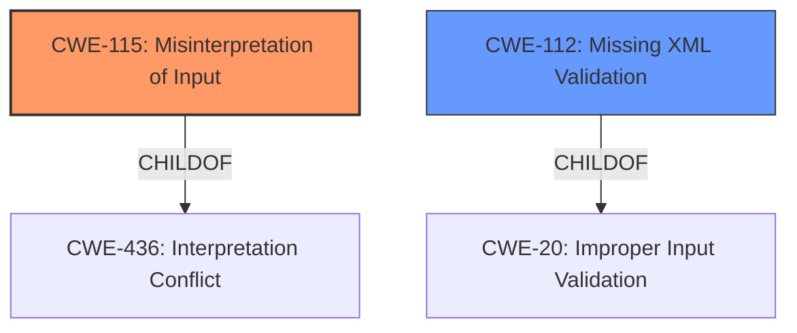

# Raw Analyzer Response for CVE-2021-21366

# Summary
| CWE ID | CWE Name | Confidence | CWE Abstraction Level | CWE Vulnerability Mapping Label | CWE-Vulnerability Mapping Notes |
|---|---|---|---|---|---|
| CWE-115 | Misinterpretation of Input | 0.8 | Base | Allowed | Primary CWE. The vulnerability stems from the `xmldom` library's incorrect handling of system identifiers, Formal Public Identifiers (FPIs), and namespaces when parsing and serializing maliciously crafted XML documents. |
| CWE-112 | Missing XML Validation | 0.6 | Base | Allowed | Secondary CWE. The xmldom library does not validate the XML against the proper schema. |

## Evidence and Confidence

*   **Confidence Score:** 0.7
*   **Evidence Strength:** MEDIUM

## Relationship Analysis
The primary CWE is CWE-115, which is a Base level CWE. It has a parent, CWE-436, but that is a higher level Class.
CWE-112 is related to CWE-20 (Improper Input Validation), but CWE-20 is discouraged.

## Vulnerability Chain
The chain of root cause and weaknesses is:
1.  **Improper handling of system identifiers, FPIs, and namespaces** (CWE-115)
2.  Unexpected syntactic changes during XML processing

## Summary of Analysis
The initial analysis identified that the root cause of the vulnerability is that `xmldom` **do not correctly preserve system identifiers, FPIs or namespaces** when repeatedly parsing and serializing maliciously crafted documents. The impact is that it may lead to unexpected syntactic changes during XML processing in some downstream applications.

The Retriever Results listed the following top CWEs:
*   CWE-115: Misinterpretation of Input
*   CWE-112: Missing XML Validation
*   CWE-116: Improper Encoding or Escaping of Output

CWE-115 (Misinterpretation of Input) appears to be the best fit for the primary root cause as it explains that the product misinterprets an input in a security-relevant fashion. The vulnerability stems from the `xmldom` library's incorrect handling of system identifiers, Formal Public Identifiers (FPIs), and namespaces when parsing and serializing maliciously crafted XML documents. The library does not preserve these elements correctly during repeated parsing and serialization cycles.

CWE-112 (Missing XML Validation) is a reasonable secondary finding. The product accepts XML from an untrusted source but does not validate the XML against the proper schema.

CWE-116 (Improper Encoding or Escaping of Output) does not appear to be relevant.

The evidence for CWE-115 is the vulnerability description: "xmldom versions 0.4.0 and older **do not correctly preserve system identifiers, FPIs or namespaces** when repeatedly parsing and serializing maliciously crafted documents."
The evidence for CWE-112 is the CVE Reference Links Content Summary: "The vulnerability stems from the `xmldom` library's incorrect handling of system identifiers, Formal Public Identifiers (FPIs), and namespaces when parsing and serializing maliciously crafted XML documents. Specifically, the library does not preserve these elements correctly during repeated parsing and serialization cycles."

Based on the provided evidence, relationship analysis, and mapping guidance, the selected CWEs are at the optimal level of specificity.