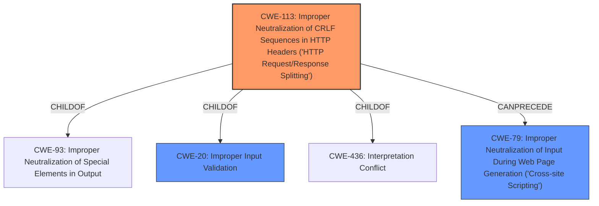

# Analysis Report for CVE-2021-21445

# Vulnerability Analysis Report: CVE-2021-21445

## Description


## Analysis (with Relationship Data)

# Summary

| CWE ID  | CWE Name                                                                                               | Confidence | CWE Abstraction Level | CWE Vulnerability Mapping Label | CWE-Vulnerability Mapping Notes |
| :-------- | :------------------------------------------------------------------------------------------------------- | :--------- | :---------------------- | :------------------------------ | :------------------------------ |
| CWE-113   | Improper Neutralization of CRLF Sequences in HTTP Headers ('HTTP Request/Response Splitting')           | 0.9        | Variant                 | Primary                       | Allowed                         |
| CWE-20    | Improper Input Validation                                                                                | 0.7        | Class                   | Secondary                       | Discouraged                      |
| CWE-79    | Improper Neutralization of Input During Web Page Generation ('Cross-site Scripting')                    | 0.6        | Base                   | Secondary                       | Allowed                         |

## Evidence and Confidence

*   **Confidence Score:** 0.8
*   **Evidence Strength:** HIGH

## Relationship Analysis

The primary CWE selected is CWE-113, a Variant of CWE-93 (Improper Neutralization of Special Elements in Output) and CWE-20 (Improper Input Validation) and a ChildOf CWE-436 (Interpretation Conflict). CWE-113 is related to CWE-79 (Improper Neutralization of Input During Web Page Generation ('Cross-site Scripting')) via a CanPrecede relationship, indicating that request/response splitting can lead to XSS. The weakness is a failure to neutralize CRLF sequences in HTTP headers, leading to potential HTTP Request/Response Splitting, which can further lead to XSS. CWE-20 is a Class-level CWE that is too general, but it reflects the **improper input validation** aspect of the vulnerability.



## Vulnerability Chain

The vulnerability chain starts with **improper input validation** (CWE-20), which leads to the inclusion of invalidated data in the HTTP response Content Type header (CWE-113), potentially leading to cross-site scripting (CWE-79) and page hijacking.

## Summary of Analysis

The initial assessment considered CWE-20 due to the stated **improper input validation**. However, CWE-20 is a very broad class. The description mentions the inclusion of invalidated data in the HTTP response Content Type header, which strongly suggests CWE-113 (Improper Neutralization of CRLF Sequences in HTTP Headers ('HTTP Request/Response Splitting')). The potential for cross-site scripting (XSS) and page hijacking suggests that the CRLF injection could be used to manipulate the HTTP response.

The evidence from the vulnerability description includes the phrase "**improper input validation**" as the root cause and "cross-site scripting and page hijacking" as the impact. The "CVE Reference Links Content Summary" confirms the **improper input validation** leading to these attacks.

The selection of CWE-113 is at the optimal level of specificity because it directly addresses the vulnerability mechanism of CRLF injection in HTTP headers. It accurately captures the **root cause** and the potential for HTTP response splitting, which can lead to further attacks.
CWE-20 is included as a secondary CWE because it is the general class of the **root cause** (improper input validation), but it is not as specific as CWE-113.
CWE-79 is included as a secondary CWE because the description mentions that the impact is XSS.

Relevant CWE Information:

# Enhanced Context (25 CWEs)

## CWE-74: Improper Neutralization of Special Elements in Output Used by a Downstream Component ('Injection')
**Abstraction Level**: Class
**Similarity Score**: 0.74
**Source**: dense

**Description**:
The product constructs all or part of a command, data structure, or record using externally-influenced input from an upstream component, but it does not neutralize or incorrectly neutralizes special elements that could modify how it is parsed or interpreted when it is sent to a downstream component.

**Mapping Guidance**:
- Usage: Discouraged
- Rationale: CWE-74 is high-level and often misused when lower-level weaknesses are more appropriate.

*This CWE was considered, but it is too high-level. CWE-113 is a more specific variant.*

## CWE-838: Inappropriate Encoding for Output Context
**Abstraction Level**: Base
**Similarity Score**: 0.73
**Source**: dense

**Description**:
The product uses or specifies an encoding when generating output to a downstream component, but the specified encoding is not the same as the encoding that is expected by the downstream component.

**Mapping Guidance**:
- Usage: Allowed
- Rationale: This CWE entry is at the Base level of abstraction, which is a preferred level of abstraction for mapping to the root causes of vulnerabilities.

*This CWE was not selected because the vulnerability is more about improper neutralization than encoding.*

## CWE-80: Improper Neutralization of Script-Related HTML Tags in a Web Page (Basic XSS)
**Abstraction Level**: Variant
**Similarity Score**: 0.73
**Source**: dense

**Description**:
The product receives input from an upstream component, but it does not neutralize or incorrectly neutralizes special characters such as "<", ">", and "&" that could be interpreted as web-scripting elements when they are sent to a downstream component that processes web pages.

**Mapping Guidance**:
- Usage: Allowed
- Rationale: This CWE entry is at the Variant level of abstraction, which is a preferred level of abstraction for mapping to the root causes of vulnerabilities.

*This CWE was not selected because it only covers XSS involving HTML tags. The CRLF injection could lead to other attacks as well.*

## CWE-707: Improper Neutralization
**Abstraction Level**: Pillar
**Similarity Score**: 0.73
**Source**: dense

**Description**:
The product does not ensure or incorrectly ensures that structured messages or data are well-formed and that certain security properties are met before being read from an upstream component or sent to a downstream component.

**Mapping Guidance**:
- Usage: Discouraged
- Rationale: This CWE entry is extremely high-level, a Pillar.

*This CWE was not selected because it is too high-level.*

## CWE-1289: Improper Validation of Unsafe Equivalence in Input
**Abstraction Level**: Base
**Similarity Score**: 0.73
**Source**: dense

**Description**:
The product receives an input value that is used as a resource identifier or other type of reference, but it does not validate or incorrectly validates that the input is equivalent to a potentially-unsafe value.

**Mapping Guidance**:
- Usage: Allowed
- Rationale: This CWE entry is at the Base level of abstraction, which is a preferred level of abstraction for mapping to the root causes of vulnerabilities.

*This CWE was not selected because the vulnerability is not specifically about unsafe equivalence.*

## CWE-184: Incomplete List of Disallowed Inputs
**Abstraction Level**: Base
**Similarity Score**: 0.73
**Source**: dense

**Description**:
The product implements a protection mechanism that relies on a list of inputs (or properties of inputs) that are not allowed by policy or otherwise require other action to neutralize before additional processing takes place, but the list is incomplete.

**Mapping Guidance**:
- Usage: Allowed
- Rationale: This CWE entry is at the Base level of abstraction, which is a preferred level of abstraction for mapping to the root causes of vulnerabilities.

*This CWE was not selected because the vulnerability is not specifically about an incomplete list of disallowed inputs.*

## CWE-436: Interpretation Conflict
**Abstraction Level**: Class
**Similarity Score**: 0.73
**Source**: dense

**Description**:
Product A handles inputs or steps differently than Product B, which causes A to perform incorrect actions based on its perception of B's state.

**Mapping Guidance**:
- Usage: Allowed-with-Review
- Rationale: This CWE entry is a Class and might have Base-level children that would be more appropriate

*This CWE was not selected, even though it is a parent of CWE-113, because it is too abstract and doesn't capture the specific issue.*

## CWE-653: Improper Isolation or Compart


## CWE Relationship Analysis

Current CWEs represent these abstraction levels: .


### Vulnerability Chain Analysis

**Chain starting from CWE-436:**
- 436 (Interpretation Conflict) - ROOT


**Chain starting from CWE-80:**
- 80 (Improper Neutralization of Script-Related HTML Tags in a Web Page (Basic XSS)) - ROOT


### CWE Relationship Diagram

```mermaid
graph TD
    classDef primary fill:#f96,stroke:#333,stroke-width:2px
    classDef secondary fill:#69f,stroke:#333
    classDef tertiary fill:#9e9,stroke:#333
```


*Report generated on 2025-03-31 05:36:43*
