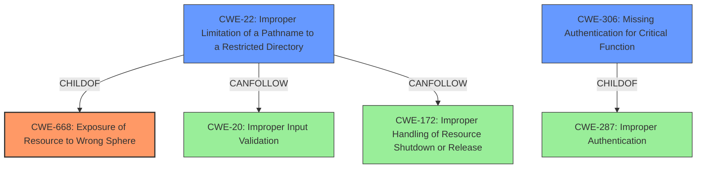

# Raw Analyzer Response for CVE-2021-21469

# Summary
| CWE ID | CWE Name | Confidence | CWE Abstraction Level | CWE Vulnerability Mapping Label | CWE-Vulnerability Mapping Notes |
|---|---|---|---|---|---|
| CWE-668 | Exposure of Resource to Wrong Sphere | 0.7 | Class | Allowed-with-Review | The product exposes a resource to the wrong control sphere, providing unintended actors with inappropriate access to the resource. |
| CWE-22 | Improper Limitation of a Pathname to a Restricted Directory ('Path Traversal') | 0.6 | Base | Allowed | The product uses external input to construct a pathname that is intended to identify a file or directory that is located underneath a restricted parent directory, but the product does not properly neutralize special elements within the pathname that can cause the pathname to resolve to a location that is outside of the restricted directory. |
| CWE-306 | Missing Authentication for Critical Function | 0.5 | Base | Allowed | The product does not perform any authentication for functionality that requires a provable user identity or consumes a significant amount of resources. |

## Evidence and Confidence

*   **Confidence Score:** 0.7
*   **Evidence Strength:** MEDIUM

## Relationship Analysis
The primary CWE is CWE-668, which is a class-level CWE. CWE-22 and CWE-306 are base-level CWEs and are children of other class CWEs. The relationships show that CWE-22 can follow CWE-20 and CWE-172. CWE-306 is a child of CWE-287 Improper Authentication.

## Vulnerability Chain
The chain of weaknesses starts with **improper protection**, leading to the possibility of setting custom paths, and the ability to define UNC paths, which allows for an SMB relay attack. This leads to **Information Disclosure**.
  - **Root Cause:** **Improper protection**
  - **Weakness 1:** Setting custom paths
  - **Weakness 2:** Defining UNC paths
  - **Attack Vector:** SMB relay attack
  - **Impact:** **Information Disclosure**

## Summary of Analysis
The analysis is based on the provided evidence, particularly the vulnerability description key phrases and the retriever results. The description points to a lack of adequate protection, potentially leading to an SMB relay attack and information disclosure.

The description says "When no adequate protection has been enforced on any level (e.g., MDS Server password not set, network and OS configuration not properly secured, etc.), a malicious user might define UNC paths which could then be exploited to put the system at risk using a so-called SMB relay attack and obtain highly sensitive data, which leads to Information Disclosure."

CWE-668 is chosen as the primary CWE because the root cause is the **improper protection** which leads to **Exposure of Resource to Wrong Sphere**.

CWE-22 is considered because defining UNC paths could lead to path traversal if not properly validated. The retriever results also list CWE-22 with a score of 0.535.

CWE-306 is considered because "MDS Server password not set" from the description could be interpreted as a missing authentication issue. The retriever results also list CWE-306 with a score of 0.451.

The selected CWEs are at the appropriate level of specificity, with CWE-668 being a class-level CWE that broadly captures the **improper protection** aspect, and CWE-22 and CWE-306 being base-level CWEs that provide more specific details about potential attack vectors.

Other CWEs considered but not used:

*   CWE-807, CWE-303, CWE-274, CWE-653, CWE-41, CWE-280, CWE-23, CWE-639, CWE-184, CWE-59, CWE-923, CWE-863, CWE-79, CWE-183, CWE-942, CWE-1289, CWE-178, CWE-209, CWE-201, CWE-202, CWE-1386, CWE-269, CWE-287: These CWEs were considered but deemed less relevant than CWE-668, CWE-22, and CWE-306 based on the vulnerability description and the retriever results. They either didn't align as closely with the described root cause or were too specific for the general nature of the **improper protection**.