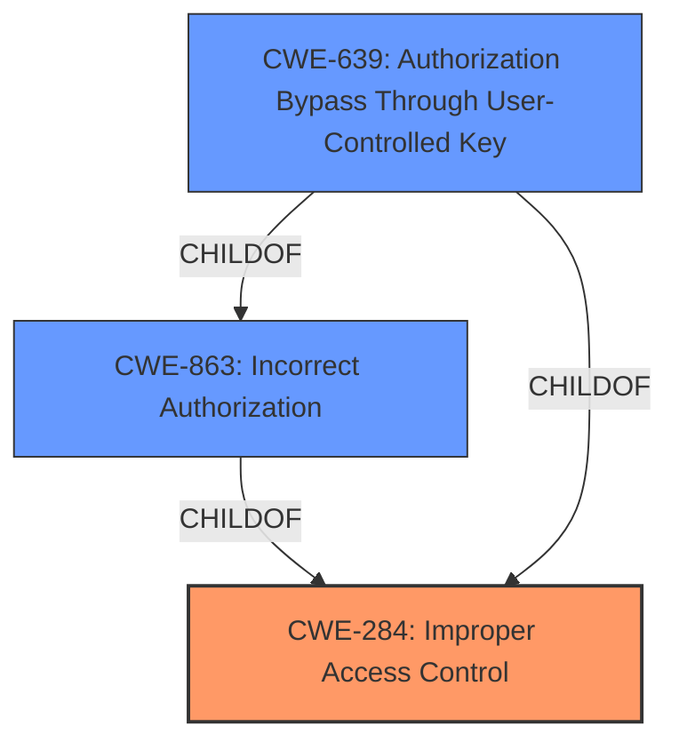

# Raw Analyzer Response for CVE-2021-21471

# Summary
| CWE ID | CWE Name | Confidence | CWE Abstraction Level | CWE Vulnerability Mapping Label | CWE-Vulnerability Mapping Notes |
|---|---|---|---|---|---|
| CWE-284 | Improper Access Control | 0.75 | Pillar | Primary | Discouraged |
| CWE-863 | Incorrect Authorization | 0.65 | Class | Secondary | Allowed-with-Review |
| CWE-639 | Authorization Bypass Through User-Controlled Key | 0.5 | Base | Secondary | Allowed |

## Evidence and Confidence

*   **Confidence Score:** 0.7
*   **Evidence Strength:** HIGH

## Relationship Analysis
The primary CWE, CWE-284, is a Pillar, making it very general. CWE-863 (Incorrect Authorization) and CWE-639 (Authorization Bypass Through User-Controlled Key) are children of CWE-284, representing more specific types of access control issues. CWE-863 is a Class, and CWE-639 is a Base, the most specific of the three. The relationship analysis shows a clear hierarchy of increasing specificity.

## Vulnerability Chain
The vulnerability chain starts with **improper access control**. An authenticated user exploits this to access API endpoints not intended for them, potentially impacting the application's integrity.

## Summary of Analysis
Initial Analysis:

The vulnerability description clearly points to **improper access control**, as evidenced by the key phrase "**improper access control**" and the summary: "**Root cause of vulnerability:** Improper access control. Authenticated users can access API endpoints that are not intended for them."

The Retriever Results list CWE-284 (Improper Access Control) as the top candidate. However, the mapping guidance for CWE-284 discourages its use due to its high-level nature. It suggests considering more specific descendants.

CWE-863 (Incorrect Authorization) and CWE-639 (Authorization Bypass Through User-Controlled Key) are also strong candidates, offering more specific classifications of the **improper access control**.

CWE-639 more closely fits the description of an authenticated user bypassing authorization to access another user's data by manipulating keys. However, the description doesn't explicitly mention key manipulation, so it's a slightly less confident match than CWE-863.

Final Conclusion:

Given the guidance against using the high-level CWE-284, it is still selected, since it's the best match for the root cause, but more specific CWEs will also be selected.
CWE-863 is included as a secondary CWE because it represents a more specific form of **improper access control**, namely an incorrect authorization check.

CWE-639 is also considered as a secondary CWE due to the possibility of the authenticated user exploiting the API via user-controlled keys.

The selected CWEs are at a good level of specificity. While more specific CWEs might exist, they would require assumptions not directly supported by the provided information.

Relevant CWE Information:

# Enhanced Context (25 CWEs)
The following CWEs were identified as potentially relevant to this vulnerability:

## CWE-284: Improper Access Control
**Abstraction:** Pillar
**Similarity Score**: 0.247 (sparse)

**Description**:
The product does not restrict or incorrectly restricts access to a resource from an unauthorized actor.

**Mapping Guidance**:
- Usage: Discouraged
- Rationale: CWE-284 is extremely high-level, a Pillar. Its name, "Improper Access Control," is often misused in low-information vulnerability reports [REF-1287] or by active use of the OWASP Top Ten, such as "A01:2021-Broken Access Control". It is not useful for trend analysis.
**Comments:** Consider using descendants of CWE-284 that are more specific to the kind of access control involved, such as those involving authorization (Missing Authorization (CWE-862), Incorrect Authorization (CWE-863), Incorrect Permission Assignment for Critical Resource (CWE-732), etc.); authentication (Missing Authentication (CWE-306) or Weak Authentication (CWE-1390)); Incorrect User Management (CWE-286); Improper Restriction of Communication Channel to Intended Endpoints (CWE-923); etc.

## CWE-863: Incorrect Authorization
**Abstraction:** Class
**Similarity Score**: 0.244 (sparse)

**Description**:
The product performs an authorization check when an actor attempts to access a resource or perform an action, but it does not correctly perform the check.

**Mapping Guidance**:
**Usage:** Allowed-with-Review
**Rationale:** This CWE entry is a Class and might have Base-level children that would be more appropriate
**Comments:** Examine children of this entry to see if there is a better fit

## CWE-639: Authorization Bypass Through User-Controlled Key
**Abstraction:** Base
**Similarity Score**: 0.238 (sparse)

**Description**:
The system's authorization functionality does not prevent one user from gaining access to another user's data or record by modifying the key value identifying the data.

**Mapping Guidance**:
- Usage: Allowed
- Rationale: This CWE entry is at the Base level of abstraction, which is a preferred level of abstraction for mapping to the root causes of vulnerabilities.
**Comments:** Carefully read both the name and description to ensure that this mapping is an appropriate fit. Do not try to 'force' a mapping to a lower-level Base/Variant simply to comply with this preferred level of abstraction.