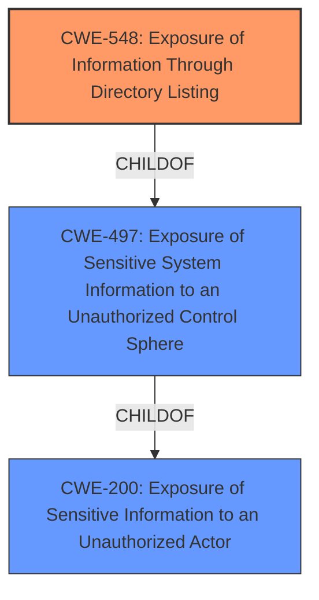

# Raw Analyzer Response for CVE-2021-21528

# Summary
| CWE ID | CWE Name | Confidence | CWE Abstraction Level | CWE Vulnerability Mapping Label | CWE-Vulnerability Mapping Notes |
|---|---|---|---|---|---|
| CWE-548 | Exposure of Information Through Directory Listing | 1.0 | Variant | Allowed | Primary CWE |
| CWE-497 | Exposure of Sensitive System Information to an Unauthorized Control Sphere | 0.7 | Base | Allowed | Secondary Candidate |
| CWE-200 | Exposure of Sensitive Information to an Unauthorized Actor | 0.5 | Class | Discouraged | Secondary Candidate |

## Evidence and Confidence

*   **Confidence Score:** 0.8
*   **Evidence Strength:** HIGH

## Relationship Analysis
The primary CWE selected is CWE-548, which is a variant of CWE-497 and a descendant of CWE-200. This indicates a hierarchical relationship where CWE-548 is the most specific representation of the **information exposure** vulnerability. The parent CWEs, while relevant, are more general. The chain relationship is less significant in this case, as the vulnerability is a direct **exposure** issue rather than a complex sequence of events.

## Vulnerability Chain
The vulnerability chain consists of a single step: an **improper configuration** leads directly to **exposure of information** through directory listing.
  - **Root Cause:** **Improper configuration** after upgrade.
  - **Weakness:** **Exposure of Information Through Directory Listing** (CWE-548)
  - **Impact:** Unauthorized access to filesystem, potentially leading to disclosure of sensitive information.

## Summary of Analysis
The initial analysis focused on identifying the root cause of the vulnerability. The vulnerability description and CVE reference links clearly point to an **"Exposure of Information through Directory Listing"**.

The retriever results also strongly suggest CWE-548 as the primary candidate. While other CWEs like CWE-497 and CWE-200 are related, they are more general. CWE-548 is a variant of CWE-497, making it a more specific and appropriate choice.

The graph relationships confirm this, showing CWE-548 as a child of CWE-497 and further descendant of CWE-200. This hierarchical structure supports the selection of CWE-548 as the most specific CWE to map to the vulnerability.

The mitigation provided in the CVE reference summary involves setting a "redirect" flag to true in the http-config. This further supports the idea that the vulnerability is related to **improper configuration** of the webserver, leading to **exposure** of directory listings.

The confidence in the selection of CWE-548 is high (1.0) due to the clear and explicit evidence in the vulnerability description and supporting information.

CWE-497 (Exposure of Sensitive System Information to an Unauthorized Control Sphere) was considered as a secondary candidate, since CWE-548 is a `CHILDOF` CWE-497. While accurate, it is less specific than CWE-548, so it was not selected as the primary CWE.

CWE-200 (Exposure of Sensitive Information to an Unauthorized Actor) was also considered, but it is even more general and discouraged for use when more specific CWEs are available.

Ultimately, CWE-548 provides the most accurate and specific representation of the **weakness**, aligning with the provided evidence and mapping guidance.

Relevant CWE Information:

# Enhanced Context (25 CWEs)
The following CWEs were identified as potentially relevant to this vulnerability:

## CWE-548: Exposure of Information Through Directory Listing
**Abstraction Level**: Variant
**Similarity Score**: 0.343
**Source**: sparse

**Description**:
A directory listing is inappropriately exposed, yielding potentially sensitive information to attackers.

**Mapping Guidance**:
- Usage: Allowed
- Rationale: This CWE entry is at the Variant level of abstraction, which is a preferred level of abstraction for mapping to the root causes of vulnerabilities.

## CWE-497: Exposure of Sensitive System Information to an Unauthorized Control Sphere
**Abstraction Level**: Base
**Similarity Score**: 0.557
**Source**: dense

**Description**:
The product does not properly prevent sensitive system-level information from being accessed by unauthorized actors who do not have the same level of access to the underlying system as the product does.

**Mapping Guidance**:
- Usage: Allowed
- Rationale: This CWE entry is at the Base level of abstraction, which is a preferred level of abstraction for mapping to the root causes of vulnerabilities.

## CWE-200: Exposure of Sensitive Information to an Unauthorized Actor
**Abstraction Level**: Class
**Similarity Score**: 0.198
**Source**: sparse

**Description**:
The product exposes sensitive information to an actor that is not explicitly authorized to have access to that information.

**Mapping Guidance**:
- Usage: Discouraged
- Rationale: CWE-200 is commonly misused to represent the loss of confidentiality in a vulnerability, but confidentiality loss is a technical impact - not a root cause error. As of CWE 4.9, over 400 CWE entries can lead to a loss of confidentiality. Other options are often available.