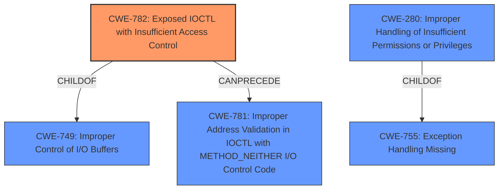

# Analysis for CVE-2021-21551

# Summary
| CWE ID | CWE Name | Confidence | CWE Abstraction Level | CWE Vulnerability Mapping Label | CWE-Vulnerability Mapping Notes |
|---|---|---|---|---|---|
| CWE-782 | Exposed IOCTL with Insufficient Access Control | 0.9 | Variant | Allowed | Primary CWE |
| CWE-280 | Improper Handling of Insufficient Permissions or Privileges  | 0.6 | Base | Allowed | Secondary Candidate |

## Evidence and Confidence

*   **Confidence Score:** 0.8
*   **Evidence Strength:** HIGH

## Relationship Analysis
The primary CWE, CWE-782, is a Variant of CWE-749, indicating a more specific type of weakness related to IOCTLs. It can be preceded by CWE-781, suggesting a potential chain. CWE-280 is a Base level CWE and a child of CWE-755. While CWE-280 is more general than CWE-782, it captures the essence of **insufficient access control** at a higher level.

## Vulnerability Chain
The vulnerability chain starts with the **insufficient access control** in the Dell dbutil_2_3.sys driver, specifically related to exposed IOCTLs (CWE-782). This leads to potential escalation of privileges, denial of service, or information disclosure. If the driver doesn't properly validate addresses within the IOCTL (CWE-781), it could further lead to out-of-bounds write (CWE-787) and potentially remote code execution.

## Summary of Analysis
The initial analysis pointed towards **insufficient access control** in the Dell driver. The presence of "dbutil_2_3.sys driver" and "IOCTL" strongly suggests CWE-782. The vulnerability description explicitly states "**insufficient access control** vulnerability which may lead to escalation of privileges, denial of service, or information disclosure." The CVE Reference Links Content Summary confirms this by stating "The Dell dbutil_2_3.sys driver contains an **insufficient access control** vulnerability." and lists "**Insufficient Access Control**" as a weakness.

The relationships in the graph influenced the selection by highlighting the specific context of the vulnerability as relating to IOCTLs and memory regions.

CWE-782 is at the optimal level of specificity because it directly addresses the exposed IOCTLs with **insufficient access control**, which is the root cause. The other considered CWEs, such as CWE-284, CWE-285, and CWE-269, are too general.

Relevant CWE Information:

# Enhanced Context (25 CWEs)

## CWE-691: Insufficient Control Flow Management
**Abstraction Level**: Pillar
**Similarity Score**: 0.81
**Source**: dense

**Description**:
The code does not sufficiently manage its control flow during execution, creating conditions in which the control flow can be modified in unexpected ways.

**Mapping Guidance**:
- Usage: Discouraged
- Rationale: This CWE entry is extremely high-level, a Pillar. However, classification research is limited for weaknesses of this type, so there can be gaps or organizational difficulties within CWE that force use of this weakness, even at such a high level of abstraction.

*CWE-691 was considered but is too high-level and doesn't directly address the access control issue.*

## CWE-664: Improper Control of a Resource Through its Lifetime
**Abstraction Level**: Pillar
**Similarity Score**: 0.78
**Source**: dense

**Description**:
The product does not maintain or incorrectly maintains control over a resource throughout its lifetime of creation, use, and release.

**Mapping Guidance**:
- Usage: Discouraged
- Rationale: This CWE entry is high-level when lower-level children are available.

*CWE-664 was considered but is too general and does not relate to the specific access control issues of the driver.*

## CWE-274: Improper Handling of Insufficient Privileges
**Abstraction Level**: Base
**Similarity Score**: 0.77
**Source**: dense

**Description**:
The product does not handle or incorrectly handles when it has insufficient privileges to perform an operation, leading to resultant weaknesses.

**Mapping Guidance**:
- Usage: Discouraged
- Rationale: This CWE entry could be deprecated in a future version of CWE.

*CWE-274 was considered but the vulnerability description is about insufficient access control, not the handling of insufficient privileges.*

## CWE-653: Improper Isolation or Compartmentalization
**Abstraction Level**: Class
**Similarity Score**: 0.77
**Source**: dense

**Description**:
The product does not properly compartmentalize or isolate functionality, processes, or resources that require different privilege levels, rights, or permissions.

**Mapping Guidance**:
- Usage: Allowed
- Rationale: This CWE entry is at the Base level of abstraction, which is a preferred level of abstraction for mapping to the root causes of vulnerabilities.

*CWE-653 was considered but is not specific to the IOCTL usage.*

## CWE-280: Improper Handling of Insufficient Permissions or Privileges 
**Abstraction Level**: Base
**Similarity Score**: 0.76
**Source**: dense

**Description**:
The product does not handle or incorrectly handles when it has insufficient privileges to access resources or functionality as specified by their permissions. This may cause it to follow unexpected code paths that may leave the product in an invalid state.

**Mapping Guidance**:
- Usage: Allowed
- Rationale: This CWE entry is at the Base level of abstraction, which is a preferred level of abstraction for mapping to the root causes of vulnerabilities.

*CWE-280 was considered and included as a secondary candidate. It's a valid, but less specific, description of the weakness.*

## CWE-1220: Insufficient Granularity of Access Control
**Abstraction Level**: Base
**Similarity Score**: 0.76
**Source**: dense

**Description**:
The product implements access controls via a policy or other feature with the intention to disable or restrict accesses (reads and/or writes) to assets in a system from untrusted agents. However, implemented access controls lack required granularity, which renders the control policy too broad because it allows accesses from unauthorized agents to the security-sensitive assets.

**Mapping Guidance**:
- Usage: Allowed
- Rationale: This CWE entry is at the Base level of abstraction, which is a preferred level of abstraction for mapping to the root causes of vulnerabilities.

*CWE-1220 was considered but not used because the description doesn't emphasize the lack of granularity. The vulnerability is more about the general **insufficient access control** on IOCTL calls.*

## CWE-667: Improper Locking
**Abstraction Level**: Class
**Similarity Score**: 0.75
**Source**: dense

**Description**:
The product does not properly acquire or release a lock on a resource, leading to unexpected resource state changes and behaviors.

**Mapping Guidance**:
- Usage: Allowed-with-Review
- Rationale: This CWE entry is a Class and might have Base-level children that would be more appropriate

*CWE-667 was considered but is related to improper locking mechanisms, not access control.*

## CWE-404: Improper Resource Shutdown or Release
**Abstraction Level**: Class
**Similarity Score**: 0.75
**Source**: dense

**Description**:
The product does not release or incorrectly releases a resource before it is made available for re-use.

**Mapping Guidance**:
- Usage: Allowed-with-Review
- Rationale: This CWE entry is a Class and might have Base-level children that would be more appropriate

*CWE-404 was considered but is related to improper resource shutdown and release, which is not the core issue.*

## CWE-668: Exposure of Resource to Wrong Sphere
**Abstraction Level**: Class
**Similarity Score**: 0.75
**Source**: dense

**Description**:
The product exposes a resource to the wrong control sphere, providing unintended actors with inappropriate access to the resource.

**Mapping Guidance**:
- Usage: Discouraged
- Rationale: CWE-668 is high-level and is often misused as