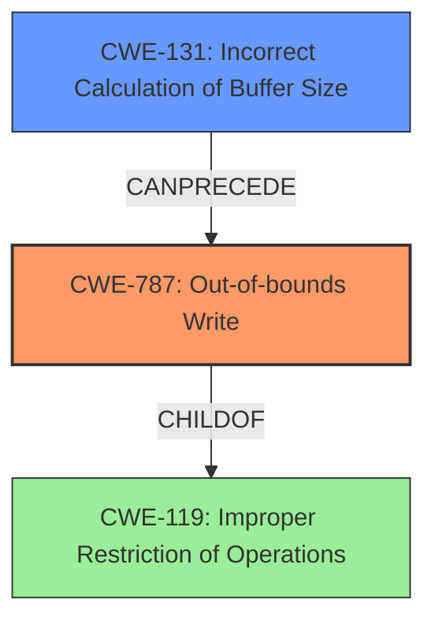

# Analysis for CVE-2021-21776

# Summary
| CWE ID | CWE Name | Confidence | CWE Abstraction Level | CWE Vulnerability Mapping Label | CWE-Vulnerability Mapping Notes |
|---|---|---|---|---|---|
| CWE-787 | Out-of-bounds Write | 1.0 | Base | Primary | Allowed |
| CWE-131 | Incorrect Calculation of Buffer Size | 0.8 | Base | Secondary | Allowed |

## Evidence and Confidence

*   **Confidence Score:** 0.9
*   **Evidence Strength:** HIGH

## Relationship Analysis
The primary weakness is CWE-787 (**CWE-787: Out-of-bounds Write**), which occurs because of an incorrect buffer size calculation, represented by CWE-131 (**CWE-131: Incorrect Calculation of Buffer Size**). CWE-787 is a child of CWE-119 (**CWE-119: Improper Restriction of Operations**), indicating a broader class of memory safety issues.

## Vulnerability Chain
The vulnerability chain starts with CWE-131 (**CWE-131: Incorrect Calculation of Buffer Size**), leading to CWE-787 (**CWE-787: Out-of-bounds Write**), which results in memory corruption.

## Summary of Analysis
The initial assessment strongly indicates CWE-787 (**CWE-787: Out-of-bounds Write**) as the primary weakness, supported by the vulnerability description which states "An **out-of-bounds write** vulnerability exists". The CVE Reference Links Content Summary confirms that the root cause is an incorrect buffer size calculation, aligning with CWE-131 (**CWE-131: Incorrect Calculation of Buffer Size**). The relationship between these two CWEs is that an incorrect buffer calculation can lead to an out-of-bounds write.

The selection of CWE-787 (**CWE-787: Out-of-bounds Write**) is at the optimal level of specificity, as it directly represents the type of memory corruption occurring. CWE-131 (**CWE-131: Incorrect Calculation of Buffer Size**) is also appropriately specific as it identifies the root cause of the out-of-bounds write.

Relevant CWE Information:

# Enhanced Context (25 CWEs)
The following CWEs were identified as potentially relevant to this vulnerability:

## CWE-131: Incorrect Calculation of Buffer Size
**Abstraction Level**: Base
**Similarity Score**: 0.80
**Source**: dense

**Description**:
The product does not correctly calculate the size to be used when allocating a buffer, which could lead to a buffer overflow.

**Mapping Guidance**:
- Usage: Allowed
- Rationale: This CWE entry is at the Base level of abstraction, which is a preferred level of abstraction for mapping to the root causes of vulnerabilities.

## CWE-787: Out-of-bounds Write
**Abstraction Level**: Base
**Similarity Score**: 4.33
**Source**: graph

**Description**:
CWE-787: Out-of-bounds Write

**Mapping Guidance**:
- Usage: Allowed
- Rationale: This CWE entry is at the Base level of abstraction, which is a preferred level of abstraction for mapping to the root causes of vulnerabilities.