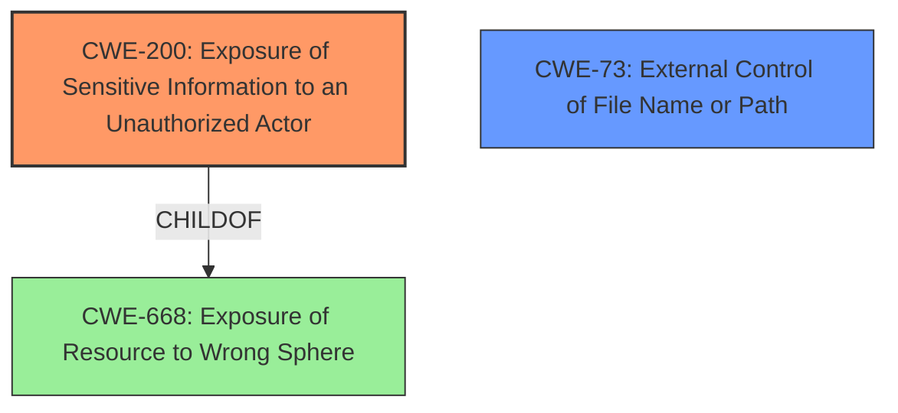

# Raw Analyzer Response for CVE-2021-21817

# Summary
| CWE ID | CWE Name | Confidence | CWE Abstraction Level | CWE Vulnerability Mapping Label | CWE-Vulnerability Mapping Notes |
|---|---|---|---|---|---|
| CWE-200 | Exposure of Sensitive Information to an Unauthorized Actor | 0.9 | Class | Allowed-with-Review | Primary CWE |
| CWE-73 | External Control of File Name or Path | 0.7 | Base | Allowed | Secondary Candidate |

## Evidence and Confidence

*   **Confidence Score:** 0.8
*   **Evidence Strength:** HIGH

## Relationship Analysis
The primary relationship influencing the CWE selection is the ChildOf relationship between CWE-200 and its parent, CWE-668 (Exposure of Resource to Wrong Sphere). However, CWE-200 is the most specific and appropriate Class-level CWE for the described vulnerability. CWE-73 is a related Base CWE that describes external control of file names or paths, which is a contributing factor to the information exposure. There's no direct chain relationship evident here (CanPrecede or CanFollow).

## Vulnerability Chain
The vulnerability chain starts with:
1.  **External Control of File Name/Path (CWE-73):** The Zebra service allows setting the MOTD banner from an arbitrary file specified by the attacker.
2.  **Exposure of Sensitive Information (CWE-200):** By specifying a sensitive file (e.g., `/etc/passwd`), the attacker can expose its contents.

The chain represents the flow from the initial **flaw** (uncontrolled filename) to the **impact** (information disclosure).

## Summary of Analysis
Initially, the vulnerability description points towards **information disclosure**. The "CVE Reference Links Content Summary" section solidifies this by stating that the root cause is that the Zebra service allows setting the "Message of the Day" (MOTD) banner from an arbitrary file on disk, which can be exploited to disclose the contents of sensitive files.

The primary CWE is **CWE-200 (Exposure of Sensitive Information to an Unauthorized Actor)** because the vulnerability's core is the disclosure of sensitive data due to improper handling of the MOTD banner setting.
The "CVE Reference Links Content Summary" confirms this by stating that the **weakness/vulnerability present** is "**information disclosure** due to insufficient input validation or lack of access control."
CWE-200 is a Class-level CWE. Although the mapping guidance discourages its use because it is commonly misused and other options are often available, it is the most accurate representation of the vulnerability. The description specifically mentions that the product manages resources that intentionally contain sensitive information, but the resources are unintentionally made accessible to unauthorized actors.

CWE-73 (External Control of File Name or Path) is a secondary CWE because the attacker has control over the file name used for the MOTD banner. This control enables the information exposure. It is at the Base level of abstraction, which is preferred.
The "CVE Reference Links Content Summary" states: "The Zebra service allows an attacker to specify an arbitrary file to be used as the MOTD banner, leading to arbitrary file read."

The selected CWEs are at the optimal level of specificity because they directly address the root cause (CWE-73) and the resulting impact (CWE-200) of the vulnerability. While more specific Variant-level CWEs might exist for particular types of information exposure or file path control, the available evidence does not support such fine-grained classifications.

Relevant CWE Information:

# Enhanced Context (25 CWEs)
The following CWEs were identified as potentially relevant to this vulnerability:

## CWE-74: Improper Neutralization of Special Elements in Output Used by a Downstream Component ('Injection')
**Abstraction Level**: Class
**Similarity Score**: 0.78
**Source**: dense

**Description**:
The product constructs all or part of a command, data structure, or record using externally-influenced input from an upstream component, but it does not neutralize or incorrectly neutralizes special elements that could modify how it is parsed or interpreted when it is sent to a downstream component.

**Mapping Guidance**:
- Usage: Discouraged
- Rationale: CWE-74 is high-level and often misused when lower-level weaknesses are more appropriate.

## CWE-184: Incomplete List of Disallowed Inputs
**Abstraction Level**: Base
**Similarity Score**: 0.76
**Source**: dense

**Description**:
The product implements a protection mechanism that relies on a list of inputs (or properties of inputs) that are not allowed by policy or otherwise require other action to neutralize before additional processing takes place, but the list is incomplete.

**Mapping Guidance**:
- Usage: Allowed
- Rationale: This CWE entry is at the Base level of abstraction, which is a preferred level of abstraction for mapping to the root causes of vulnerabilities.

## CWE-134: Use of Externally-Controlled Format String
**Abstraction Level**: Base
**Similarity Score**: 0.76
**Source**: dense

**Description**:
The product uses a function that accepts a format string as an argument, but the format string originates from an external source.

**Mapping Guidance**:
- Usage: Allowed
- Rationale: This CWE entry is at the Base level of abstraction, which is a preferred level of abstraction for mapping to the root causes of vulnerabilities.

## CWE-41: Improper Resolution of Path Equivalence
**Abstraction Level**: Base
**Similarity Score**: 0.75
**Source**: dense

**Description**:
The product is vulnerable to file system contents disclosure through path equivalence. Path equivalence involves the use of special characters in file and directory names. The associated manipulations are intended to generate multiple names for the same object.

**Mapping Guidance**:
- Usage: Allowed
- Rationale: This CWE entry is at the Base level of abstraction, which is a preferred level of abstraction for mapping to the root causes of vulnerabilities.

## CWE-138: Improper Neutralization of Special Elements
**Abstraction Level**: Class
**Similarity Score**: 0.75
**Source**: dense

**Description**:
The product receives input from an upstream component, but it does not neutralize or incorrectly neutralizes special elements that could be interpreted as control elements or syntactic markers when they are sent to a downstream component.

**Mapping Guidance**:
- Usage: Discouraged
- Rationale: This CWE entry is a level-1 Class (i.e., a child of a Pillar). It might have lower-level children that would be more appropriate

## CWE-1289: Improper Validation of Unsafe Equivalence in Input
**Abstraction Level**: Base
**Similarity Score**: 0.75
**Source**: dense

**Description**:
The product receives an input value that is used as a resource identifier or other type of reference, but it does not validate or incorrectly validates that the input is equivalent to a potentially-unsafe value.

**Mapping Guidance**:
- Usage: Allowed
- Rationale: This CWE entry is at the Base level of abstraction, which is a preferred level of abstraction for mapping to the root causes of vulnerabilities.

## CWE-212: Improper Removal of Sensitive Information Before Storage or Transfer
**Abstraction Level**: Base
**Similarity Score**: 0.75
**Source**: dense

**Description**:
The product stores, transfers, or shares a resource that contains sensitive information, but it does not properly remove that information before the product makes the resource available to unauthorized actors.

**Mapping Guidance**:
- Usage: Allowed
- Rationale: This CWE entry is at the Base level of abstraction, which is a preferred level of abstraction for mapping to the root causes of vulnerabilities.

## CWE-23: Relative Path Traversal
**Abstraction Level**: Base
**Similarity Score**: 0.75
**Source**: dense

**Description**:
The product uses external input to construct a pathname that should be within a restricted directory, but it does not properly neutralize sequences such as ".." that can resolve to a location that is outside of that directory.

**Mapping Guidance**:
- Usage: Allowed
- Rationale: This CWE entry is at the Base level of abstraction, which is a preferred level of abstraction for mapping to the root causes of vulnerabilities.

## CWE-538: Insertion of Sensitive Information into Externally-Accessible File or Directory
**Abstraction Level**: Base
**Similarity Score**: 0.75
**Source**: dense

**Description**:
The product places sensitive information into files or directories that are accessible to actors who are allowed to have access to the files, but not to the sensitive information.

**Mapping Guidance**:
- Usage: Allowed
- Rationale: This CWE entry is at the Base level of abstraction, which is a preferred level of