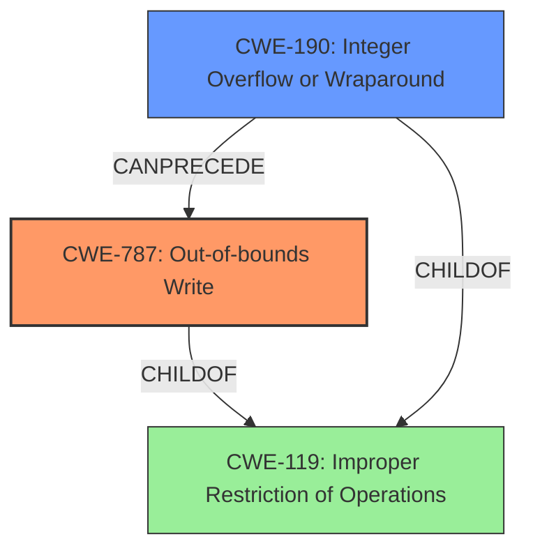

# Raw Analyzer Response for CVE-2021-21832

# Summary
| CWE ID | CWE Name | Confidence | CWE Abstraction Level | CWE Vulnerability Mapping Label | CWE-Vulnerability Mapping Notes |
|---|---|---|---|---|---|
| CWE-787 | Out-of-bounds Write | 1.0 | Base | Allowed | Primary CWE |
| CWE-190 | Integer Overflow or Wraparound | 0.9 | Base | Allowed | Secondary CWE |

## Evidence and Confidence

*   **Confidence Score:** 0.95
*   **Evidence Strength:** HIGH

## Relationship Analysis
The primary weakness is CWE-787, which directly reflects the **out-of-bounds write**. CWE-190 is included as a secondary weakness because the vulnerability description and CVE reference explicitly state that an **integer overflow** leads to the allocation of a small buffer, which subsequently results in the **out-of-bounds write**.

## Vulnerability Chain
The vulnerability chain starts with the parsing of a crafted ISO file. This leads to an **integer overflow** (CWE-190) when calculating the buffer size. The **integer overflow** results in allocating a small buffer. Subsequent writes to this small buffer cause a heap **out-of-bounds write** (CWE-787), which leads to memory corruption and a potential crash.

## Summary of Analysis
Initially, the description indicated a memory corruption vulnerability leading to an out-of-bounds write. The provided evidence, particularly the CVE Reference Links Content Summary, strongly supports CWE-787 (**Out-of-bounds Write**). The summary explicitly states that "subsequent writes to this small buffer will cause a heap out-of-bounds write." This direct statement reinforces the selection of CWE-787 as the primary weakness.

Furthermore, the CVE Reference Links Content Summary states, "An **integer overflow** occurs when parsing a crafted ISO file... Because the shift operation is done in a 32-bit register, an overflow can occur, causing a small or zero-size buffer to be allocated." This statement provides sufficient evidence for including CWE-190 (**Integer Overflow or Wraparound**) as a secondary contributing factor.

The relationship graph shows how these CWEs are related, with CWE-190 potentially preceding CWE-787, and both being children of the more general CWE-119. The selection of CWE-787 and CWE-190 provides a more specific and accurate representation of the vulnerability than using the more general CWE-119 (**Improper Restriction of Operations within the Bounds of a Memory Buffer**).

Relevant CWE Information:

# Enhanced Context (25 CWEs)
The following CWEs were identified as potentially relevant to this vulnerability:

## CWE-476: NULL Pointer Dereference
**Abstraction Level**: Base
**Similarity Score**: 0.77
**Source**: dense

**Description**:
The product dereferences a pointer that it expects to be valid but is NULL.

**Mapping Guidance**:
- Usage: Allowed
- Rationale: This CWE entry is at the Base level of abstraction, which is a preferred level of abstraction for mapping to the root causes of vulnerabilities.

**Why it was not selected**: This CWE was not selected because there is no evidence of null pointer dereference. The vulnerability is due to an integer overflow leading to an out-of-bounds write.

## CWE-191: Integer Underflow (Wrap or Wraparound)
**Abstraction Level**: Base
**Similarity Score**: 0.77
**Source**: dense

**Description**:
The product subtracts one value from another, such that the result is less than the minimum allowable integer value, which produces a value that is not equal to the correct result.

**Mapping Guidance**:
- Usage: Allowed
- Rationale: This CWE entry is at the Base level of abstraction, which is a preferred level of abstraction for mapping to the root causes of vulnerabilities.

**Why it was not selected**: This CWE was not selected because the vulnerability description and CVE reference link content summary explicitly mentioned integer overflow and not underflow.

## CWE-131: Incorrect Calculation of Buffer Size
**Abstraction Level**: Base
**Similarity Score**: 0.77
**Source**: dense

**Description**:
The product does not correctly calculate the size to be used when allocating a buffer, which could lead to a buffer overflow.

**Mapping Guidance**:
- Usage: Allowed
- Rationale: This CWE entry is at the Base level of abstraction, which is a preferred level of abstraction for mapping to the root causes of vulnerabilities.

**Why it was not selected**: While the integer overflow leads to an incorrect calculation of the buffer size, CWE-190 is a better fit because it highlights the root cause, which is the integer overflow itself. The incorrect buffer size calculation is a consequence of the overflow.

## CWE-824: Access of Uninitialized Pointer
**Abstraction Level**: Base
**Similarity Score**: 0.75
**Source**: dense

**Description**:
The product accesses or uses a pointer that has not been initialized.

**Mapping Guidance**:
- Usage: Allowed
- Rationale: This CWE entry is at the Base level of abstraction, which is a preferred level of abstraction for mapping to the root causes of vulnerabilities.

**Why it was not selected**: There is no evidence in the provided information to suggest the access of an uninitialized pointer. The vulnerability stems from writing to a memory location outside the intended buffer due to an integer overflow.

## CWE-170: Improper Null Termination
**Abstraction Level**: Base
**Similarity Score**: 0.75
**Source**: dense

**Description**:
The product does not terminate or incorrectly terminates a string or array with a null character or equivalent terminator.

**Mapping Guidance**:
- Usage: Allowed
- Rationale: This CWE entry is at the Base level of abstraction, which is a preferred level of abstraction for mapping to the root causes of vulnerabilities.

**Why it was not selected**: This CWE does not apply, as the issue is not related to improper null termination of strings. The vulnerability is an out-of-bounds write due to an integer overflow.

## CWE-822: Untrusted Pointer Dereference
**Abstraction Level**: Base
**Similarity Score**: 0.75
**Source**: dense

**Description**:
The product obtains a value from an untrusted source, converts this value to a pointer, and dereferences the resulting pointer.

**Mapping Guidance**:
- Usage: Allowed
- Rationale: This CWE entry is at the Base level of abstraction, which is a preferred level of abstraction for mapping to the root causes of vulnerabilities.

**Why it was not selected**: This CWE does not apply because the vulnerability doesn't involve dereferencing a pointer obtained from an untrusted source. It involves writing to memory outside buffer bounds.

## CWE-125: Out-of-bounds Read
**Abstraction Level**: Base
**Similarity Score**: 0.75
**Source**: dense

**Description**:
The product reads data past the end, or before the beginning, of the intended buffer.

**Mapping Guidance**:
- Usage: Allowed
- Rationale: This CWE entry is at the Base level of abstraction, which is a preferred level of abstraction for mapping to the root causes of vulnerabilities.

**Why it was not selected**: While out-of-bounds access is involved, the specific vulnerability is an out-of-bounds write, not a read.

## CWE-805: Buffer Access with Incorrect Length Value
**Abstraction Level**: Base
**Similarity Score**: 0.75
**Source**: dense

**Description**:
The product uses a sequential operation to read or write a buffer, but it uses an incorrect length value that causes it to access memory that is outside of the bounds of the buffer.

**Mapping Guidance**:
- Usage: Allowed
- Rationale: This CWE entry is at the Base level of abstraction, which is a preferred level of abstraction for mapping to the root causes of vulnerabilities.

**Why it was not selected**: This CWE is related, but the integer overflow causing the incorrect length value is a more fundamental issue, which is captured by CWE-190. The out-of-bounds write is the direct result of this, making CWE-787 the better fit.

## CWE-667: Improper Locking
**Abstraction Level**: Class
**Similarity Score**: 0.75
**Source**: dense

**Description**:
The product does not properly acquire or release a lock on a resource, leading to unexpected resource state changes and behaviors.

**Mapping Guidance**:
- Usage: Allowed-with-Review