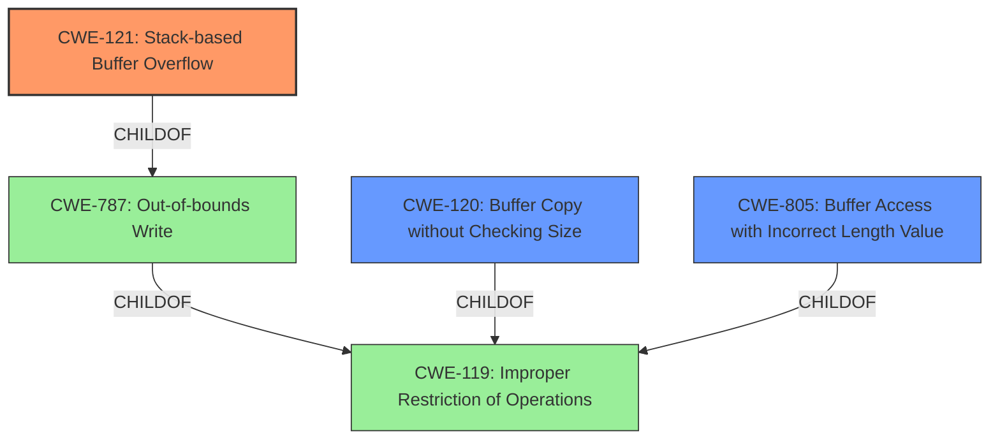

# Analysis Report for CVE-2021-21906

# Vulnerability Analysis Report: CVE-2021-21906

## Description


## Analysis (with Relationship Data)

# Summary
| CWE ID | CWE Name | Confidence | CWE Abstraction Level | CWE Vulnerability Mapping Label | CWE-Vulnerability Mapping Notes |
|---|---|---|---|---|---|
| CWE-121 | Stack-based Buffer Overflow | 1.0 | Variant | Allowed | Primary CWE |
| CWE-120 | Buffer Copy without Checking Size of Input ('Classic Buffer Overflow') | 0.7 | Base | Allowed-with-Review | Secondary Candidate |
| CWE-805 | Buffer Access with Incorrect Length Value | 0.6 | Base | Allowed | Secondary Candidate |

## Evidence and Confidence

*   **Confidence Score:** 0.9
*   **Evidence Strength:** HIGH

## Relationship Analysis
The primary weakness, CWE-121 [CWE-121: Stack-based Buffer Overflow], is a variant of CWE-787 [CWE-787: Out-of-bounds Write] and CWE-788. CWE-121 [CWE-121: Stack-based Buffer Overflow] directly reflects the stack-based nature of the overflow described in the vulnerability. CWE-120 [CWE-120: Buffer Copy without Checking Size of Input ('Classic Buffer Overflow')] and CWE-805 [CWE-805: Buffer Access with Incorrect Length Value] are related as potential root causes, where a missing size check or incorrect length value leads to the overflow. CWE-119 [CWE-119: Improper Restriction of Operations within the Bounds of a Memory Buffer] is a higher-level class that encompasses these buffer-related issues, but is discouraged in favor of more specific CWEs.



## Vulnerability Chain
The vulnerability chain starts with the **improper handling of the input** within the `checkPassword` function, specifically how the `readfile` function is used to read data into a fixed-size buffer without bounds checking. This leads directly to a **stack-based buffer overflow**, which then allows for potential **remote code execution**.

## Summary of Analysis
The initial assessment identified several candidate CWEs based on the vulnerability description. The primary **weakness** is clearly a **stack-based buffer overflow**, as indicated by the vulnerability description key phrases and CVE reference links content summary.

The selection of CWE-121 [CWE-121: Stack-based Buffer Overflow] as the primary CWE is strongly supported by the explicit mention of a "stack-based buffer overflow" in the vulnerability description. The CVE reference links content summary confirms that the `checkPassword` function uses `readfile` to copy data into a fixed-size buffer without bounds checking, leading to this overflow. This matches the characteristics of CWE-121 [CWE-121: Stack-based Buffer Overflow], which is a Variant-level CWE suitable for this specific type of buffer overflow.

The decision to include CWE-120 [CWE-120: Buffer Copy without Checking Size of Input ('Classic Buffer Overflow')] as a secondary CWE is based on the root cause analysis. The vulnerability stems from the `readfile` function copying data without checking the size of the input, aligning with the description of CWE-120 [CWE-120: Buffer Copy without Checking Size of Input ('Classic Buffer Overflow')]. However, since the primary issue is the stack-based overflow itself, CWE-121 [CWE-121: Stack-based Buffer Overflow] is the more direct and specific classification.

CWE-805 [CWE-805: Buffer Access with Incorrect Length Value] was also considered because the `readfile` function might be using an incorrect length value, leading to the out-of-bounds write. However, the description emphasizes the lack of bounds checking as the primary issue, making CWE-120 [CWE-120: Buffer Copy without Checking Size of Input ('Classic Buffer Overflow')] a slightly better fit as a root cause.

CWE-119 [CWE-119: Improper Restriction of Operations within the Bounds of a Memory Buffer] was considered but ultimately deemed too general. The mapping guidance for CWE-119 [CWE-119: Improper Restriction of Operations within the Bounds of a Memory Buffer] discourages its use when more specific CWEs are available.

The selected CWEs are at the optimal level of specificity because they accurately represent the vulnerability's root cause (lack of bounds checking) and its manifestation (stack-based buffer overflow). The evidence clearly supports these classifications, and the relationship analysis confirms the hierarchical connections between the CWEs.


## CWE Relationship Analysis

Current CWEs represent these abstraction levels: .


### Vulnerability Chain Analysis

**Chain starting from CWE-805:**
- 805 (Buffer Access with Incorrect Length Value) - ROOT


**Chain starting from CWE-121:**
- 121 (Stack-based Buffer Overflow) - ROOT


### CWE Relationship Diagram

```mermaid
graph TD
    classDef primary fill:#f96,stroke:#333,stroke-width:2px
    classDef secondary fill:#69f,stroke:#333
    classDef tertiary fill:#9e9,stroke:#333
```


*Report generated on 2025-03-30 18:42:15*
