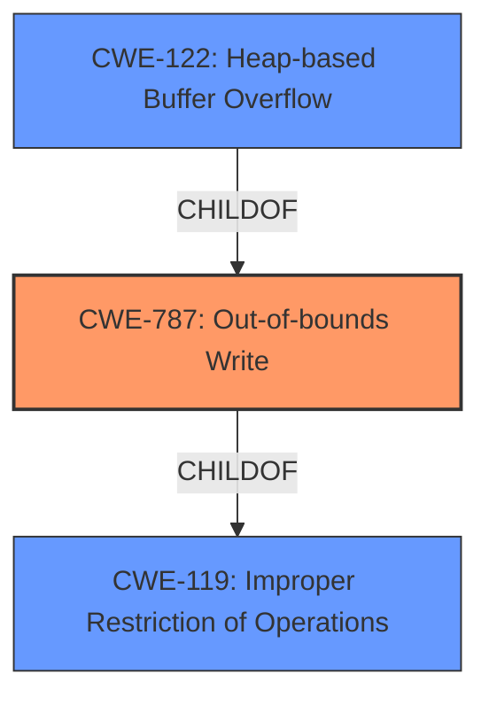

# Raw Analyzer Response for CVE-2021-21947

# Summary
| CWE ID  | CWE Name                                                        | Confidence | CWE Abstraction Level | CWE Vulnerability Mapping Label | CWE-Vulnerability Mapping Notes |
| :-------- | :-------------------------------------------------------------- | :--------- | :-------------------- | :------------------------------ | :------------------------------ |
| CWE-787   | Out-of-bounds Write                                             | 1          | Base                  | Primary CWE                      | Allowed                       |
| CWE-122   | Heap-based Buffer Overflow                                      | 0.8        | Variant               | Secondary Candidate              | Allowed                       |
| CWE-119   | Improper Restriction of Operations within the Bounds of a Memory Buffer | 0.6        | Class                 | Secondary Candidate              | Discouraged                    |

## Evidence and Confidence

*   **Confidence Score:** 0.9
*   **Evidence Strength:** HIGH

## Relationship Analysis
The primary relationship that influenced the CWE selection was the hierarchical relationship. CWE-787 is a parent of CWE-122, and both are children of CWE-119. While the vulnerability is described as a "**heap-based buffer overflow**," the root cause is ultimately an out-of-bounds write. Therefore, CWE-787 is the most specific and appropriate base-level CWE. CWE-122 describes the location of the buffer, which is useful context. CWE-119 is a more general classification and therefore discouraged.

## Vulnerability Chain
The vulnerability chain starts with the processing of a specially-crafted JPEG file. The lack of boundary checks during the buffer writes in the `process_jpeg_lossless` function leads to a **heap-based buffer overflow**. This can then lead to overwriting heap metadata, controlling execution flow, or arbitrary code execution.

## Summary of Analysis
The initial assessment identified CWE-787 as the most likely candidate based on the "**heap-based buffer overflow**" description and the "Missing boundary checks during buffer writes" evidence in the CVE Reference Links Content Summary. The retriever results also listed CWE-787 as a top CWE.

The relationship analysis confirmed that CWE-787 is more specific than its parent CWE-119 and that CWE-122 provides context about the location of the buffer. Therefore, CWE-787 is the optimal choice.

The evidence "The buffer offset is calculated and used to write short or byte data into the buffer, without considering if the offset exceeds buffer limits" supports that the root cause is an out-of-bounds write, confirming CWE-787.

Relevant CWE Information:

# Enhanced Context (25 CWEs)

## CWE-131: Incorrect Calculation of Buffer Size
Considered but not used because the description doesn't focus on incorrect calculation of buffer size, but on the **missing boundary checks** when writing to the buffer.

## CWE-197: Numeric Truncation Error
Considered but not used because there's no evidence of numeric truncation. The issue is related to boundary checks during buffer writes.

## CWE-191: Integer Underflow (Wrap or Wraparound)
Considered but not used because there's no evidence of integer underflow.

## CWE-681: Incorrect Conversion between Numeric Types
Considered but not used because there is no evidence that a conversion between numeric data types caused the vulnerability.

## CWE-805: Buffer Access with Incorrect Length Value
Considered but not used because the description focuses on **missing boundary checks** rather than an incorrect length value.

## CWE-124: Buffer Underwrite ('Buffer Underflow')
Considered but not used because the vulnerability is a buffer overflow, not a buffer underflow.

## CWE-129: Improper Validation of Array Index
Considered but not used because the description focuses on missing boundary checks rather than improper validation of an array index.

## CWE-680: Integer Overflow to Buffer Overflow
Considered but not used because there's no evidence of an integer overflow leading to a buffer overflow.

## CWE-190: Integer Overflow or Wraparound
Considered but not used because there is no evidence of an integer overflow.

## CWE-126: Buffer Over-read
Considered but not used because the vulnerability is a buffer overflow (write), not a buffer over-read.

## CWE-128: Wrap-around Error
Considered but not used because there is no evidence of a wrap-around error.

## CWE-170: Improper Null Termination
Considered but not used because improper null termination isn't the issue.

## CWE-195: Signed to Unsigned Conversion Error
Considered but not used because there is no evidence of signed to unsigned conversion errors.

## CWE-787: Out-of-bounds Write
Selected as the primary CWE. The vulnerability involves writing data beyond the intended boundaries of a buffer, causing a **heap-based buffer overflow**. This aligns directly with the description of CWE-787: Out-of-bounds Write.

## CWE-839: Numeric Range Comparison Without Minimum Check
Considered but not used because the description focuses on missing boundary checks rather than a missing minimum check.

## CWE-1284: Improper Validation of Specified Quantity in Input
Considered but not used because the description doesn't specifically mention improper validation of a specified quantity in the input, but rather the lack of boundary checks during write operations.

## CWE-617: Reachable Assertion
Considered but not used because there is no evidence that a reachable assertion contributed to the vulnerability.

## CWE-463: Deletion of Data Structure Sentinel
Considered but not used because this is not related to the deletion of data structure sentinel.

## CWE-125: Out-of-bounds Read
Considered but not used because this is related to writing out of bounds, not reading.