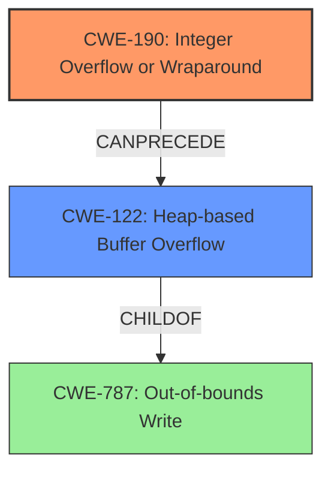

# Analysis for CVE-2021-21948

# Summary
| CWE ID | CWE Name | Confidence | CWE Abstraction Level | CWE Vulnerability Mapping Label | CWE-Vulnerability Mapping Notes |
|---|---|---|---|---|---|
| CWE-190 | Integer Overflow or Wraparound | 1.0 | Base | Allowed | Primary CWE. The **root cause** of the vulnerability is an integer overflow when calculating the buffer size. |
| CWE-122 | Heap-based Buffer Overflow | 1.0 | Variant | Allowed | Secondary CWE. The **integer overflow** leads to an undersized buffer being allocated, which then leads to a **heap-based buffer overflow** when data is written to it. |

## Evidence and Confidence

*   **Confidence Score:** 1.0
*   **Evidence Strength:** HIGH

## Relationship Analysis
The primary weakness is CWE-190 Integer Overflow, which leads to the secondary weakness CWE-122 Heap-based Buffer Overflow. CWE-190 is a base class, while CWE-122 is a variant, providing a more specific description of the overflow's location.

## Vulnerability Chain
The vulnerability chain starts with:
1.  CWE-190 Integer Overflow: The calculation of the buffer size results in an integer overflow due to the use of 32-bit registers instead of 64-bit registers.
2.  CWE-122 Heap-based Buffer Overflow: The undersized buffer is allocated on the heap. When data is written to this buffer, it overflows, leading to memory corruption.

## Summary of Analysis
The analysis indicates that the vulnerability is primarily due to an integer overflow (CWE-190) leading to a heap-based buffer overflow (CWE-122). The evidence from the "CVE Reference Links Content Summary" explicitly states the integer overflow in the buffer size calculation as the root cause.

> **Root cause of vulnerability:**
> Integer overflow in the `GfFile::readDatHeadVec` function within the AnyCubic Chitubox plugin. This overflow is caused by using 32-bit registers for multiplication instead of 64-bit registers, leading to truncation of the result and an incorrect size calculation for the buffer.
>
> **Weaknesses/vulnerabilities present:**
> - Heap-based buffer overflow due to an integer overflow during buffer size calculation. The calculated size is too small, leading to memory corruption when data is read into the buffer.

CWE-190 is selected as the primary CWE because it represents the **root cause** of the vulnerability: the integer overflow during buffer size calculation. CWE-122 is selected as a secondary CWE because it represents the direct consequence of the integer overflow: the **heap-based buffer overflow**. This is further supported by the vulnerability description key phrases, which highlight the presence of a "**heap-based buffer overflow**."

Other CWEs Considered:
* CWE-119 Improper Restriction of Operations within the Bounds of a Memory Buffer: While the vulnerability does involve writing beyond buffer boundaries, CWE-119 is too high-level. The more specific CWE-122 (Heap-based Buffer Overflow) is a better fit.
* CWE-131 Incorrect Calculation of Buffer Size: While the root cause involves an incorrect calculation, the integer overflow is more specific, making CWE-190 a better choice.
* CWE-787 Out-of-bounds Write: This is a parent of CWE-122, and while accurate, CWE-122 gives more context (heap).

Relevant CWE Information:

# Enhanced Context (25 CWEs)

## CWE-191: Integer Underflow (Wrap or Wraparound)
**Abstraction Level**: Base
**Similarity Score**: 0.79
**Source**: dense

**Description**:
The product subtracts one value from another, such that the result is less than the minimum allowable integer value, which produces a value that is not equal to the correct result.

**Mapping Guidance**:
- Usage: Allowed
- Rationale: This CWE entry is at the Base level of abstraction, which is a preferred level of abstraction for mapping to the root causes of vulnerabilities.

## CWE-131: Incorrect Calculation of Buffer Size
**Abstraction Level**: Base
**Similarity Score**: 0.79
**Source**: dense

**Description**:
The product does not correctly calculate the size to be used when allocating a buffer, which could lead to a buffer overflow.

**Mapping Guidance**:
- Usage: Allowed
- Rationale: This CWE entry is at the Base level of abstraction, which is a preferred level of abstraction for mapping to the root causes of vulnerabilities.

## CWE-681: Incorrect Conversion between Numeric Types
**Abstraction Level**: Base
**Similarity Score**: 0.78
**Source**: dense

**Description**:
When converting from one data type to another, such as long to integer, data can be omitted or translated in a way that produces unexpected values. If the resulting values are used in a sensitive context, then dangerous behaviors may occur.

**Mapping Guidance**:
- Usage: Allowed
- Rationale: This CWE entry is at the Base level of abstraction, which is a preferred level of abstraction for mapping to the root causes of vulnerabilities.

## CWE-197: Numeric Truncation Error
**Abstraction Level**: Base
**Similarity Score**: 0.77
**Source**: dense

**Description**:
Truncation errors occur when a primitive is cast to a primitive of a smaller size and data is lost in the conversion.

**Mapping Guidance**:
- Usage: Allowed
- Rationale: This CWE entry is at the Base level of abstraction, which is a preferred level of abstraction for mapping to the root causes of vulnerabilities.

## CWE-129: Improper Validation of Array Index
**Abstraction Level**: Variant
**Similarity Score**: 0.77
**Source**: dense

**Description**:
The product uses untrusted input when calculating or using an array index, but the product does not validate or incorrectly validates the index to ensure the index references a valid position within the array.

**Mapping Guidance**:
- Usage: Allowed
- Rationale: This CWE entry is at the Variant level of abstraction, which is a preferred level of abstraction for mapping to the root causes of vulnerabilities.

## CWE-125: Out-of-bounds Read
**Abstraction Level**: Base
**Similarity Score**: 0.77
**Source**: dense

**Description**:
The product reads data past the end, or before the beginning, of the intended buffer.

**Mapping Guidance**:
- Usage: Allowed
- Rationale: This CWE entry is at the Base level of abstraction, which is a preferred level of abstraction for mapping to the root causes of vulnerabilities.

## CWE-805: Buffer Access with Incorrect Length Value
**Abstraction Level**: Base
**Similarity Score**: 0.77
**Source**: dense

**Description**:
The product uses a sequential operation to read or write a buffer, but it uses an incorrect length value that causes it to access memory that is outside of the bounds of the buffer.

**Mapping Guidance**:
- Usage: Allowed
- Rationale: This CWE entry is at the Base level of abstraction, which is a preferred level of abstraction for mapping to the root causes of vulnerabilities.

## CWE-193: Off-by-one Error
**Abstraction Level**: Base
**Similarity Score**: 0.76
**Source**: dense

**Description**:
A product calculates or uses an incorrect maximum or minimum value that is 1 more, or 1 less, than the correct value.

**Mapping Guidance**:
- Usage: Allowed
- Rationale: This CWE entry is at the Base level of abstraction, which is a preferred level of abstraction for mapping to the root causes of vulnerabilities.

## CWE-126: Buffer Over-read
**Abstraction Level**: Variant
**Similarity Score**: 0.76
**Source**: dense

**Description**:
The product reads from a buffer using buffer access mechanisms such as indexes or pointers that reference memory locations after the targeted buffer.

**Mapping Guidance**:
- Usage: Allowed
- Rationale: This CWE entry is at the Variant level of abstraction, which is a preferred level of abstraction for mapping to the root causes of vulnerabilities.

## CWE-124: Buffer Underwrite ('Buffer Underflow')
**Abstraction Level**: Base
**Similarity Score**: 0.76
**Source**: dense

**Description**:
The product writes to a buffer using an index or pointer that references a memory location prior to the beginning of the buffer.

**Mapping Guidance**:
- Usage: Allowed
- Rationale: