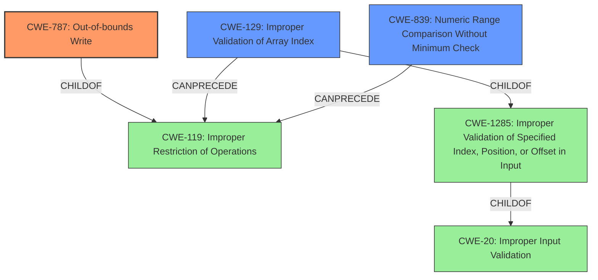

# Enhanced Analysis for CVE-2021-21949

# Summary
| CWE ID | CWE Name | Confidence | CWE Abstraction Level | CWE Vulnerability Mapping Label | CWE-Vulnerability Mapping Notes |
|---|---|---|---|---|---|
| CWE-787 | Out-of-bounds Write | 0.9 | Base | Allowed | Primary CWE. The vulnerability directly leads to an out-of-bounds write.|
| CWE-129 | Improper Validation of Array Index | 0.8 | Variant | Allowed | Secondary CWE. The root cause is due to the improper validation of the array index. |
| CWE-839 | Numeric Range Comparison Without Minimum Check | 0.7 | Base | Allowed | Secondary CWE.  The CVE Reference indicates this check is missing. |

## Evidence and Confidence

*   **Confidence Score:** 0.8
*   **Evidence Strength:** HIGH

## Relationship Analysis
The primary weakness is **CWE-787 (Out-of-bounds Write)**, which is a base CWE. The root cause is **CWE-129 (Improper Validation of Array Index)**, a variant of **CWE-1285 (Improper Validation of Specified Index, Position, or Offset in Input)** and **CWE-20 (Improper Input Validation)**. Additionally, **CWE-839 (Numeric Range Comparison Without Minimum Check)** contributes to the vulnerability by not properly validating the range of numeric values used as array indices. **CWE-129** can precede **CWE-119 (Improper Restriction of Operations within the Bounds of a Memory Buffer)**, which is a parent of **CWE-787**.



## Vulnerability Chain
The vulnerability chain starts with **CWE-20 (Improper Input Validation)**. Specifically, the **AC** and **DC** values from the SOS header are not properly validated, leading to **CWE-129 (Improper Validation of Array Index)**. The lack of a minimum check in the numeric range comparison (**CWE-839**) further exacerbates the issue. This results in an **out-of-bounds write (CWE-787)** in the `stack_image_row_temp` buffer within the `process_jpeg_progressive` function, potentially leading to code execution.

## Summary of Analysis
The initial assessment identified **CWE-787 (Out-of-bounds Write)** as the primary weakness, aligning with the vulnerability description's statement of an **out-of-bounds write** occurring. The root cause analysis, supported by the "CVE Reference Links Content Summary," points to **CWE-129 (Improper Validation of Array Index)** as the underlying cause, originating from the **improper array index validation** in the JPEG-JFIF progressive image parser. Additionally, the **lack of validation** on `AC` and `DC` values from the SOS header used as indexes for huffman tables and the signed comparison without minimum check contribute to the vulnerability. Thus **CWE-839 (Numeric Range Comparison Without Minimum Check)** is included.

The relationships between these CWEs, particularly the chain from **CWE-129** to **CWE-119** (parent of **CWE-787**), and the contribution of **CWE-839** via missing validation, reinforce the selection. These choices are at the optimal level of specificity, with **CWE-787** pinpointing the direct consequence, **CWE-129** identifying the root cause, and **CWE-839** showing a missing validation step.

Relevant CWE Information:

# Enhanced Context (25 CWEs)
The following CWEs were identified as potentially relevant to this vulnerability:

## CWE-191: Integer Underflow (Wrap or Wraparound)
**Abstraction Level**: Base
**Similarity Score**: 0.79
**Source**: dense
- Not selected as it's not directly related to the root cause.

## CWE-129: Improper Validation of Array Index
**Abstraction Level**: Variant
**Similarity Score**: 0.79
**Source**: dense
- Selected as a secondary weakness because the description indicates an improper array index validation vulnerability.

## CWE-131: Incorrect Calculation of Buffer Size
**Abstraction Level**: Base
**Similarity Score**: 0.79
**Source**: dense
- Not selected as there's no explicit mention of incorrect buffer size calculation.

## CWE-681: Incorrect Conversion between Numeric Types
**Abstraction Level**: Base
**Similarity Score**: 0.77
**Source**: dense
- Not selected, the vulnerability description does not provide any detail that indicates a conversion issue.

## CWE-190: Integer Overflow or Wraparound
**Abstraction Level**: Base
**Similarity Score**: 0.77
**Source**: dense
- Not selected, the vulnerability description does not provide any detail that indicates an integer overflow.

## CWE-125: Out-of-bounds Read
**Abstraction Level**: Base
**Similarity Score**: 0.77
**Source**: dense
- Not selected as the vulnerability focuses on out-of-bounds write.

## CWE-193: Off-by-one Error
**Abstraction Level**: Base
**Similarity Score**: 0.77
**Source**: dense
- Not selected as the vulnerability does not specifically point to an off-by-one error, but rather a general improper array index validation.

## CWE-197: Numeric Truncation Error
**Abstraction Level**: Base
**Similarity Score**: 0.76
**Source**: dense
- Not selected, the vulnerability description does not provide any detail that indicates an integer truncation.

## CWE-805: Buffer Access with Incorrect Length Value
**Abstraction Level**: Base
**Similarity Score**: 0.76
**Source**: dense
- Not selected, the vulnerability description does not provide any detail that indicates an incorrect length value.

## CWE-823: Use of Out-of-range Pointer Offset
**Abstraction Level**: Base
**Similarity Score**: 0.76
**Source**: dense
- Not selected as the primary issue is related to array indexing, not pointer arithmetic.

## CWE-190: Integer Overflow or Wraparound
**Abstraction Level**: Base
**Similarity Score**: 6658.74
**Source**: sparse
- Not selected, the vulnerability description does not provide any detail that indicates an integer overflow.

## CWE-125: Out-of-bounds Read
**Abstraction Level**: Base
**Similarity Score**: 6363.09
**Source**: sparse
- Not selected as the vulnerability focuses on out-of-bounds write.

## CWE-823: Use of Out-of-range Pointer Offset
**Abstraction Level**: Base
**Similarity Score**: 6341.54
**Source**: sparse
- Not selected as the primary issue is related to array indexing, not pointer arithmetic.

## CWE-839: Numeric Range Comparison Without Minimum Check
**Abstraction Level**: Base
**Similarity Score**: 6327.71
**Source**: sparse
- Selected as the CVE Reference indicates a missing minimum check.

## CWE-193: Off-by-one Error
**Abstraction Level**: Base
**Similarity Score**: 6298.42
**Source**: sparse
- Not selected as the vulnerability does not specifically point to an off-by-one error, but rather a general improper array index validation.

## CWE-195: Signed to Unsigned Conversion Error
**Abstraction Level**: variant
**Similarity Score**: 4.53
**Source**: graph
- Not selected, the vulnerability description does not provide any detail that indicates a signed to unsigned conversion.

## CWE-1284: Improper Validation of Specified Quantity in Input
**Abstraction Level**: base
**


## CWE Relationship Analysis

Current CWEs represent these abstraction levels: .


### Vulnerability Chain Analysis

**Chain starting from CWE-131:**
- 131 (Incorrect Calculation of Buffer Size) - ROOT


**Chain starting from CWE-839:**
- 839 (Numeric Range Comparison Without Minimum Check) - ROOT


### CWE Relationship Diagram

```mermaid
graph TD
    classDef primary fill:#f96,stroke:#333,stroke-width:2px
    classDef secondary fill:#69f,stroke:#333
    classDef tertiary fill:#9e9,stroke:#333
```