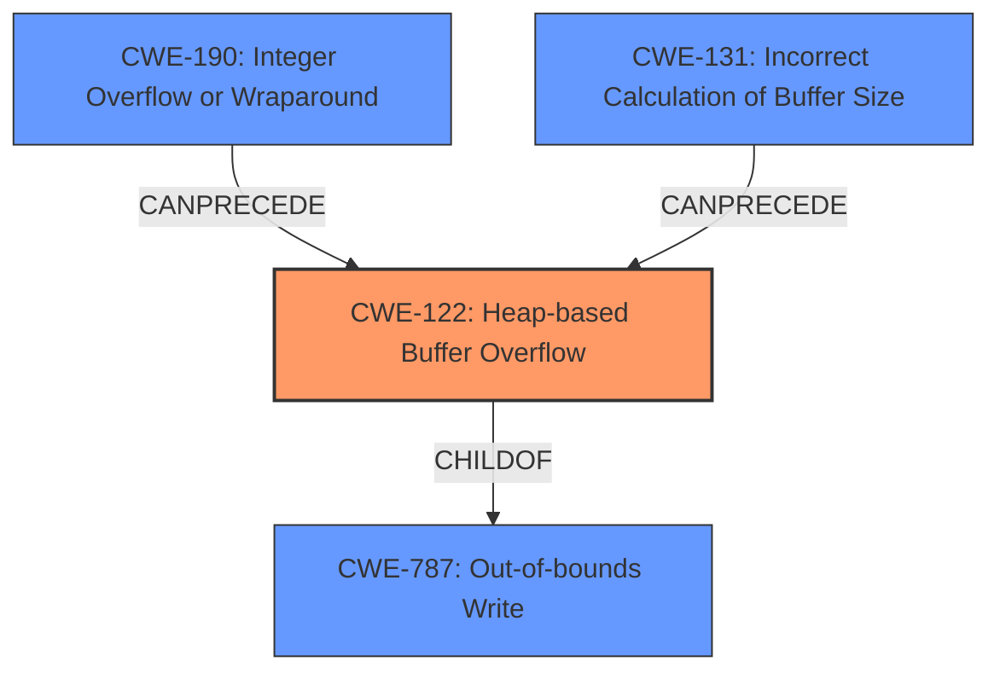

# Analysis for CVE-2021-21958

# Summary
| CWE ID  | CWE Name                                                                 | Confidence | CWE Abstraction Level | CWE Vulnerability Mapping Label | CWE-Vulnerability Mapping Notes |
| :-------- | :----------------------------------------------------------------------- | :---------- | :---------------------- | :------------------------------ | :-------------------------------- |
| CWE-122 | Heap-based Buffer Overflow                                                 | 0.95        | Variant               | Allowed                       | Primary CWE                       |
| CWE-190 | Integer Overflow or Wraparound                                           | 0.75        | Base                  | Allowed                       | Secondary candidate               |
| CWE-131 | Incorrect Calculation of Buffer Size                                     | 0.75        | Base                  | Allowed                       | Secondary candidate               |

## Evidence and Confidence

*   **Confidence Score:** 0.85
*   **Evidence Strength:** HIGH

## Relationship Analysis
The primary relationship that impacted my decision was the ChildOf relationship between CWE-122 and CWE-787 (Out-of-bounds Write). CWE-122 is a more specific variant of CWE-787, indicating that the out-of-bounds write occurs specifically in the heap. CWE-190 and CWE-131 can precede buffer overflows, indicating a potential chain where integer handling issues or incorrect size calculations contribute to the overflow condition.

## Vulnerability Chain
The vulnerability chain starts with a **malformed file** leading to **incorrect calculation of the buffer size** and/or **integer overflow/wraparound**, which then leads to a **heap-based buffer overflow**, resulting in **memory corruption and potential arbitrary code execution**.

## Summary of Analysis
The initial analysis focused on identifying the root cause of the vulnerability. The description clearly states a "**heap-based buffer overflow**" and the CVE Reference Links Content Summary elaborates on the **insecure handling of stream size** and **incorrect calculation of data size** within the `HwordApp.dll` component.

Based on the evidence:
- Vulnerability Description Key Phrases: "**rootcause:** **heap-based buffer overflow**"
- CVE Reference Links Content Summary: "**Heap-based buffer overflow** (CWE-122)", "**Incorrect calculation of data size to be read into buffer**"
- Retriever Results: CWE-122 (Heap-based Buffer Overflow) is a strong match.

CWE-122 is selected as the primary CWE because it directly reflects the **heap-based buffer overflow** described in the vulnerability. CWE-190 (Integer Overflow or Wraparound) and CWE-131 (Incorrect Calculation of Buffer Size) are considered as secondary CWEs because the summary describes an incorrect calculation of the stream size. The graph relationships show that CWE-190 and CWE-131 can precede CWE-122, suggesting they could be contributing factors.

The selected CWEs are at the optimal level of specificity. CWE-122 is a Variant, which is a preferred level of abstraction. It provides more detail than its parent CWE-787 (Out-of-bounds Write) by specifying the location of the buffer overflow (heap).

Relevant CWE Information:

# Enhanced Context (25 CWEs)
The following CWEs were identified as potentially relevant to this vulnerability:

## CWE-131: Incorrect Calculation of Buffer Size
**Abstraction Level**: Base
**Similarity Score**: 0.79
**Source**: dense

**Description**:
The product does not correctly calculate the size to be used when allocating a buffer, which could lead to a buffer overflow.

**Mapping Guidance**:
- Usage: Allowed
- Rationale: This CWE entry is at the Base level of abstraction, which is a preferred level of abstraction for mapping to the root causes of vulnerabilities.

## CWE-190: Integer Overflow or Wraparound
**Abstraction Level**: Base
**Similarity Score**: 6463.39
**Source**: sparse

**Description**:
The product performs a calculation that can produce an integer overflow or wraparound when the logic assumes that the resulting value will always be larger than the original value.

**Mapping Guidance**:
- Usage: Allowed
- Rationale: This CWE entry is at the Base level of abstraction, which is a preferred level of abstraction for mapping to the root causes of vulnerabilities.

## CWE-122: Heap-based Buffer Overflow
**Abstraction Level**: Variant
**Similarity Score**: 0.394
**Source**: sparse

**Description**:
A heap overflow condition is a buffer overflow, where the buffer that can be overwritten is allocated in the heap portion of memory, generally meaning that the buffer was allocated using a routine such as malloc().

**Mapping Guidance**:
- Usage: Allowed
- Rationale: This CWE entry is at the Variant level of abstraction, which is a preferred level of abstraction for mapping to the root causes of vulnerabilities.

**CWE-122**: The vulnerability description explicitly mentions "**heap-based buffer overflow**", making this a direct match. The weakness occurs when the application writes data beyond the allocated buffer in the heap memory. The security implication is memory corruption, potentially leading to arbitrary code execution. CWE-122 is a variant of CWE-787 (Out-of-bounds Write), providing a more specific classification. The MITRE mapping guidance allows its usage.

**CWE-190**: The CVE Reference Links Content Summary mentions conditions that can cause a larger size to be used. This hints at a possible integer overflow if the `stream_size` field is not properly validated and leads to an incorrect calculation, potentially resulting in a wraparound. The security implication is that the calculation can lead to less memory being allocated than expected. CWE-190 can precede CWE-119 (Improper Restriction of Operations within the Bounds of a Memory Buffer) and, subsequently, CWE-122. The MITRE mapping guidance allows its usage.

**CWE-131**: The CVE Reference Links Content Summary mentions "**incorrect calculation of data size to be read into buffer**." This aligns with the description of CWE-131, where the product does not correctly calculate the buffer size. The security implication is a potential buffer overflow. CWE-131 can precede CWE-119 and subsequently CWE-122. The MITRE mapping guidance allows its usage.

**CWEs Considered but Not Used:**

- CWE-119: While the vulnerability results in an out-of-bounds write, CWE-122 is a more specific variant that describes the heap-based nature of the overflow. The mapping guidance for CWE-119 discourages its use when lower-level CWEs are available.
- CWE-125, CWE-126: These CWEs describe out-of-bounds reads, which are not explicitly mentioned in the vulnerability description. The focus is on a buffer overflow (write), not a read.
- CWE-129: This CWE describes improper validation of array indices. While a buffer is being overflowed, the root cause is not explicitly related to an array index. It's more directly tied to the size calculation and stream size handling.
- CWE-193: This CWE describes an off-by-one error. While such an error could contribute to the overflow, it is not the primary weakness described.
- CWE-839: This CWE describes numeric range comparison without a minimum check. It's not directly applicable as the main issue is with the size calculation and the overflow, not a missing minimum check.
- CWE-1284: Improper Validation of Specified Quantity in Input - While related to input size, the description is less specific than CWE-131 for the root cause and impact of the overflow.