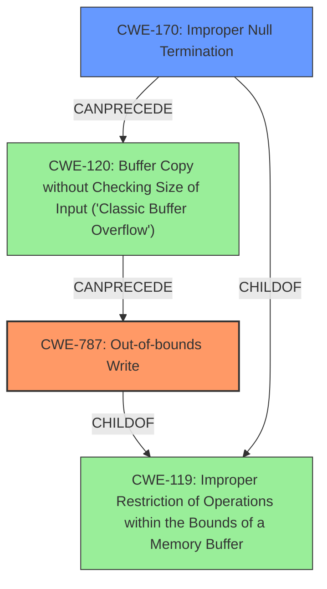

# Analysis Report for CVE-2021-21967

# Vulnerability Analysis Report: CVE-2021-21967

## Description


## Analysis (with Relationship Data)

# Summary
| CWE ID | CWE Name | Confidence | CWE Abstraction Level | CWE Vulnerability Mapping Label | CWE-Vulnerability Mapping Notes |
|---|---|---|---|---|---|
| CWE-787 | Out-of-bounds Write | 1.0 | Base | Primary | Allowed |
| CWE-170 | Improper Null Termination | 0.6 | Base | Secondary | Allowed |

## Evidence and Confidence

*   **Confidence Score:** 0.9
*   **Evidence Strength:** HIGH

## Relationship Analysis
The primary weakness is CWE-787 (**Out-of-bounds Write**), which occurs due to writing data beyond the intended buffer's boundaries. CWE-170 (**Improper Null Termination**) is considered as a potential contributing factor because the CVE description mentions the use of `strcpy` with a non-null-terminated string, and CWE-170 can lead to buffer overflows. Both CWE-787 and CWE-170 are childs of CWE-119 (**Improper Restriction of Operations within the Bounds of a Memory Buffer**). CWE-170 can precede CWE-120 (**Buffer Copy without Checking Size of Input ('Classic Buffer Overflow')**), which can lead to CWE-787.



## Vulnerability Chain
The vulnerability chain starts with the **improper handling of a non-null-terminated string**, potentially related to CWE-170 (**Improper Null Termination**). This leads to the use of `strcpy` in `SeaConnectOTADownload_file`, resulting in CWE-787 (**Out-of-bounds Write**) because the destination buffer `dest` in `OTAUpdateStruct` overflows due to the lack of bounds checking. The impact of the **out-of-bounds write** is a denial of service, as it overwrites the return address on the stack, causing the device to crash.

## Summary of Analysis
The initial assessment identified CWE-787 (**Out-of-bounds Write**) as the primary weakness, supported by the vulnerability description explicitly stating the presence of an **out-of-bounds write**. The "CVE Reference Links Content Summary" confirms that the vulnerability is caused by a stack-based buffer overflow due to the use of `strcpy` with a non-null-terminated string.

The relationship analysis reveals that CWE-170 (**Improper Null Termination**) could be a contributing factor, as the use of `strcpy` with a potentially non-null-terminated string is mentioned. This could lead to a buffer overflow, which subsequently results in an **out-of-bounds write**.

The final decision is based on the explicit mention of **out-of-bounds write** in the vulnerability description and the confirmation from the CVE reference links content summary. The selected CWEs are at the optimal level of specificity as CWE-787 is a base level CWE and captures the essence of the **out-of-bounds write**, while CWE-170 is a contributing factor.

Relevant CWE Information:

# Enhanced Context (25 CWEs)

## CWE-170: Improper Null Termination
**Abstraction:** Base
**Status:** Incomplete

### Description
The product does not terminate or incorrectly terminates a string or array with a null character or equivalent terminator.

### Extended Description
Null termination errors frequently occur in two different ways. An off-by-one error could cause a null to be written out of bounds, leading to an overflow. Or, a program could use a strncpy() function call incorrectly, which prevents a null terminator from being added at all. Other scenarios are possible.

### Alternative Terms
None

### Relationships
ChildOf -> CWE-707
CanPrecede -> CWE-120
CanPrecede -> CWE-126
CanAlsoBe -> CWE-147
PeerOf -> CWE-464
PeerOf -> CWE-463
ChildOf -> CWE-20

### Mapping Guidance
**Usage:** Allowed
**Rationale:** This CWE entry is at the Base level of abstraction, which is a preferred level of abstraction for mapping to the root causes of vulnerabilities.
**Comments:** Carefully read both the name and description to ensure that this mapping is an appropriate fit. Do not try to 'force' a mapping to a lower-level Base/Variant simply to comply with this preferred level of abstraction.
**Reasons:**
- Acceptable-Use


### Additional Notes
**[Relationship]** Factors: this is usually resultant from other weaknesses such as off-by-one errors, but it can be primary to boundary condition violations such as buffer overflows. In buffer overflows, it can act as an expander for assumed-immutable data.

**[Relationship]** Overlaps missing input terminator.

**[Applicable Platform]** 

Conceptually, this does not just apply to the C language; any language or representation that involves a terminator could have this type of problem.


**[Maintenance]** As currently described, this entry is more like a category than a weakness.


### Observed Examples
- **CVE-2000-0312:** Attacker does not null-terminate argv[] when invoking another program.
- **CVE-2003-0777:** Interrupted step causes resultant lack of null termination.
- **CVE-2004-1072:** Fault causes resultant lack of null termination, leading to buffer expansion.

**Explanation:** CWE-170 (**Improper Null Termination**) is considered because the vulnerability description highlights the use of `strcpy` with a non-null-terminated string. This can potentially lead to a buffer overflow, which then causes the **out-of-bounds write**. The security implication is that a missing or incorrect null terminator can allow the `strcpy` function to read beyond the intended buffer, potentially leaking information or causing a crash. The `strcpy` function copies characters from the source string to the destination string until it encounters a null terminator. If the source string is not null-terminated, `strcpy` will continue reading past the end of the source buffer, leading to a read buffer overflow.

## CWE-787: Out-of-bounds Write
**Abstraction:** Base
**Status:** Draft

### Description
The product writes data past the end, or before the beginning, of the intended buffer.

### Extended Description
Not provided

### Alternative Terms
Memory Corruption: Often used to describe the consequences of writing to memory outside the bounds of a buffer, or to memory that is otherwise invalid.

### Relationships
ChildOf -> CWE-119
ChildOf -> CWE-119
ChildOf -> CWE-119
ChildOf -> CWE-119

### Mapping Guidance
**Usage:** Allowed
**Rationale:** This CWE entry is at the Base level of abstraction, which is a preferred level of abstraction for mapping to the root causes of vulnerabilities.
**Comments:** Carefully read both the name and description to ensure that this mapping is an appropriate fit. Do not try to 'force' a mapping to a lower-level Base/Variant simply to comply with this preferred level of abstraction.
**Reasons:**
- Acceptable-Use

### Observed Examples
- **CVE-2023-1017:** The reference implementation code for a Trusted Platform Module does not implement length checks on data, allowing for an attacker to write 2 bytes past the end of a buffer.
- **CVE-2021-21220:** Chain: insufficient input validation (CWE-20) in browser allows heap corruption (CWE-787), as exploited in the wild per CISA KEV.
- **CVE-2021-28664:** GPU kernel driver allows memory corruption because a user can obtain read/write access to read-only pages, as exploited in the wild per CISA KEV.

**Explanation:** CWE-787 (**Out-of-bounds Write**) is the primary CWE because the vulnerability description explicitly states the presence of an **out-of-bounds write**. The "CVE Reference Links Content Summary" confirms that the vulnerability is caused by a stack-based buffer overflow when handling OTA updates. An attacker can perform a man-in-the-middle attack to trigger this vulnerability. The security implication is that writing beyond the buffer's boundaries can overwrite critical data, such as return addresses, leading to arbitrary code execution


## CWE Relationship Analysis

Current CWEs represent these abstraction levels: .


### Vulnerability Chain Analysis

**Chain starting from CWE-147:**
- 147 (Improper Neutralization of Input Terminators) - ROOT


**Chain starting from CWE-170:**
- 170 (Improper Null Termination) - ROOT


### CWE Relationship Diagram

```mermaid
graph TD
    classDef primary fill:#f96,stroke:#333,stroke-width:2px
    classDef secondary fill:#69f,stroke:#333
    classDef tertiary fill:#9e9,stroke:#333
```


*Report generated on 2025-03-30 16:48:35*
