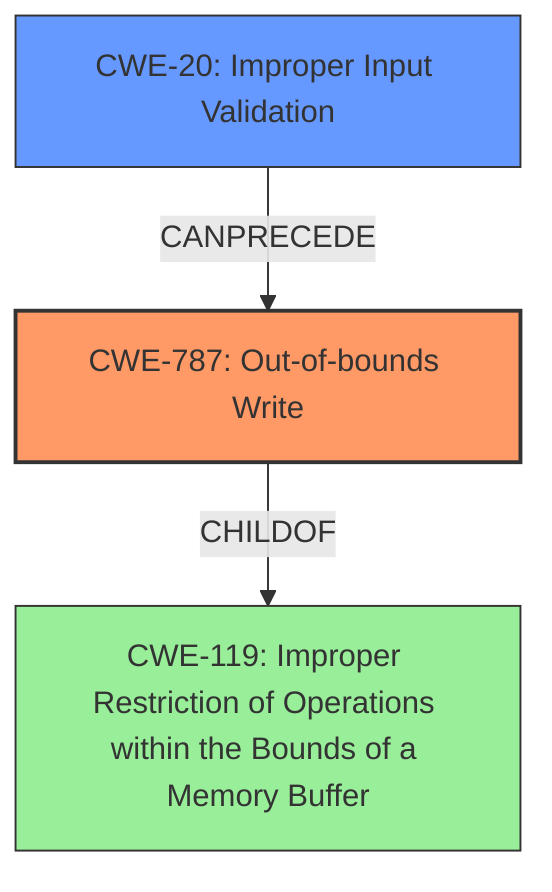

# Raw Analyzer Response for CVE-2021-21968

# Summary
| CWE ID | CWE Name | Confidence | CWE Abstraction Level | CWE Vulnerability Mapping Label | CWE-Vulnerability Mapping Notes |
|---|---|---|---|---|---|
| CWE-787 | Out-of-bounds Write | 1.0 | Base | Allowed | Primary CWE |
| CWE-20 | Improper Input Validation | 0.8 | Class | Allowed | Secondary CWE |

## Evidence and Confidence

*   **Confidence Score:** 0.9
*   **Evidence Strength:** HIGH

## Relationship Analysis
The primary weakness is an out-of-bounds write (CWE-787) due to the lack of input validation (CWE-20). CWE-787 is a child of CWE-119 (Improper Restriction of Operations within the Bounds of a Memory Buffer), highlighting the buffer-related nature of the vulnerability. CWE-20 can precede CWE-787, as improper input validation can lead to out-of-bounds writes.

## Vulnerability Chain
The vulnerability chain starts with **improper input validation (CWE-20)** of the `dest` parameter in the MQTT message. This allows an attacker to specify an arbitrary file path, leading to an **out-of-bounds write (CWE-787)** and ultimately resulting in arbitrary file overwrite.

## Summary of Analysis
The analysis is based on the vulnerability description and the CVE reference links content summary. The root cause is the **improper input validation** in the OTA update task functionality, which allows an attacker to specify an arbitrary file path. This leads to the **out-of-bounds write** and arbitrary file overwrite.

The key evidence is: "Root cause of vulnerability: **Improper input validation** in the OTA update task of the Sealevel Systems, Inc. SeaConnect 370W device. Specifically, the `dest` field of the MQTT message is not validated, allowing an attacker to specify an arbitrary file path for writing." and "Weaknesses/vulnerabilities present: **Improper Input Validation (CWE-20)**: The `dest` parameter of the MQTT message is not properly validated, leading to arbitrary file write."

The graph relationships confirm that CWE-20 can precede CWE-787. The selected CWEs are at the optimal level of specificity, as CWE-787 directly describes the out-of-bounds write, and CWE-20 identifies the root cause of the vulnerability.

Relevant CWE Information:

# Enhanced Context (25 CWEs)

## CWE-131: Incorrect Calculation of Buffer Size
Not selected as the vulnerability is due to the `dest` parameter not being validated, rather than incorrect calculation of the buffer size.

## CWE-191: Integer Underflow (Wrap or Wraparound)
Not selected, as there's no indication of integer underflow in the vulnerability description.

## CWE-125: Out-of-bounds Read
Not selected as the vulnerability is an out-of-bounds write, not read.

## CWE-126: Buffer Over-read
Not selected as the vulnerability is an out-of-bounds write, not read.

## CWE-193: Off-by-one Error
Not selected as there is no evidence of an off-by-one error.

## CWE-134: Use of Externally-Controlled Format String
Not selected as the vulnerability doesn't involve format strings.

## CWE-119: Improper Restriction of Operations within the Bounds of a Memory Buffer
CWE-119 is a Class-level CWE. While it is related, CWE-787 is a more specific Base-level CWE that is more appropriate.

## CWE-129: Improper Validation of Array Index
Not selected as the vulnerability doesn't specifically involve an array index.

## CWE-190: Integer Overflow or Wraparound
Not selected as there is no mention of integer overflow.

## CWE-681: Incorrect Conversion between Numeric Types
Not selected as there is no mention of incorrect conversion.

## CWE-1284: Improper Validation of Specified Quantity in Input
Not selected as the quantity is not the root cause.

## CWE-170: Improper Null Termination
Not selected as there is no mention of improper null termination.

## CWE-1339: Insufficient Precision or Accuracy of a Real Number
Not selected as there is no mention of real number precision.

## CWE-120: Buffer Copy without Checking Size of Input ('Classic Buffer Overflow')
Not selected as the vulnerability isn't specifically a buffer copy operation.

## CWE-123: Write-what-where Condition
Not selected as the description doesn't indicate the ability to write arbitrary values to arbitrary locations, only arbitrary file overwrite.

## CWE-787: Out-of-bounds Write
Selected as the primary CWE because the vulnerability involves writing data outside the intended buffer boundary due to **improper input validation.** The attacker can specify an arbitrary file path, leading to an **out-of-bounds write** and arbitrary file overwrite. This aligns directly with the CWE-787 description.

## CWE-195: Signed to Unsigned Conversion Error
Not selected as there is no indication of signed to unsigned conversion errors.

## CWE-463: Deletion of Data Structure Sentinel
Not selected as there is no indication of sentinel deletion.

## CWE-464: Addition of Data Structure Sentinel
Not selected as there is no indication of sentinel addition.

## CWE-128: Wrap-around Error
Not selected as there is no mention of wrap-around errors.

CWE-787 is the most specific and relevant CWE.

CWE-20 is related to the root cause of the vulnerability. The **improper input validation** allows the attacker to control the file path, leading to the out-of-bounds write. Thus, it is a secondary CWE to consider.