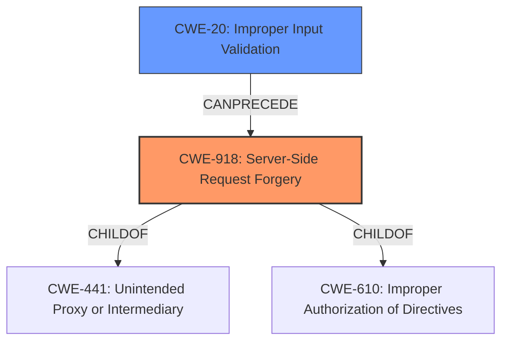

# Analysis Report for CVE-2021-21973

# Vulnerability Analysis Report: CVE-2021-21973

## Description


## Analysis (with Relationship Data)

# Summary
| CWE ID | CWE Name | Confidence | CWE Abstraction Level | CWE Vulnerability Mapping Label | CWE-Vulnerability Mapping Notes |
|---|---|---|---|---|---|
| CWE-918 | Server-Side Request Forgery (SSRF) | 1.0 | Base | Primary | Allowed |
| CWE-20 | Improper Input Validation | 0.7 | Class | Secondary | Discouraged |

## Evidence and Confidence

*   **Confidence Score:** 0.9
*   **Evidence Strength:** HIGH

## Relationship Analysis
The primary CWE is CWE-918, which is a base-level weakness describing Server-Side Request Forgery. This is a child of CWE-441 (Unintended Proxy or Intermediary) and CWE-610 (Improper Authorization of Directives). CWE-20 is a class-level weakness describing improper input validation, which can be a contributing factor to SSRF.



## Vulnerability Chain
The vulnerability chain starts with the **improper validation of URLs** (likely related to CWE-20), which leads to the possibility of Server-Side Request Forgery (CWE-918). A malicious actor can then send a POST request to the vCenter Server plugin, leading to information disclosure.

## Summary of Analysis
The primary weakness is CWE-918 (Server-Side Request Forgery), which is a direct consequence of **improper validation of URLs**. The vulnerability description explicitly states the root cause and impact, providing strong evidence for this classification. The "CVE Reference Links Content Summary" section confirms the root cause as "improper validation of URLs" leading to SSRF.

CWE-20 (Improper Input Validation) is considered as a secondary weakness, as the **improper validation of URLs** is a specific instance of improper input validation. While CWE-20 is a more general class, the description highlights a lack of proper validation, which is the root cause of the SSRF vulnerability.

The choice of CWE-918 is at the base level of abstraction, which is preferred, and directly addresses the vulnerability. While CWE-20 is a contributing factor, it is a higher-level class and less specific. The evidence strongly supports CWE-918 as the primary CWE, with CWE-20 playing a secondary role as a contributing factor.

Relevant CWE Information:
# Enhanced Context (25 CWEs)
The following CWEs were identified as potentially relevant to this vulnerability:

## CWE-1289: Improper Validation of Unsafe Equivalence in Input
**Abstraction Level**: Base
**Similarity Score**: 0.76
**Source**: dense

**Description**:
The product receives an input value that is used as a resource identifier or other type of reference, but it does not validate or incorrectly validates that the input is equivalent to a potentially-unsafe value.

**Mapping Guidance**:
- Usage: Allowed
- Rationale: This CWE entry is at the Base level of abstraction, which is a preferred level of abstraction for mapping to the root causes of vulnerabilities.

## CWE-918: Server-Side Request Forgery (SSRF)
**Abstraction Level:** Base
**Similarity Score**: 8379.18
**Source**: sparse

**Description**:
The web server receives a URL or similar request from an upstream component and retrieves the contents of this URL, but it does not sufficiently ensure that the request is being sent to the expected destination.

**Mapping Guidance**
**Usage:** Allowed
**Rationale:** This CWE entry is at the Base level of abstraction, which is a preferred level of abstraction for mapping to the root causes of vulnerabilities.

CWEs Considered but Not Used:

*   CWE-306 (Missing Authentication for Critical Function): While the description mentions that no authentication is required to exploit the vulnerability, the primary issue is the improper validation of URLs, not the missing authentication. Therefore, CWE-306 is not the most appropriate CWE.
*   CWE-73 (External Control of File Name or Path), CWE-611 (Improper Restriction of XML External Entity Reference), CWE-266 (Incorrect Privilege Assignment), CWE-113 (Improper Neutralization of CRLF Sequences in HTTP Headers ('HTTP Request/Response Splitting')), CWE-22 (Improper Limitation of a Pathname to a Restricted Directory ('Path Traversal')): These CWEs are not directly related to the SSRF vulnerability caused by **improper validation of URLs**. These are file or header manipulation issues, and don't fit the SSRF description.
*   CWE-74 (Improper Neutralization of Special Elements in Output Used by a Downstream Component ('Injection')): While SSRF can be seen as a type of injection, it is more precisely categorized as CWE-918. The mapping guidance discourages using CWE-74 when lower-level weaknesses are more appropriate.
*   CWE-284 (Improper Access Control): This is a very high-level CWE (Pillar) and not specific enough to describe the SSRF vulnerability. The mapping guidance discourages its use for low-information vulnerability reports.
* CWE-1289: Improper Validation of Unsafe Equivalence in Input: This is a good alternate candidate as it matches the **improper validation of URLs** description, but CWE-918 is a better fit because it identifies the root cause of the vulnerability as an SSRF.


## CWE Relationship Analysis

Current CWEs represent these abstraction levels: .


### Vulnerability Chain Analysis

**Chain starting from CWE-113:**
- 113 (Improper Neutralization of CRLF Sequences in HTTP Headers ('HTTP Request/Response Splitting')) - ROOT


**Chain starting from CWE-306:**
- 306 (Missing Authentication for Critical Function) - ROOT


### CWE Relationship Diagram

```mermaid
graph TD
    classDef primary fill:#f96,stroke:#333,stroke-width:2px
    classDef secondary fill:#69f,stroke:#333
    classDef tertiary fill:#9e9,stroke:#333
```


*Report generated on 2025-04-02 05:37:00*
