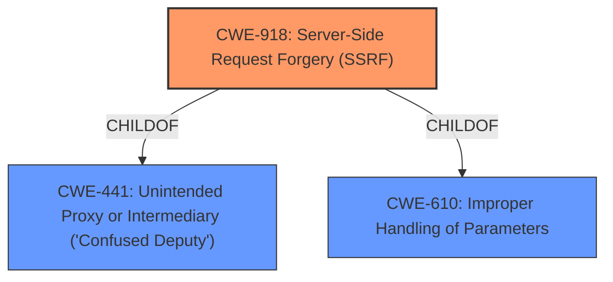

# Enhanced Analysis for CVE-2021-21975

# Summary
| CWE ID | CWE Name | Confidence | CWE Abstraction Level | CWE Vulnerability Mapping Label | CWE-Vulnerability Mapping Notes |
|---|---|---|---|---|---|
| CWE-918 | Server-Side Request Forgery (SSRF) | 1.0 | Base | Primary | Allowed |

## Evidence and Confidence

*   **Confidence Score:** 1.0
*   **Evidence Strength:** HIGH

## Relationship Analysis
The primary CWE selected is CWE-918 (Server-Side Request Forgery), which is a base-level CWE. The retriever results also included CWE-441 (Unintended Proxy or Intermediary) which is a class-level CWE and a parent of CWE-918. Given the specific nature of the vulnerability as a **server-side request forgery**, the base CWE-918 is more appropriate.



## Vulnerability Chain
The vulnerability chain is as follows:
1.  **Root Cause:** **Server-Side Request Forgery (SSRF)** (CWE-918) due to the vRealize Operations Manager API not sufficiently ensuring that a request is being sent to the expected destination.
2.  **Impact:** A malicious actor with network access to the vRealize Operations Manager API can perform an SSRF attack to steal administrative credentials.

## Summary of Analysis
The initial analysis strongly pointed to CWE-918 as the primary weakness, which was confirmed by the vulnerability description and the "CVE Reference Links Content Summary" which explicitly states that "The vRealize Operations Manager API contains a **Server Side Request Forgery vulnerability**." The retriever results also ranked CWE-918 as the top candidate.

The vulnerability description states that the **rootcause** is a "**server-side request forgery**". The **impact** is that an attacker can "steal administrative credentials." This aligns perfectly with the description of CWE-918. The CWE is at the optimal level of specificity (Base).

Relevant CWE Information:

# Enhanced Context (25 CWEs)

## CWE-74: Improper Neutralization of Special Elements in Output Used by a Downstream Component ('Injection')
**Abstraction Level**: Class
**Similarity Score**: 0.79
**Source**: dense

**Description**:
The product constructs all or part of a command, data structure, or record using externally-influenced input from an upstream component, but it does not neutralize or incorrectly neutralizes special elements that could modify how it is parsed or interpreted when it is sent to a downstream component.

**Mapping Guidance**:
- Usage: Discouraged
- Rationale: CWE-74 is high-level and often misused when lower-level weaknesses are more appropriate.

## CWE-918: Server-Side Request Forgery (SSRF)
**Abstraction Level**: Base
**Similarity Score**: 5687.55
**Source**: sparse

**Description**:
The web server receives a URL or similar request from an upstream component and retrieves the contents of this URL, but it does not sufficiently ensure that the request is being sent to the expected destination.

**Mapping Guidance**:
- Usage: Allowed
- Rationale: This CWE entry is at the Base level of abstraction, which is a preferred level of abstraction for mapping to the root causes of vulnerabilities.


## CWE Relationship Analysis

Current CWEs represent these abstraction levels: .


### Vulnerability Chain Analysis

**Chain starting from CWE-441:**
- 441 (Unintended Proxy or Intermediary ('Confused Deputy')) - ROOT


**Chain starting from CWE-918:**
- 918 (Server-Side Request Forgery (SSRF)) - ROOT


### CWE Relationship Diagram

```mermaid
graph TD
    classDef primary fill:#f96,stroke:#333,stroke-width:2px
    classDef secondary fill:#69f,stroke:#333
    classDef tertiary fill:#9e9,stroke:#333
```