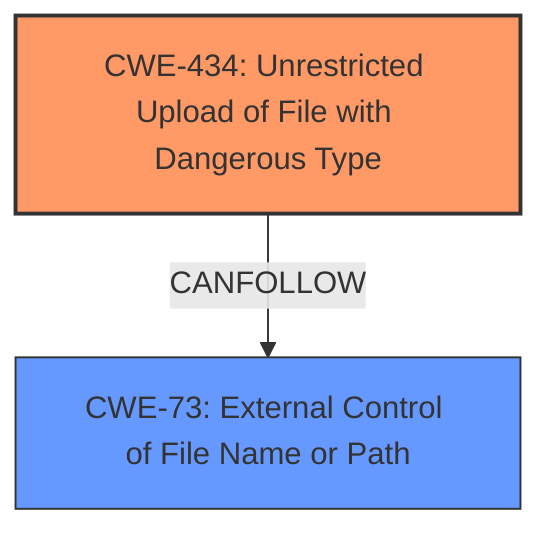

# Enhanced Analysis for CVE-2021-22005

# Summary
| CWE ID | CWE Name | Confidence | CWE Abstraction Level | CWE Vulnerability Mapping Label | CWE-Vulnerability Mapping Notes |
|---|---|---|---|---|---|
| CWE-434 | Unrestricted Upload of File with Dangerous Type | 1.0 | Base | Allowed | Primary CWE |
| CWE-73 | External Control of File Name or Path | 0.7 | Base | Allowed | Secondary Candidate |

## Evidence and Confidence

*   **Confidence Score:** 0.9
*   **Evidence Strength:** HIGH

## Relationship Analysis
The primary relationship that influenced the decision was the direct match of CWE-434 to the vulnerability description, indicating an unrestricted file upload leading to code execution. CWE-73 was considered as a related weakness where external input controls the file name/path, potentially contributing to the upload vulnerability.



## Vulnerability Chain
The vulnerability chain starts with the **unrestricted file upload** (CWE-434), which allows a malicious actor to upload a specially crafted file. This leads to code execution on the vCenter Server. The chain could involve **external control of filename or path** (CWE-73) contributing to how the file is handled on the server.

## Summary of Analysis
The initial analysis focused on identifying the **root cause** of the vulnerability, which is the **arbitrary file upload**. The "CVE Reference Links Content Summary" section confirms the **root cause** as an arbitrary file upload flaw within the Analytics service and highlights the lack of proper restrictions on file types and contents. The retriever results show CWE-434 as the top candidate, and its description directly matches the vulnerability: "The product allows the upload or transfer of dangerous file types that are automatically processed within its environment." This directly leads to the ability to execute code on the vCenter Server, making it a clear and specific match.

CWE-73 was considered because external control over the file name or path might contribute to exploiting the unrestricted file upload. However, the primary issue is the lack of restrictions on the *type* of file being uploaded, making CWE-434 the more direct and impactful weakness.

The selection of CWE-434 as the primary CWE is based on the evidence from the vulnerability description and its alignment with the CWE's definition, focusing on the unrestricted upload of dangerous file types leading to code execution.

# Relevant CWE Information:

## Vulnerability Description
The vCenter Server contains an **arbitrary file upload** vulnerability in the Analytics service. A malicious actor with network access to port 443 on vCenter Server may exploit this issue to execute code on vCenter Server by uploading a specially crafted file.

### Vulnerability Description Key Phrases
- **rootcause:** **arbitrary file upload**
- **impact:** code execution
- **vector:** uploading a specially crafted file
- **attacker:** malicious actor with network access to port 443
- **product:** vCenter Server
- **component:** Analytics service

## CVE Reference Links Content Summary
Based on the provided documents, here's a breakdown of the vulnerability described in CVE-2021-22005:

**Root Cause:**
- The vulnerability stems from an arbitrary file upload flaw present within the Analytics service of VMware vCenter Server.

**Weaknesses/Vulnerabilities:**
- Unrestricted file upload: The Analytics service lacks proper restrictions on the types and contents of files that can be uploaded.

**Impact of Exploitation:**
- Remote Code Execution: A successful exploit allows a malicious actor to execute arbitrary code on the vCenter Server system.

**Attack Vectors:**
- Network Access: The attacker needs network access to port 443 of the vCenter Server.
- Malicious File Upload: The attacker uploads a specially crafted file designed to trigger code execution.

**Required Attacker Capabilities/Position:**
- Network access to the vCenter Server on port 443.
- Ability to craft a malicious file for upload.
- No prior authentication is needed to exploit this vulnerability.

**Additional Notes:**
- The vulnerability is rated as "Critical" with a CVSSv3 base score of 9.8.
- This vulnerability is being actively exploited in the wild.
- vCenter Server 6.5 is not affected by this vulnerability.
- VMware has released updates to address this vulnerability.
- A workaround is provided in KB85717: https://kb.vmware.com/kb/85717

## CWE-434: Unrestricted Upload of File with Dangerous Type
The product allows the upload or transfer of dangerous file types that are automatically processed within its environment.

The vulnerability description clearly states an **arbitrary file upload** vulnerability. The "CVE Reference Links Content Summary" confirms the **root cause** as an arbitrary file upload flaw, and also specifies "Unrestricted file upload: The Analytics service lacks proper restrictions on the types and contents of files that can be uploaded". This aligns directly with the description of CWE-434. The impact is code execution, which is a typical consequence of uploading a dangerous file type. The confidence is high (1.0) because of the direct and explicit evidence.

## CWE-73: External Control of File Name or Path
The product allows user input to control or influence paths or file names that are used in filesystem operations.

This CWE could potentially be a contributing factor, as the attacker might control the file name or path during the upload process. However, the primary weakness is the lack of restrictions on the *type* of file being uploaded. Therefore, while relevant, CWE-73 is a secondary consideration.


## CWE Relationship Analysis

Current CWEs represent these abstraction levels: .


### Vulnerability Chain Analysis

**Chain starting from CWE-73:**
- 73 (External Control of File Name or Path) - ROOT


**Chain starting from CWE-434:**
- 434 (Unrestricted Upload of File with Dangerous Type) - ROOT


### CWE Relationship Diagram

```mermaid
graph TD
    classDef primary fill:#f96,stroke:#333,stroke-width:2px
    classDef secondary fill:#69f,stroke:#333
    classDef tertiary fill:#9e9,stroke:#333
```