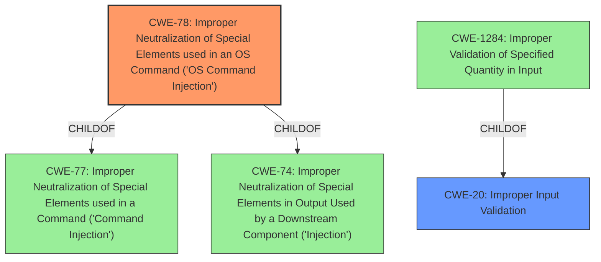

# Analysis Report for CVE-2021-22127

# Vulnerability Analysis Report: CVE-2021-22127

## Description


## Analysis (with Relationship Data)

# Summary
| CWE ID | CWE Name | Confidence | CWE Abstraction Level | CWE Vulnerability Mapping Label | CWE-Vulnerability Mapping Notes |
|---|---|---|---|---|---|
| CWE-78 | Improper Neutralization of Special Elements used in an OS Command ('OS Command Injection') | 1.0 | Base | Primary | Allowed |
| CWE-20 | Improper Input Validation | 0.7 | Class | Secondary | Discouraged |

## Evidence and Confidence

*   **Confidence Score:** 0.9
*   **Evidence Strength:** HIGH

## Relationship Analysis
The primary relationship that influenced my decision was the ChildOf relationship between CWE-78 and CWE-77 (Improper Neutralization of Special Elements used in a Command). This indicates that OS Command Injection is a specific type of command injection. Additionally, CWE-78 can also be a child of CWE-74 (Improper Neutralization of Special Elements in Output Used by a Downstream Component ('Injection')), highlighting that OS Command Injection is a form of injection. CWE-20 is a parent to CWE-1284 which relates to a quantity in the input, but the provided vulnerability description does not indicate what quantity is not validated, and it is more generally about the network name, so is not a good match.



## Vulnerability Chain
The vulnerability chain starts with the **improper input validation** of the network name (SSID). This leads to the **improper neutralization** of special elements used in an OS command, allowing an attacker to inject arbitrary commands. Finally, this results in the execution of arbitrary code on the host operating system as root.

## Summary of Analysis
The initial assessment pointed towards **CWE-78** due to the OS command injection flaw described in the CVE Reference Links Content Summary: "The application doesn't properly sanitize or validate the SSID, allowing an attacker to inject and execute arbitrary OS commands."
The **improper input validation** is the root cause described in the Vulnerability Description Key Phrases.

The primary CWE is **CWE-78 Improper Neutralization of Special Elements used in an OS Command ('OS Command Injection')**. The vulnerability description states that an attacker can execute arbitrary code on the host operating system by injecting commands into the network name. This aligns directly with the description of CWE-78, which involves constructing an OS command using externally-influenced input without proper neutralization.

The secondary CWE is **CWE-20 Improper Input Validation**. This is a more general weakness, but it's relevant because the root cause of the vulnerability is the lack of proper validation of the network name. The application should be validating the input to ensure that it does not contain any malicious commands. However, CWE-20 is discouraged because it is high level and often misused when lower-level weaknesses are more appropriate.

Relevant CWE Information:

# Enhanced Context (25 CWEs)
The following CWEs were identified as potentially relevant to this vulnerability:

## CWE-59: Improper Link Resolution Before File Access ('Link Following')
**Abstraction Level**: Base
**Similarity Score**: 0.76
**Source**: dense
- Not selected because it does not apply to this vulnerability which is related to network names instead of files.

## CWE-653: Improper Isolation or Compartmentalization
**Abstraction Level**: Class
**Similarity Score**: 0.76
**Source**: dense
- Not selected because it does not apply to this vulnerability.

## CWE-41: Improper Resolution of Path Equivalence
**Abstraction Level**: Base
**Similarity Score**: 0.76
**Source**: dense
- Not selected because it does not apply to this vulnerability which is related to network names instead of files.

## CWE-274: Improper Handling of Insufficient Privileges
**Abstraction Level**: Base
**Similarity Score**: 0.75
**Source**: dense
- Not selected because it does not apply to this vulnerability.

## CWE-74: Improper Neutralization of Special Elements in Output Used by a Downstream Component ('Injection')
**Abstraction Level**: Class
**Similarity Score**: 0.75
**Source**: dense
- Not selected because CWE-78 is a better fit as it's specific to OS Command Injection.

## CWE-1289: Improper Validation of Unsafe Equivalence in Input
**Abstraction Level**: Base
**Similarity Score**: 0.75
**Source**: dense
- Not selected because it does not apply to this vulnerability.

## CWE-73: External Control of File Name or Path
**Abstraction Level**: Base
**Similarity Score**: 0.75
**Source**: dense
- Not selected because it does not apply to this vulnerability which is related to network names instead of files.

## CWE-266: Incorrect Privilege Assignment
**Abstraction Level**: Base
**Similarity Score**: 0.74
**Source**: dense
- Not selected because it does not apply to this vulnerability.

## CWE-280: Improper Handling of Insufficient Permissions or Privileges
**Abstraction Level**: Base
**Similarity Score**: 0.74
**Source**: dense
- Not selected because it does not apply to this vulnerability.

## CWE-23: Relative Path Traversal
**Abstraction Level**: Base
**Similarity Score**: 0.74
**Source**: dense
- Not selected because it does not apply to this vulnerability which is related to network names instead of files.

## CWE-22: Improper Limitation of a Pathname to a Restricted Directory ('Path Traversal')
**Abstraction Level**: Base
**Similarity Score**: 9149.17
**Source**: sparse
- Not selected because it does not apply to this vulnerability which is related to network names instead of files.

## CWE-23: Relative Path Traversal
**Abstraction Level**: Base
**Similarity Score**: 8851.75
**Source**: sparse
- Not selected because it does not apply to this vulnerability which is related to network names instead of files.

## CWE-59: Improper Link Resolution Before File Access ('Link Following')
**Abstraction Level**: Base
**Similarity Score**: 8815.04
**Source**: sparse
- Not selected because it does not apply to this vulnerability which is related to network names instead of files.

## CWE-88: Improper Neutralization of Argument Delimiters in a Command ('Argument Injection')
**Abstraction Level**: Base
**Similarity Score**: 8443.43
**Source**: sparse
- Not selected because CWE-78 is a better fit as it's specific to OS Command Injection.

## CWE-427: Uncontrolled Search Path Element
**Abstraction Level**: Base
**Similarity Score**: 8436.11
**Source**: sparse
- Not selected because it does not apply to this vulnerability.

## CWE-78: Improper Neutralization of Special Elements used in an OS Command ('OS Command Injection')
**Abstraction Level**: base
**Similarity Score**: 5.03
**Source**: graph

**Description**:
CWE-78: Improper Neutralization of Special Elements used in an OS Command ('OS Command Injection')

**Mapping Guidance**:
- Usage: Allowed
- Rationale: This CWE entry is at the Base level of abstraction, which is a preferred level of abstraction for mapping to the root causes of vulnerabilities.

**Relationships**:
- CANFOLLOW -> CWE-184
- CANALSOBE -> CWE-88
- CHILDOF -> CWE-77
- CHILDOF -> CWE-77
- CHILDOF -> CWE-74
- Selected because this is the primary CWE.

## CWE-22: Improper Limitation of a Pathname to a Restricted Directory ('Path Traversal')
**Abstraction Level**: base
**Similarity Score**: 4.33
**Source**: graph
- Not selected because it does not apply to this vulnerability which is related to network names instead of files.

## CWE-770: Allocation of Resources Without Limits or Throttling
**Abstraction Level**: base
**Similarity Score**: 4.33
**Source**: graph
- Not selected because it does not apply to this vulnerability.

## CWE-190:


## CWE Relationship Analysis

Current CWEs represent these abstraction levels: .


### Vulnerability Chain Analysis

**Chain starting from CWE-41:**
- 41 (Improper Resolution of Path Equivalence) - ROOT


**Chain starting from CWE-78:**
- 78 (Improper Neutralization of Special Elements used in an OS Command ('OS Command Injection')) - ROOT


### CWE Relationship Diagram

```mermaid
graph TD
    classDef primary fill:#f96,stroke:#333,stroke-width:2px
    classDef secondary fill:#69f,stroke:#333
    classDef tertiary fill:#9e9,stroke:#333
```


*Report generated on 2025-03-31 05:57:41*
