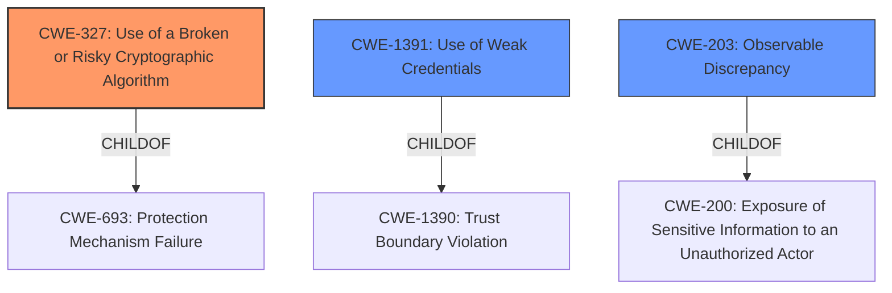

# Analysis Report for CVE-2021-22212

# Vulnerability Analysis Report: CVE-2021-22212

## Description


## Analysis (with Relationship Data)

# Summary
| CWE ID | CWE Name | Confidence | CWE Abstraction Level | CWE Vulnerability Mapping Label | CWE-Vulnerability Mapping Notes |
|---|---|---|---|---|---|
| CWE-327 | Use of a Broken or Risky Cryptographic Algorithm | 0.8 | Class | Primary | Allowed-with-Review |
| CWE-1391 | Use of Weak Credentials | 0.7 | Class | Secondary | Allowed-with-Review |
| CWE-203 | Observable Discrepancy | 0.6 | Base | Secondary | Allowed |

## Evidence and Confidence

*   **Confidence Score:** 0.7
*   **Evidence Strength:** HIGH

## Relationship Analysis
The analysis focused on the relationship between cryptographic algorithm vulnerabilities (CWE-327) and related weaknesses like the use of weak credentials (CWE-1391) and observable discrepancies (CWE-203). CWE-327 is a class-level CWE and has children that might be a better fit, but none seem to apply here. CWE-1391 and CWE-203 were considered as contributing factors to the overall vulnerability, but were deemed secondary to the core cryptographic issue. The abstraction levels were considered to ensure the most specific and accurate representation of the vulnerability.



## Vulnerability Chain
The vulnerability chain starts with the **root cause** of `ntpkeygen` generating keys with '#' characters. This leads to `ntpd` either padding, shortening, or failing to load these keys. The final impact is that the administrator cannot use the keys as expected, or the keys are shorter than expected and easier to brute-force, potentially resulting in MITM attacks.

## Summary of Analysis
The initial analysis identified the **root cause** as the generation of keys with '#' characters, which `ntpd` then improperly handles, leading to weakened keys. This is based on the **Vulnerability Description Key Phrases** that says "**rootcause:** **NTPsec 1.2.0 allows ntpkeygen to generate keys with # characters**" and "**impact:** fails to load keys with # characters and pads or shortens the key and brute-force keys". The analysis also considered other related weaknesses like insufficient entropy or improper input validation.

The Retriever Results and Complete CWE Specifications helped refine the classification. CWE-327 (Use of a Broken or Risky Cryptographic Algorithm) was chosen as the primary CWE because the generated keys are effectively weakened by the '#' character, making them easier to brute-force. The **CVE Reference Links Content Summary** section supports this by stating: "As a result, keys containing '#' were truncated when read by `ntpd`. This resulted in keys being shorter than expected, making them easier to break."

CWE-1391 (Use of Weak Credentials) was added as a secondary CWE because the **impact** of the vulnerability is the creation of weak keys. CWE-203 (Observable Discrepancy) was included as a tertiary CWE because the behavior of `ntpd` (padding, shortening, or failing to load keys) could be observable and expose information about the key.

The selected CWEs are at the optimal level of specificity because they directly address the **root cause** and **impact** of the vulnerability.

Relevant CWE Information:

# Enhanced Context (25 CWEs)

## CWE-1240: Use of a Cryptographic Primitive with a Risky Implementation
**Abstraction Level**: Base
**Similarity Score**: 0.79
**Source**: dense

**Description**:
To fulfill the need for a cryptographic primitive, the product implements a cryptographic algorithm using a non-standard, unproven, or disallowed/non-compliant cryptographic implementation.

**Mapping Guidance**:
- Usage: Allowed
- Rationale: This CWE entry is at the Base level of abstraction, which is a preferred level of abstraction for mapping to the root causes of vulnerabilities.

*This CWE was considered, but it was determined that CWE-327 was a better fit because the issue is not with the implementation of the algorithm, but with the keys being generated in such a way that they become weak.*

## CWE-330: Use of Insufficiently Random Values
**Abstraction Level**: Class
**Similarity Score**: 0.77
**Source**: dense

**Description**:
The product uses insufficiently random numbers or values in a security context that depends on unpredictable numbers.

**Mapping Guidance**:
- Usage: Discouraged
- Rationale: This CWE entry is a level-1 Class (i.e., a child of a Pillar). It might have lower-level children that would be more appropriate

*This CWE was considered, but it was not directly related to the described vulnerability.*

## CWE-335: Incorrect Usage of Seeds in Pseudo-Random Number Generator (PRNG)
**Abstraction Level**: Base
**Similarity Score**: 0.76
**Source**: dense

**Description**:
The product uses a Pseudo-Random Number Generator (PRNG) but does not correctly manage seeds.

**Mapping Guidance**:
- Usage: Allowed
- Rationale: This CWE entry is at the Base level of abstraction, which is a preferred level of abstraction for mapping to the root causes of vulnerabilities.

*This CWE was considered, but it was not directly related to the described vulnerability.*

## CWE-1391: Use of Weak Credentials
**Abstraction Level**: Class
**Similarity Score**: 0.76
**Source**: dense

**Description**:
The product uses weak credentials (such as a default key or hard-coded password) that can be calculated, derived, reused, or guessed by an attacker.

**Mapping Guidance**:
- Usage: Allowed-with-Review
- Rationale: This CWE entry is a Class and might have Base-level children that would be more appropriate

*This CWE was added as a secondary CWE because the impact of the vulnerability is the creation of weak keys.*

## CWE-203: Observable Discrepancy
**Abstraction Level**: Base
**Similarity Score**: 0.75
**Source**: dense

**Description**:
The product behaves differently or sends different responses under different circumstances in a way that is observable to an unauthorized actor, which exposes security-relevant information about the state of the product, such as whether a particular operation was successful or not.

**Mapping Guidance**:
- Usage: Allowed
- Rationale: This CWE entry is at the Base level of abstraction, which is a preferred level of abstraction for mapping to the root causes of vulnerabilities.

*This CWE was included as a tertiary CWE because the behavior of `ntpd` (padding, shortening, or failing to load keys) could be observable and expose information about the key.*

## CWE-331: Insufficient Entropy
**Abstraction Level**: Base
**Similarity Score**: 0.75
**Source**: dense

**Description**:
The product uses an algorithm or scheme that produces insufficient entropy, leaving patterns or clusters of values that are more likely to occur than others.

**Mapping Guidance**:
- Usage: Allowed
- Rationale: This CWE entry is at the Base level of abstraction, which is a preferred level of abstraction for mapping to the root causes of vulnerabilities.

*This CWE was considered, but it was not directly related to the described vulnerability.*

## CWE-312: Cleartext Storage of Sensitive Information
**Abstraction Level**: Base
**Similarity Score**: 0.75
**Source**: dense

**Description**:
The product stores sensitive information in cleartext within a resource that might be accessible to another control sphere.

**Mapping Guidance**:
- Usage: Allowed
- Rationale: This CWE entry is at the Base level of abstraction, which is a preferred level of abstraction for mapping to the root causes of vulnerabilities.

*This CWE was considered, but it was not directly related to the described vulnerability.*

## CWE-208: Observable Timing Discrepancy
**Abstraction Level**: Base
**Similarity Score**: 0.74
**Source**: dense

**Description**:
Two separate operations in a product require different amounts of time to complete, in a way that is observable to an actor and reveals security-relevant information about the state of the product, such as whether a particular operation was successful or not.

**Mapping Guidance**:
- Usage: Allowed
- Rationale: This CWE entry is at the Base level of abstraction, which


## CWE Relationship Analysis

Current CWEs represent these abstraction levels: .


### Vulnerability Chain Analysis

**Chain starting from CWE-208:**
- 208 (Observable Timing Discrepancy) - ROOT


**Chain starting from CWE-203:**
- 203 (Observable Discrepancy) - ROOT


### CWE Relationship Diagram

```mermaid
graph TD
    classDef primary fill:#f96,stroke:#333,stroke-width:2px
    classDef secondary fill:#69f,stroke:#333
    classDef tertiary fill:#9e9,stroke:#333
```


*Report generated on 2025-03-30 18:27:59*
