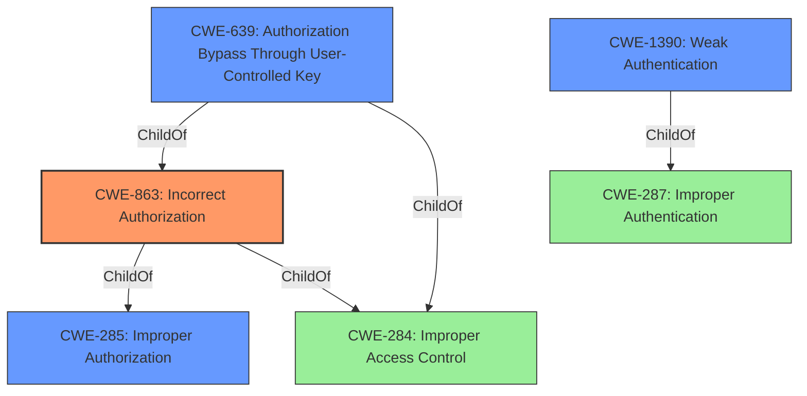

# Analysis Report for CVE-2021-22240

# Vulnerability Analysis Report: CVE-2021-22240

## Description


## Analysis (with Relationship Data)

# Summary
| CWE ID | CWE Name | Confidence | CWE Abstraction Level | CWE Vulnerability Mapping Label | CWE-Vulnerability Mapping Notes |
|---|---|---|---|---|---|
| CWE-863 | Incorrect Authorization | 0.9 | Class | Allowed-with-Review | Primary CWE |
| CWE-639 | Authorization Bypass Through User-Controlled Key | 0.7 | Base | Allowed | Secondary Candidate |
| CWE-1390 | Weak Authentication | 0.5 | Class | Allowed-with-Review | Secondary Candidate |
| CWE-285 | Improper Authorization | 0.4 | Class | Discouraged | Secondary Candidate |

## Evidence and Confidence

*   **Confidence Score:** 0.9
*   **Evidence Strength:** HIGH

## Relationship Analysis
The primary CWE selected is CWE-863, Incorrect Authorization, which is a Class-level CWE. Its parent is CWE-285, Improper Authorization, and is related to CWE-284, Improper Access Control. The more specific CWE-639, Authorization Bypass Through User-Controlled Key, is a child of both CWE-863 and CWE-284. CWE-1390, Weak Authentication is also a child of CWE-287.



## Vulnerability Chain
The vulnerability chain starts with an **improper access control** issue, where the `omniauth_block_auto_created_users` setting **fails to prevent** the creation of new users via single sign-on (SSO) when a user cap is enabled. This **incorrect authorization** allows new users to bypass intended restrictions and gain access to the system, potentially leading to unauthorized access.

## Summary of Analysis
The initial assessment, based on the vulnerability description and the retriever results, points to **improper access control** as the root cause. The vulnerability description key phrases highlight "**Improper access control**" as the root cause. The CVE Reference Links Content Summary states that "The `omniauth_block_auto_created_users` setting, intended to block new user accounts when a user cap is enabled, was not functioning as expected." This suggests a failure in the authorization mechanism.

The retriever results list CWE-863 (Incorrect Authorization) and CWE-285 (Improper Authorization) as top candidates. However, CWE-285 is discouraged because it is a high-level Class. CWE-863 is more specific, indicating that an authorization check was performed but was incorrect.

The analysis also considered CWE-639 (Authorization Bypass Through User-Controlled Key), which is a Base-level CWE. While the vulnerability involves bypassing authorization, the root cause is not necessarily due to a user-controlled key. The SSO mechanism, while initiated by the user, involves more complex interactions and configurations.

CWE-1390 (Weak Authentication) was considered, but the primary issue is not the strength of the authentication mechanism itself, but rather the failure to properly authorize user creation based on the user cap setting.

Therefore, the final decision is to classify the vulnerability as CWE-863 (Incorrect Authorization) as the primary CWE, with CWE-639 and CWE-1390 as secondary candidates. This classification is based on the evidence that the authorization check related to the user cap was not functioning correctly, allowing unauthorized user creation. The abstraction level of CWE-863 (Class) is appropriate as it captures the general nature of the authorization failure. CWE-639 (Base) offers a more specific view but doesn't fully capture the root cause, while CWE-1390 is more related to authentication.

Relevant CWE Information:

# Enhanced Context (25 CWEs)
The following CWEs were identified as potentially relevant to this vulnerability:

## CWE-639: Authorization Bypass Through User-Controlled Key
**Abstraction Level**: Base
**Similarity Score**: 0.76
**Source**: dense

**Description**:
The system's authorization functionality does not prevent one user from gaining access to another user's data or record by modifying the key value identifying the data.

**Mapping Guidance**:
- Usage: Allowed
- Rationale: This CWE entry is at the Base level of abstraction, which is a preferred level of abstraction for mapping to the root causes of vulnerabilities.

## CWE-1289: Improper Validation of Unsafe Equivalence in Input
**Abstraction Level**: Base
**Similarity Score**: 0.75
**Source**: dense

**Description**:
The product receives an input value that is used as a resource identifier or other type of reference, but it does not validate or incorrectly validates that the input is equivalent to a potentially-unsafe value.

**Mapping Guidance**:
- Usage: Allowed
- Rationale: This CWE entry is at the Base level of abstraction, which is a preferred level of abstraction for mapping to the root causes of vulnerabilities.

## CWE-274: Improper Handling of Insufficient Privileges
**Abstraction Level**: Base
**Similarity Score**: 0.75
**Source**: dense

**Description**:
The product does not handle or incorrectly handles when it has insufficient privileges to perform an operation, leading to resultant weaknesses.

**Mapping Guidance**:
- Usage: Discouraged
- Rationale: This CWE entry could be deprecated in a future version of CWE.

## CWE-404: Improper Resource Shutdown or Release
**Abstraction Level**: Class
**Similarity Score**: 0.75
**Source**: dense

**Description**:
The product does not release or incorrectly releases a resource before it is made available for re-use.

**Mapping Guidance**:
- Usage: Allowed-with-Review
- Rationale: This CWE entry is a Class and might have Base-level children that would be more appropriate

## CWE-653: Improper Isolation or Compartmentalization
**Abstraction Level**: Class
**Similarity Score**: 0.75
**Source**: dense

**Description**:
The product does not properly compartmentalize or isolate functionality, processes, or resources that require different privilege levels, rights, or permissions.

**Mapping Guidance**:
- Usage: Allowed
- Rationale: This CWE entry is at the Base level of abstraction, which is a preferred level of abstraction for mapping to the root causes of vulnerabilities.

## CWE-664: Improper Control of a Resource Through its Lifetime
**Abstraction Level**: Pillar
**Similarity Score**: 0.75
**Source**: dense

**Description**:
The product does not maintain or incorrectly maintains control over a resource throughout its lifetime of creation, use, and release.

**Mapping Guidance**:
- Usage: Discouraged
- Rationale: This CWE entry is high-level when lower-level children are available.

## CWE-1220: Insufficient Granularity of Access Control
**Abstraction Level**: Base
**Similarity Score**: 0.75
**Source**: dense

**Description**:
The product implements access controls via a policy or other feature with the intention to disable or restrict accesses (reads and/or writes) to assets in a system from untrusted agents. However, implemented access controls lack required granularity, which renders the control policy too broad because it allows accesses from unauthorized agents to the security-sensitive assets.

**Mapping Guidance**:
- Usage: Allowed
- Rationale: This CWE entry is at the Base level of abstraction, which is a preferred level of abstraction for mapping to the root causes of vulnerabilities.

## CWE-280: Improper Handling of Insufficient Permissions or Privileges
**Abstraction Level**: Base
**Similarity Score**: 0.75
**Source**: dense

**Description**:
The product does not handle or incorrectly handles when it has insufficient privileges to access resources or functionality as specified by their permissions. This may cause it to follow unexpected code paths that may leave the product in an invalid state.

**Mapping Guidance**:
- Usage: Allowed
- Rationale: This CWE entry is at the Base level of abstraction, which is a preferred level of abstraction for mapping to the root causes of vulnerabilities.

## CWE-405: Asymmetric Resource Consumption (Amplification)
**Abstraction Level**: Class


## CWE Relationship Analysis

Current CWEs represent these abstraction levels: .


### Vulnerability Chain Analysis

**Chain starting from CWE-280:**
- 280 (Improper Handling of Insufficient Permissions or Privileges ) - ROOT


**Chain starting from CWE-405:**
- 405 (Asymmetric Resource Consumption (Amplification)) - ROOT


### CWE Relationship Diagram

```mermaid
graph TD
    classDef primary fill:#f96,stroke:#333,stroke-width:2px
    classDef secondary fill:#69f,stroke:#333
    classDef tertiary fill:#9e9,stroke:#333
```


*Report generated on 2025-03-31 09:34:02*
