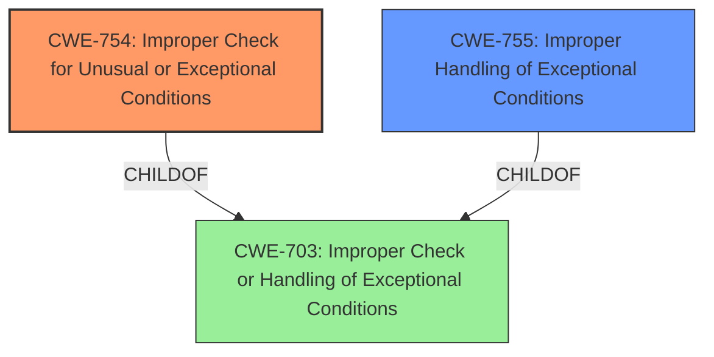

# Analysis Report for CVE-2021-22285

# Vulnerability Analysis Report: CVE-2021-22285

## Description


## Analysis (with Relationship Data)

# Summary
| CWE ID | CWE Name | Confidence | CWE Abstraction Level | CWE Vulnerability Mapping Label | CWE-Vulnerability Mapping Notes |
|---|---|---|---|---|---|
| CWE-754 | Improper Check for Unusual or Exceptional Conditions | 0.9 | Class | Primary | Allowed-with-Review |
| CWE-755 | Improper Handling of Exceptional Conditions | 0.8 | Class | Secondary | Discouraged |

## Evidence and Confidence

*   **Confidence Score:** 0.85
*   **Evidence Strength:** HIGH

## Relationship Analysis
The primary relationship is that both CWE-754 and CWE-755 are children of CWE-703 (Improper Check or Handling of Exceptional Conditions), which is a higher-level Pillar. Since the vulnerability description explicitly mentions both "Improper Handling of Exceptional Conditions" and "Improper Check for Unusual or Exceptional Conditions," mapping to the children (CWE-754 and CWE-755) provides more specific classifications than mapping to the parent (CWE-703) alone.



## Vulnerability Chain
The vulnerability chain is relatively simple:
1.  **Root Cause:** **Improper Check for Unusual or Exceptional Conditions** (CWE-754) and **Improper Handling of Exceptional Conditions** (CWE-755)
2.  **Impact:** Denial of service or making the module unresponsive.

## Summary of Analysis
The initial analysis identified CWE-754 and CWE-755 as potential matches based on the vulnerability description's key phrases. The retriever results also support these findings, with CWE-755 and CWE-754 being ranked among the top candidates. The "Vulnerability Description Key Phrases" clearly states the **weakness** is "**Improper Handling of Exceptional Conditions, Improper Check for Unusual or Exceptional Conditions**".

The relationship analysis further solidifies this decision. While CWE-703 (Improper Check or Handling of Exceptional Conditions) is a parent of both CWE-754 and CWE-755, choosing the children provides a more granular and accurate representation of the vulnerability, as the description mentions both conditions specifically.

The evidence from the vulnerability description directly supports the selection of CWE-754 and CWE-755. The description explicitly states that the vulnerability involves both improper handling and improper checking of exceptional conditions.

CWE-754 is chosen as the primary because checking should happen before handling.

The selected CWEs are at the optimal level of specificity because they directly correspond to the weaknesses described in the vulnerability description. Choosing a more general CWE (e.g., CWE-703) would lose valuable information about the specific nature of the vulnerability.

Relevant CWE Information:

# Enhanced Context (25 CWEs)
The following CWEs were identified as potentially relevant to this vulnerability:

## CWE-404: Improper Resource Shutdown or Release
**Abstraction Level**: Class
**Similarity Score**: 0.78
**Source**: dense

**Description**:
The product does not release or incorrectly releases a resource before it is made available for re-use.

**Mapping Guidance**:
- Usage: Allowed-with-Review
- Rationale: This CWE entry is a Class and might have Base-level children that would be more appropriate

**Analysis:** While a resource issue could stem from not handling exceptions properly, this CWE is too specific and does not directly address the **weakness** described. It was therefore not selected.

## CWE-226: Sensitive Information in Resource Not Removed Before Reuse
**Abstraction Level**: Base
**Similarity Score**: 0.78
**Source**: dense

**Description**:
The product releases a resource such as memory or a file so that it can be made available for reuse, but it does not clear or "zeroize" the information contained in the resource before the product performs a critical state transition or makes the resource available for reuse by other entities.

**Mapping Guidance**:
- Usage: Allowed
- Rationale: This CWE entry is at the Base level of abstraction, which is a preferred level of abstraction for mapping to the root causes of vulnerabilities.

**Analysis:** Similar to CWE-404, this is too specific and doesn't match the broader problem of exception handling.

## CWE-664: Improper Control of a Resource Through its Lifetime
**Abstraction Level**: Pillar
**Similarity Score**: 0.75
**Source**: dense

**Description**:
The product does not maintain or incorrectly maintains control over a resource throughout its lifetime of creation, use, and release.

**Mapping Guidance**:
- Usage: Discouraged
- Rationale: This CWE entry is high-level when lower-level children are available.

**Analysis:** This is too high-level (Pillar) and doesn't fit as well as CWE-754/755.

## CWE-415: Double Free
**Abstraction Level**: Variant
**Similarity Score**: 0.75
**Source**: dense

**Description**:
The product calls free() twice on the same memory address, potentially leading to modification of unexpected memory locations.

**Mapping Guidance**:
- Usage: Allowed
- Rationale: This CWE entry is at the Variant level of abstraction, which is a preferred level of abstraction for mapping to the root causes of vulnerabilities.

**Analysis:** This is a specific memory management issue, not a general exception handling problem.

## CWE-130: Improper Handling of Length Parameter Inconsistency
**Abstraction Level**: Base
**Similarity Score**: 0.75
**Source**: dense

**Description**:
The product parses a formatted message or structure, but it does not handle or incorrectly handles a length field that is inconsistent with the actual length of the associated data.

**Mapping Guidance**:
- Usage: Allowed
- Rationale: This CWE entry is at the Base level of abstraction, which is a preferred level of abstraction for mapping to the root causes of vulnerabilities.

**Analysis:** This is specific to length parameter issues, which is not mentioned in the description.

## CWE-667: Improper Locking
**Abstraction Level**: Class
**Similarity Score**: 0.74
**Source**: dense

**Description**:
The product does not properly acquire or release a lock on a resource, leading to unexpected resource state changes and behaviors.

**Mapping Guidance**:
- Usage: Allowed-with-Review
- Rationale: This CWE entry is a Class and might have Base-level children that would be more appropriate

**Analysis:** This is related to locking mechanisms, not exception handling.

## CWE-754: Improper Check for Unusual or Exceptional Conditions
**Abstraction Level**: Class
**Similarity Score**: 0.74
**Source**: dense

**Description**:
The product does not check or incorrectly checks for unusual or exceptional conditions that are not expected to occur frequently during day to day operation of the product.

**Mapping Guidance**:
- Usage: Allowed-with-Review
- Rationale: This CWE entry is a Class and might have Base-level children that would be more appropriate

**Analysis:** This is the same as the selected primary CWE.

## CWE-131: Incorrect Calculation of Buffer Size
**Abstraction Level**: Base
**Similarity Score**: 0.74
**Source**: dense

**Description**:
The product does not correctly calculate the size to be used when allocating a buffer, which could lead to a buffer overflow.

**Mapping Guidance**:
- Usage: Allowed
- Rationale: This CWE entry is at the Base level of abstraction, which is a preferred level of abstraction for mapping to the root causes of vulnerabilities.

**Analysis:** This is a specific buffer size calculation issue, not a general exception handling problem.

## CWE-703: Improper Check or Handling of Exceptional Conditions
**Abstraction Level**: Pillar
**Similarity Score**: 0.74
**Source**: dense

**Description**:
The product does not properly anticipate or handle exceptional conditions that rarely occur during normal operation of the product.

**Mapping Guidance**:
- Usage: Discouraged
- Rationale: This CWE entry is extremely high-level, a Pillar.

**Analysis:** This is the parent of the selected CWEs and is too high-level.

## CWE-1325: Improperly Controlled Sequential Memory Allocation
**Abstraction Level**: Base
**Similarity Score**: 0.74
**Source**: dense

**Description**:
The product manages a group of objects or resources and performs a separate memory allocation for each object, but it does not properly limit the total amount of memory that is consumed by all of the combined objects.

**Mapping Guidance**:
- Usage: Allowed
-


## CWE Relationship Analysis

Current CWEs represent these abstraction levels: .


### Vulnerability Chain Analysis

**Chain starting from CWE-131:**
- 131 (Incorrect Calculation of Buffer Size) - ROOT


**Chain starting from CWE-1325:**
- 1325 (Improperly Controlled Sequential Memory Allocation) - ROOT


### CWE Relationship Diagram

```mermaid
graph TD
    classDef primary fill:#f96,stroke:#333,stroke-width:2px
    classDef secondary fill:#69f,stroke:#333
    classDef tertiary fill:#9e9,stroke:#333
```


*Report generated on 2025-03-31 02:47:31*
