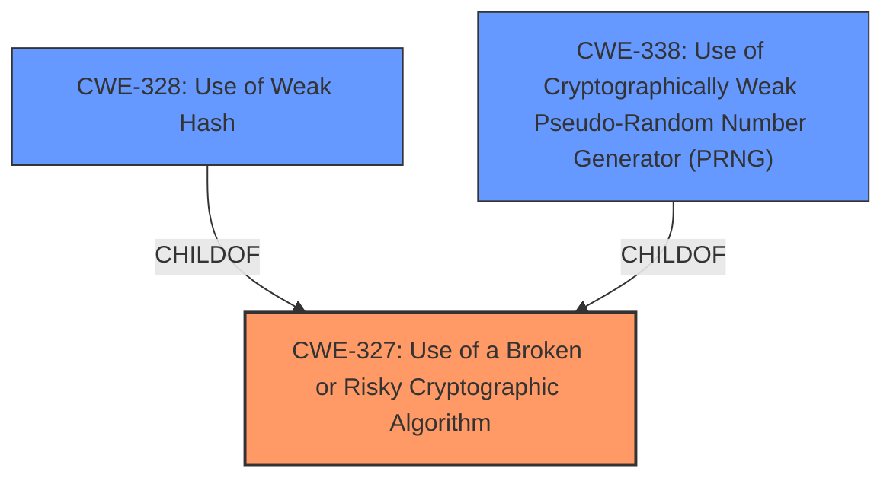

# Analysis Report for CVE-2021-22356

# Vulnerability Analysis Report: CVE-2021-22356

## Description


## Analysis (with Relationship Data)

# Summary
| CWE ID    | CWE Name                                                        | Confidence | CWE Abstraction Level | CWE Vulnerability Mapping Label | CWE-Vulnerability Mapping Notes |
| :-------- | :-------------------------------------------------------------- | :--------- | :---------------------- | :------------------------------ | :------------------------------ |
| CWE-327   | Use of a Broken or Risky Cryptographic Algorithm                | 0.95       | Class                   | Primary CWE                     | Allowed-with-Review             |
| CWE-328   | Use of Weak Hash                                                | 0.7        | Base                    | Secondary Candidate             | Allowed                       |
| CWE-338   | Use of Cryptographically Weak Pseudo-Random Number Generator (PRNG) | 0.6       | Base                    | Secondary Candidate             | Allowed                       |

## Evidence and Confidence

*   **Confidence Score:** 0.8
*   **Evidence Strength:** HIGH

## Relationship Analysis
The primary CWE selected is CWE-327 (Use of a Broken or Risky Cryptographic Algorithm), which is a Class-level CWE. CWE-327 is a parent of CWE-328 (Use of Weak Hash) and CWE-916 (Use of Password Hash With Insufficient Computational Effort). If the specific weak algorithm was a hashing algorithm, then CWE-328 would be a more appropriate and specific choice. Similarly, if the algorithm involved generating random numbers, then CWE-338 (Use of Cryptographically Weak Pseudo-Random Number Generator (PRNG)) might be more appropriate; however, as a class, it can also point to a broader range of cryptographic flaws.



## Vulnerability Chain
The chain of events is as follows:
1.  Root Cause: **Weak secure algorithm** (CWE-327)
2.  Attack Vector: Capturing and analyzing messages between devices.
3.  Impact: Information leak.

## Summary of Analysis
The initial assessment focused on the use of a **weak secure algorithm**. The primary focus was to identify a CWE that describes the **root cause** of the vulnerability.

The selection of CWE-327 is based on the vulnerability description stating that a **weak secure algorithm** is used. The vulnerability can be exploited by capturing and analyzing messages, which leads to an information leak. This aligns directly with the description of CWE-327, which states that the product uses a broken or risky cryptographic algorithm or protocol, and that insecure cryptography can be exploited to expose sensitive information.

The evidence from the vulnerability description is: "There is a **weak secure algorithm** vulnerability in Huawei products." and "A **weak secure algorithm** is used in a module. Attackers can exploit this vulnerability by capturing and analyzing the messages between devices to obtain information. This can lead to information leak."

The final decision to use CWE-327 is based on the direct evidence of a **weak secure algorithm** being used. While other CWEs like CWE-328 and CWE-338 were considered, they are more specific types of cryptographic weaknesses. Without more information about the exact nature of the algorithm, CWE-327 is the most appropriate choice, as it covers the general case of using a broken or risky cryptographic algorithm. CWE-327 is also a better fit than CWE-326 "Inadequate Encryption Strength" as the term "algorithm" is used rather than "encryption".

Relevant CWE Information:

# Enhanced Context (25 CWEs)
The following CWEs were identified as potentially relevant to this vulnerability:

## CWE-345: Insufficient Verification of Data Authenticity
**Abstraction Level**: Class
**Similarity Score**: 0.78
**Source**: dense

**Description**:
The product does not sufficiently verify the origin or authenticity of data, in a way that causes it to accept invalid data.

**Mapping Guidance**:
- Usage: Discouraged
- Rationale: This CWE entry is a level-1 Class (i.e., a child of a Pillar). It might have lower-level children that would be more appropriate

## CWE-1240: Use of a Cryptographic Primitive with a Risky Implementation
**Abstraction Level**: Base
**Similarity Score**: 0.78
**Source**: dense

**Description**:
To fulfill the need for a cryptographic primitive, the product implements a cryptographic algorithm using a non-standard, unproven, or disallowed/non-compliant cryptographic implementation.

**Mapping Guidance**:
- Usage: Allowed
- Rationale: This CWE entry is at the Base level of abstraction, which is a preferred level of abstraction for mapping to the root causes of vulnerabilities.

## CWE-1391: Use of Weak Credentials
**Abstraction Level**: Class
**Similarity Score**: 0.77
**Source**: dense

**Description**:
The product uses weak credentials (such as a default key or hard-coded password) that can be calculated, derived, reused, or guessed by an attacker.

**Mapping Guidance**:
- Usage: Allowed-with-Review
- Rationale: This CWE entry is a Class and might have Base-level children that would be more appropriate

## CWE-330: Use of Insufficiently Random Values
**Abstraction Level**: Class
**Similarity Score**: 0.77
**Source**: dense

**Description**:
The product uses insufficiently random numbers or values in a security context that depends on unpredictable numbers.

**Mapping Guidance**:
- Usage: Discouraged
- Rationale: This CWE entry is a level-1 Class (i.e., a child of a Pillar). It might have lower-level children that would be more appropriate

## CWE-203: Observable Discrepancy
**Abstraction Level**: Base
**Similarity Score**: 0.76
**Source**: dense

**Description**:
The product behaves differently or sends different responses under different circumstances in a way that is observable to an unauthorized actor, which exposes security-relevant information about the state of the product, such as whether a particular operation was successful or not.

**Mapping Guidance**:
- Usage: Allowed
- Rationale: This CWE entry is at the Base level of abstraction, which is a preferred level of abstraction for mapping to the root causes of vulnerabilities.

## CWE-328: Use of Weak Hash
**Abstraction Level**: Base
**Similarity Score**: 0.76
**Source**: dense

**Description**:
The product uses an algorithm that produces a digest (output value) that does not meet security expectations for a hash function that allows an adversary to reasonably determine the original input (preimage attack), find another input that can produce the same hash (2nd preimage attack), or find multiple inputs that evaluate to the same hash (birthday attack).

**Mapping Guidance**:
- Usage: Allowed
- Rationale: This CWE entry is at the Base level of abstraction, which is a preferred level of abstraction for mapping to the root causes of vulnerabilities.

## CWE-331: Insufficient Entropy
**Abstraction Level**: Base
**Similarity Score**: 0.76
**Source**: dense

**Description**:
The product uses an algorithm or scheme that produces insufficient entropy, leaving patterns or clusters of values that are more likely to occur than others.

**Mapping Guidance**:
- Usage: Allowed
- Rationale: This CWE entry is at the Base level of abstraction, which is a preferred level of abstraction for mapping to the root causes of vulnerabilities.

## CWE-303: Incorrect Implementation of Authentication Algorithm
**Abstraction Level**: Base
**Similarity Score**: 0.75
**Source**: dense

**Description**:
The requirements for the product dictate the use of an established authentication algorithm, but the implementation of the algorithm is incorrect.

**Mapping Guidance**:
- Usage: Allowed
- Rationale: This CWE entry is at the Base level of abstraction, which is a preferred level of abstraction for mapping to the root causes of vulnerabilities.

## CWE-657: Violation of Secure Design Principles
**Abstraction Level**: Class
**Similarity Score**: 0.75
**Source**: dense

**Description**:
The product violates well-established principles for secure design.

**Mapping Guidance**:
- Usage: Discouraged
- Rationale: This CWE entry is a level-1 Class (i.e., a child of a Pillar). It might have lower-level children that would be more appropriate

## CWE-807: Reliance on Untrusted Inputs in a Security Decision
**Abstraction Level**: Base
**Similarity Score**: 0.75
**Source**: dense

**Description**:
The product uses a protection mechanism that relies on the existence or values of an input, but the input can be modified by an untrusted actor in a way that bypasses the protection mechanism.

**Mapping


## CWE Relationship Analysis

Current CWEs represent these abstraction levels: .


### Vulnerability Chain Analysis

**Chain starting from CWE-916:**
- 916 (Use of Password Hash With Insufficient Computational Effort) - ROOT


**Chain starting from CWE-203:**
- 203 (Observable Discrepancy) - ROOT


### CWE Relationship Diagram

```mermaid
graph TD
    classDef primary fill:#f96,stroke:#333,stroke-width:2px
    classDef secondary fill:#69f,stroke:#333
    classDef tertiary fill:#9e9,stroke:#333
```


*Report generated on 2025-03-31 03:18:05*
