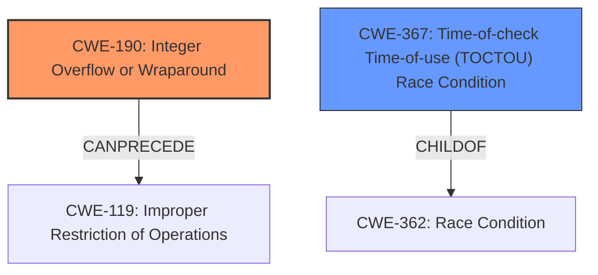

# Analysis Report for CVE-2021-22437

# Vulnerability Analysis Report: CVE-2021-22437

## Description


## Analysis (with Relationship Data)

# Summary
| CWE ID | CWE Name | Confidence | CWE Abstraction Level | CWE Vulnerability Mapping Label | CWE-Vulnerability Mapping Notes |
|---|---|---|---|---|---|
| CWE-190 | Integer Overflow or Wraparound | 1.0 | Base | Allowed | Primary CWE |
| CWE-367 | Time-of-check Time-of-use (TOCTOU) Race Condition | 0.9 | Base | Allowed | Secondary Candidate |

## Evidence and Confidence

*   **Confidence Score:** 0.95
*   **Evidence Strength:** HIGH

## Relationship Analysis
The primary CWE is CWE-190, which is a base-level CWE. CWE-367 is also a base-level CWE. CWE-190 can precede CWE-119 (Improper Restriction of Operations within the Bounds of a Memory Buffer), and the vulnerability mentions random address access which could be an impact of writing to an arbitrary memory location. CWE-367 is a child of CWE-362 (Race Condition).



## Vulnerability Chain
The vulnerability chain starts with a **software integer overflow** (CWE-190), leading to a **TOCTOU condition** (CWE-367), which may cause random address access.

## Summary of Analysis
The vulnerability description clearly states that there is a **software integer overflow** leading to a **TOCTOU condition** in smartphones. The CVE Reference Links Content Summary confirms the root cause as a software integer overflow leading to a TOCTOU condition. The impact is random address access.

Based on the provided information, the primary CWE is CWE-190 (Integer Overflow or Wraparound), as the **integer overflow** is the root cause. The TOCTOU condition that results from the **integer overflow** is represented by CWE-367 (Time-of-check Time-of-use (TOCTOU) Race Condition).

The selection of CWE-190 is based on the explicit mention of "software integer overflow" in both the vulnerability description and the CVE reference. The selection of CWE-367 is based on the explicit mention of "TOCTOU condition." These are base-level CWEs.

Relevant CWE Information:

# Enhanced Context (25 CWEs)
The following CWEs were identified as potentially relevant to this vulnerability:

## CWE-191: Integer Underflow (Wrap or Wraparound)
**Abstraction Level**: Base

## CWE-131: Incorrect Calculation of Buffer Size
**Abstraction Level**: Base

## CWE-681: Incorrect Conversion between Numeric Types
**Abstraction Level**: Base

## CWE-197: Numeric Truncation Error
**Abstraction Level**: Base

## CWE-805: Buffer Access with Incorrect Length Value
**Abstraction Level**: Base

## CWE-125: Out-of-bounds Read
**Abstraction Level**: Base

## CWE-129: Improper Validation of Array Index
**Abstraction Level**: Variant

## CWE-667: Improper Locking
**Abstraction Level**: Class

## CWE-823: Use of Out-of-range Pointer Offset
**Abstraction Level**: Base

## CWE-754: Improper Check for Unusual or Exceptional Conditions
**Abstraction Level**: Class

## CWE-190: Integer Overflow or Wraparound
**Abstraction Level**: Base

## CWE-191: Integer Underflow (Wrap or Wraparound)
**Abstraction Level**: Base

## CWE-125: Out-of-bounds Read
**Abstraction Level**: Base

## CWE-839: Numeric Range Comparison Without Minimum Check
**Abstraction Level**: Base

## CWE-823: Use of Out-of-range Pointer Offset
**Abstraction Level**: Base

## CWE-128: Wrap-around Error
**Abstraction Level**: base

## CWE-787: Out-of-bounds Write
**Abstraction Level**: base

## CWE-839: Numeric Range Comparison Without Minimum Check
**Abstraction Level**: base

## CWE-1284: Improper Validation of Specified Quantity in Input
**Abstraction Level**: base

## CWE-123: Write-what-where Condition
**Abstraction Level**: base

## CWE-789: Memory Allocation with Excessive Size Value
**Abstraction Level**: variant

## CWE-1339: Insufficient Precision or Accuracy of a Real Number
**Abstraction Level**: base

## CWE-120: Buffer Copy without Checking Size of Input ('Classic Buffer Overflow')
**Abstraction Level**: base

## CWE-195: Signed to Unsigned Conversion Error
**Abstraction Level**: variant

## CWE-190: Integer Overflow or Wraparound
**Abstraction Level**: Base

### Detailed Analysis of Selected CWEs:

1.  **CWE-190: Integer Overflow or Wraparound**
    *   **Explanation:** The vulnerability description explicitly mentions a **software integer overflow**. CWE-190 describes a situation where a calculation results in a value exceeding the maximum representable value for an integer, leading to a wraparound.
    *   **Security Implications:** Integer overflows can lead to unexpected behavior, such as incorrect calculations, buffer overflows, or other memory corruption issues.
    *   **Relationship:** Can precede CWE-119 (Improper Restriction of Operations within the Bounds of a Memory Buffer). An **integer overflow** can cause an undersized buffer to be allocated.
    *   **Mapping Guidance:** Usage: Allowed. The description directly matches the vulnerability.
    *   **Confidence:** 1.0

2.  **CWE-367: Time-of-check Time-of-use (TOCTOU) Race Condition**
    *   **Explanation:** The vulnerability description also mentions a **TOCTOU condition**. CWE-367 describes a scenario where the state of a resource changes between the time it's checked and the time it's used, leading to unexpected behavior.
    *   **Security Implications:** TOCTOU conditions can be exploited to bypass security checks or cause incorrect operations.
    *   **Relationship:** ChildOf CWE-362 (Race Condition).
    *   **Mapping Guidance:** Usage: Allowed. The description directly matches the vulnerability.
    *   **Confidence:** 0.9

### CWEs Considered But Not Used:

*   CWE-119: Improper Restriction of Operations within the Bounds of a Memory Buffer: While the impact mentions "random address access," this is a consequence of the **integer overflow** and **TOCTOU condition**, not the root cause. CWE-119 is also a Class-level CWE, which is discouraged when more specific Base-level CWEs are available.
*   CWE-125: Out-of-bounds Read and CWE-787: Out-of-bounds Write: These are potential impacts of the vulnerability, but the root cause is the **integer overflow** and resulting **TOCTOU condition**.
*   CWE-131: Incorrect Calculation of Buffer Size: This is a possible consequence of an integer overflow, but the description doesn't explicitly mention a buffer size calculation.
*   CWE-704: Incorrect Type Conversion or Cast: Not explicitly mentioned in the description.
*   CWE-823: Use of Out-of-range Pointer Offset: This is a possible consequence, but not the root cause.
*   CWE-1284: Improper Validation of Specified Quantity in Input: This could be related to the **integer overflow**, but not directly stated.
*   CWE-191: Integer Underflow (Wrap or Wraparound): Overflow is explicitly mentioned, not underflow.


## CWE Relationship Analysis

Current CWEs represent these abstraction levels: .


### Vulnerability Chain Analysis

**Chain starting from CWE-823:**
- 823 (Use of Out-of-range Pointer Offset) - ROOT


**Chain starting from CWE-119:**
- 119 (Improper Restriction of Operations within the Bounds of a Memory Buffer) - ROOT


### CWE Relationship Diagram

```mermaid
graph TD
    classDef primary fill:#f96,stroke:#333,stroke-width:2px
    classDef secondary fill:#69f,stroke:#333
    classDef tertiary fill:#9e9,stroke:#333
```


*Report generated on 2025-03-30 18:33:48*
